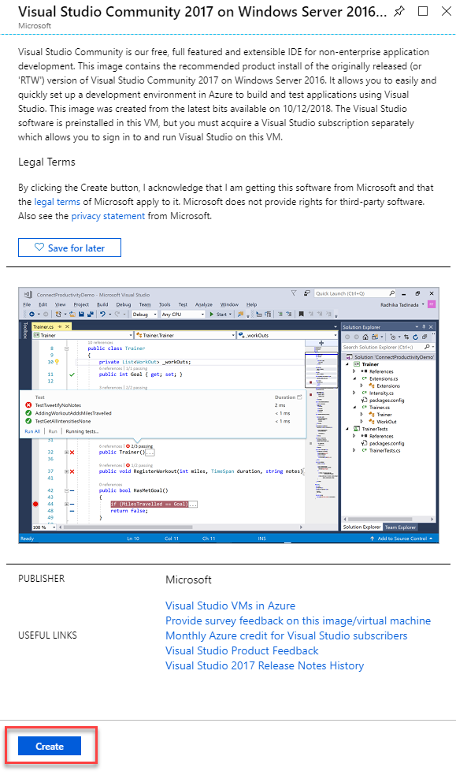
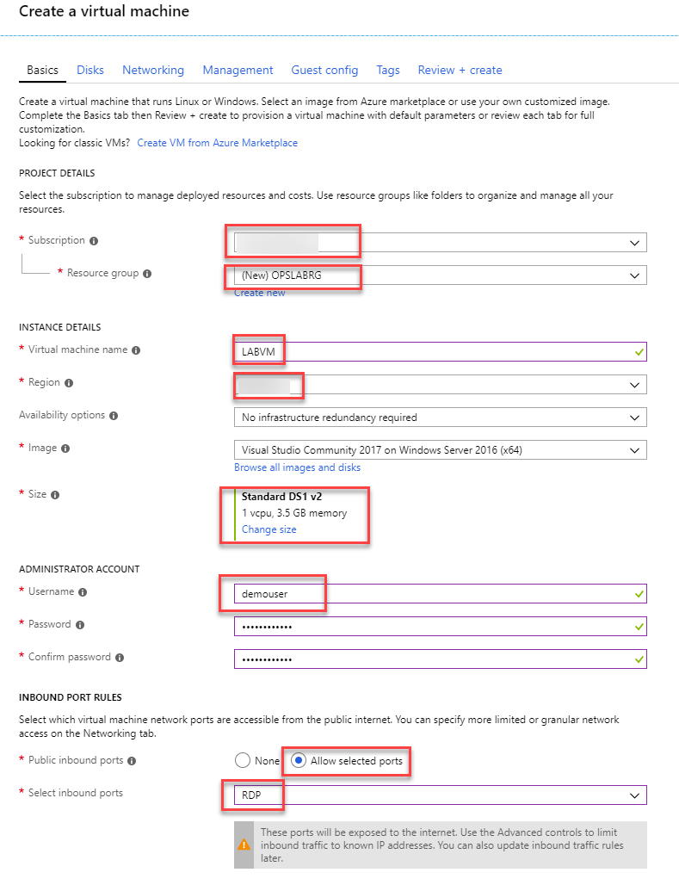
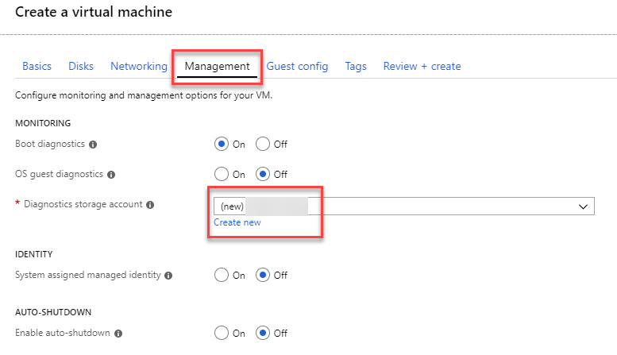
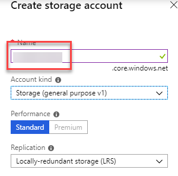
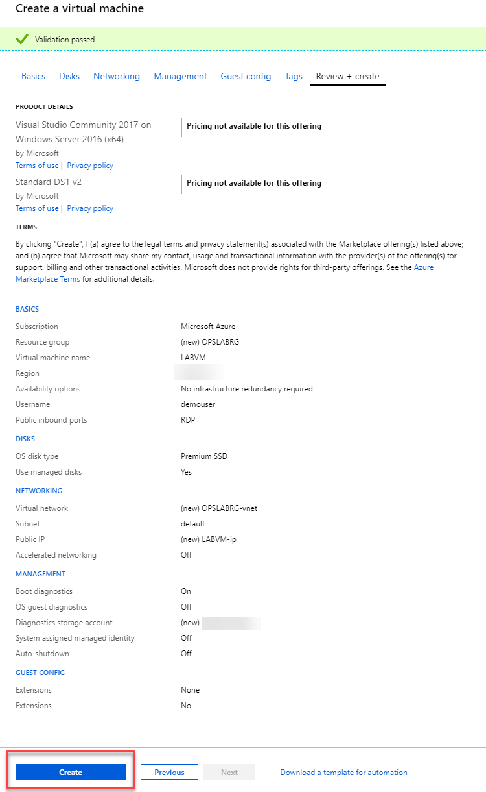
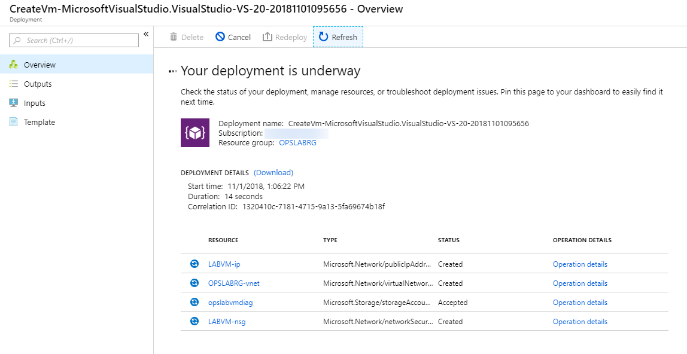
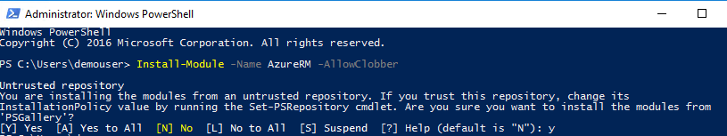

<div class="MCWHeader1">
Building a resilient IaaS architecture
</div>

<div class="MCWHeader2">
Before the hands-on lab setup guide
</div>

<div class="MCWHeader3">
November 2018
</div>


Information in this document, including URL and other Internet Web site references, is subject to change without notice. Unless otherwise noted, the example companies, organizations, products, domain names, e-mail addresses, logos, people, places, and events depicted herein are fictitious, and no association with any real company, organization, product, domain name, e-mail address, logo, person, place or event is intended or should be inferred. Complying with all applicable copyright laws is the responsibility of the user. Without limiting the rights under copyright, no part of this document may be reproduced, stored in or introduced into a retrieval system, or transmitted in any form or by any means (electronic, mechanical, photocopying, recording, or otherwise), or for any purpose, without the express written permission of Microsoft Corporation.

Microsoft may have patents, patent applications, trademarks, copyrights, or other intellectual property rights covering subject matter in this document. Except as expressly provided in any written license agreement from Microsoft, the furnishing of this document does not give you any license to these patents, trademarks, copyrights, or other intellectual property.

The names of manufacturers, products, or URLs are provided for informational purposes only and Microsoft makes no representations and warranties, either expressed, implied, or statutory, regarding these manufacturers or the use of the products with any Microsoft technologies. The inclusion of a manufacturer or product does not imply endorsement of Microsoft of the manufacturer or product. Links may be provided to third party sites. Such sites are not under the control of Microsoft and Microsoft is not responsible for the contents of any linked site or any link contained in a linked site, or any changes or updates to such sites. Microsoft is not responsible for webcasting or any other form of transmission received from any linked site. Microsoft is providing these links to you only as a convenience, and the inclusion of any link does not imply endorsement of Microsoft of the site or the products contained therein.

© 2018 Microsoft Corporation. All rights reserved.

Microsoft and the trademarks listed at <https://www.microsoft.com/en-us/legal/intellectualproperty/Trademarks/Usage/General.aspx> are trademarks of the Microsoft group of companies. All other trademarks are property of their respective owners.

**Contents**

- [Building a resilient IaaS architecture before the hands-on lab setup guide](#building-a-resilient-iaas-architecture-before-the-hands-on-lab-setup-guide)
  - [Requirements](#requirements)
  - [Before the hands-on lab](#before-the-hands-on-lab)
    - [Task 1: Create a Virtual Machine using the Azure portal](#task-1-create-a-virtual-machine-using-the-azure-portal)
    - [Task 2: Connect to the VM and download the student files](#task-2-connect-to-the-vm-and-download-the-student-files)
    - [Task 3: Install Azure PowerShell](#task-3-install-azure-powershell)
  - [Summary](#summary)

# Building a resilient IaaS architecture before the hands-on lab setup guide 

## Requirements

1.  Microsoft Azure Subscription

2.  Virtual Machine Built during this hands-on lab or local machine with the following:

    - Visual Studio 2017 Community or Enterprise Edition
    - Latest Azure PowerShell cmdlets:
        - <https://azure.microsoft.com/en-us/downloads/>
        - <https://docs.microsoft.com/en-us/powershell/azure/install-azurerm-ps>
        - Ensure you reboot after installing the SDK or Azure PowerShell may not work correctly.

## Before the hands-on lab

Duration: 30 minutes

In this exercise, you deploy a Lab VM and configure the tools needed to complete the rest of your lab.

### Task 1: Create a Virtual Machine using the Azure portal 

1.  Launch a browser and navigate to <https://portal.azure.com>. Once prompted, login with your Microsoft Azure credentials. If prompted, choose whether your account is an organization account or just a Microsoft Account.

    >**Note**: You may need to launch an \"in-private\" session in your browser if you have multiple Microsoft Accounts.

2.  Click on **+ Create a resource**, and in the search box, type in **Visual Studio Community 2017 on Windows Server 2016** and press Enter. Click the Visual Studio Community 2017 image running on Windows Server 2016 and with the latest update.

3.  In the returned search results, click the image name.
   
    

4.  At the bottom of the page in the Marketplace solution blade, click **Create**.

    

5.  Set the following configuration on the Basics tab:

    -   Subscription: **If you have multiple subscriptions choose the subscription to execute your labs in**.
    -   Resource Group (create new): **OPSLABRG**
    -   Virtual machine name: **LABVM**
    -   Location: **Choose the closest Azure region to you**.
    -   Size: **DS1\_V2 Standard**
    -   User name: **demouser**
    -   Password: **demo\@pass123**
    -   Public inbound ports: **RDP (3389)**

    

    >**Note**: If the Azure Subscription you are using is [NOT]{.underline} a trial Azure subscription, you may want to choose the DS2\_V2 to have more power in this LABMVM. If you are using a trial subscription or one that you know has a restriction on the number of cores, choose the DS1\_V2.

6. On the **Management** tab, create a new diagnostics storage account with a unique name.
   
   

   

7. Click the **Review + create** or click on the **Review + create** tab.

8.  On the **Review + create** tab, click **Create**.

    

9.  The deployment should begin provisioning. It may take more than 10 minutes for the virtual machine to complete provisioning.

    

    >**Note**: Once the deployment is complete, move on to the next exercise.

### Task 2: Connect to the VM and download the student files

1.  In the Azure portal, browse to **LABVM** and wait for it to show the Status of **Running**. Click **Connect** to establish a new remote desktop session.

    

2.  Depending on your remote desktop protocol client and browser configuration, you will either be prompted to open an RDP file, or you will need to download it followed by opening it up separately to connect. You may also be required to click, **Use a different account**.

    

3.  Login with the credentials specified during creation:

    -   User: **demouser**
    -   Password: **demo\@pass123**

4.  You will be presented with a remote desktop connection warning because of a certificate trust issue. Click, **Don't ask me again for connections to this computer** followed by **Yes** to continue with the connection.

    

5.  When logging on for the first time, you will see a prompt on the right asking about network discovery. Click **No**.

    

6.  Notice that Server Manager opens by default. On the left, click **Local Server**.

    

7.  On the right side of the pane, click **On** by **IE Enhanced Security Configuration**.

    

8.  Change to **Off** for Administrators and click **OK**.

    

9.  In the lower left corner, click Internet Explorer to open it. On first use, you will be prompted about security settings. Accept the defaults by clicking **OK**.

    

10. If prompted, click **Don't show this again** regarding protected mode.

11. To download the exercise files for the hands-on lab, paste this URL into the browser.

    https://cloudworkshop.blob.core.windows.net/resilient-iaas-hackathon/Building_Resilient_Iaas_Hackathon_Student_Files.zip  

12. You will be prompted about what you want to do with the file. Select **Save**.

    

    >**Note**: If you are blocked from downloading the file with a "Your security settings do not allow this file to be downloaded" alert, you will need to adjust the security settings for IE to allow downloads. Click **Settings > Internet Options**, and then select the **Security** tab. Click the **Custom level...** button and enable both **File download** and **Font download**. Click **OK**, and then **OK** again. Re-paste the URL into the browser and download. 

13. Download progress is shown at the bottom of the browser window. When the download is complete, click **Open folder**.

    

14. The **Downloads** folder will open, ***Right-click*** the zip file, and click **Extract All**. In the **Extract Compressed (Zipped) Folders** window, enter **C:\\HOL** in the **Files will be extracted to this folder** dialog. Click the **Extract** button.

### Task 3: Install Azure PowerShell

1. Open a PowerShell prompt as an administrator (Right click > More > Run as administrator).

2. Execute the following command:

    ```powershell
    Install-Module -Name AzureRM -AllowClobber
    ```

    

    >**Note**: By default, the PowerShell gallery isn't configured as a trusted repository for PowerShellGet. The first time you use the PSGallery you will see a message related to an untrusted repository. Answer *Yes* or *Yes to all* to complete the installation.

## Summary

In this exercise, you setup a lab virtual machine, downloaded the required setup files, and installed Azure PowerShell. 

You should follow all steps provided *before* attending the Hands-on lab.
