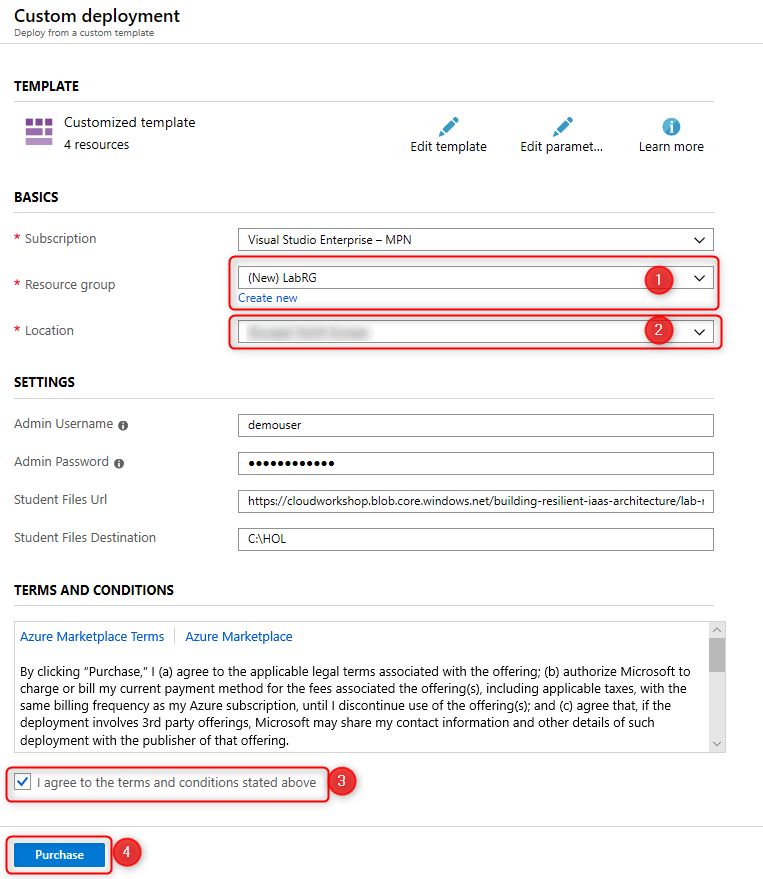
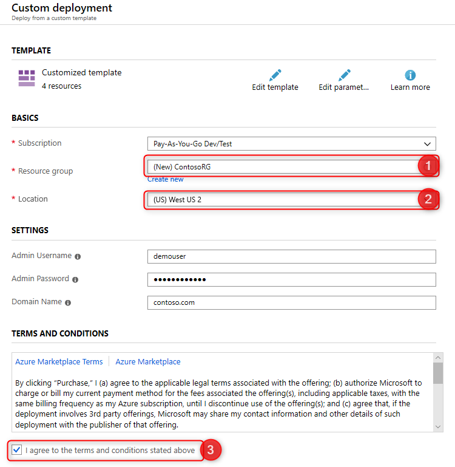
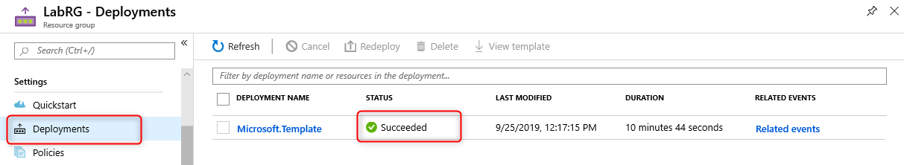
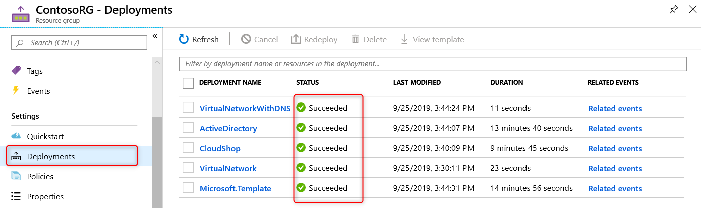

Building a resilient IaaS architecture

Before the hands-on lab setup guide

June 2019

Information in this document, including URL and other Internet Web site references, is subject to change without notice. Unless otherwise noted, the example companies, organizations, products, domain names, e-mail addresses, logos, people, places, and events depicted herein are fictitious, and no association with any real company, organization, product, domain name, e-mail address, logo, person, place or event is intended or should be inferred. Complying with all applicable copyright laws is the responsibility of the user. Without limiting the rights under copyright, no part of this document may be reproduced, stored in or introduced into a retrieval system, or transmitted in any form or by any means (electronic, mechanical, photocopying, recording, or otherwise), or for any purpose, without the express written permission of Microsoft Corporation.

Microsoft may have patents, patent applications, trademarks, copyrights, or other intellectual property rights covering subject matter in this document. Except as expressly provided in any written license agreement from Microsoft, the furnishing of this document does not give you any license to these patents, trademarks, copyrights, or other intellectual property.

The names of manufacturers, products, or URLs are provided for informational purposes only and Microsoft makes no representations and warranties, either expressed, implied, or statutory, regarding these manufacturers or the use of the products with any Microsoft technologies. The inclusion of a manufacturer or product does not imply endorsement of Microsoft of the manufacturer or product. Links may be provided to third party sites. Such sites are not under the control of Microsoft and Microsoft is not responsible for the contents of any linked site or any link contained in a linked site, or any changes or updates to such sites. Microsoft is not responsible for webcasting or any other form of transmission received from any linked site. Microsoft is providing these links to you only as a convenience, and the inclusion of any link does not imply endorsement of Microsoft of the site or the products contained therein.

© 2019 Microsoft Corporation. All rights reserved.

Microsoft and the trademarks listed at <https://www.microsoft.com/en-us/legal/intellectualproperty/Trademarks/Usage/General.aspx> are trademarks of the Microsoft group of companies. All other trademarks are property of their respective owners.

**Contents**

- [Building a resilient IaaS architecture before the hands-on lab setup guide](#building-a-resilient-iaas-architecture-before-the-hands-on-lab-setup-guide)
  - [Requirements](#requirements)
  - [Before the hands-on lab](#before-the-hands-on-lab)
    - [Task 1: Create the LabVM Virtual Machine](#task-1-create-the-labvm-virtual-machine)
    - [Task 2: Deploy the CloudShop sample application](#task-2-deploy-the-cloudshop-sample-application)
    - [Task 3: Wait for deployments to complete, and validate](#task-3-wait-for-deployments-to-complete-and-validate)
  - [Summary](#summary)

# Building a resilient IaaS architecture before the hands-on lab setup guide 

## Requirements

1.  Microsoft Azure Subscription

2.  LabVM virtual machine deployed using the instructions below. This is pre-installed with various tools and files you will use during this lab.

3.  CloudShop sample application, also deployed using the instructions below.

## Before the hands-on lab

Duration: 25 minutes

In this exercise, you deploy a Lab VM needed to complete the rest of your lab.

You should follow all steps provided *before* attending the hands-on lab.

### Task 1: Create the LabVM Virtual Machine

In this task, you will use an Azure Resource Manager template to deploy the LabVM virtual machine. This machine will be pre-configured with Visual Studio 2019 Community Edition, has Azure PowerShell pre-installed, and is pre-loaded with various files which you will use during the lab.

1.  Select the **Deploy to Azure** button below to open the Azure portal and launch the template deployment for the LabVM. Log in to the Azure portal using your subscription credentials if you are prompted to do so.
   
    

2.  Complete the Custom deployment blade as follows

    - Resource Group: **(Create new) LabRG**
    - Location: **Choose a location close to you**

    Select the checkbox to agree to the terms and conditions, then select **Purchase**.

    

    You should proceed to the next task **without** waiting for the deployment to complete. This saves time.

### Task 2: Deploy the CloudShop sample application

In this task, you will use an Azure Resource Manager template to deploy the CloudShop sample application, which you will use in this lab.

1.  Select the **Deploy to Azure** button below to open the Azure portal and launch the template deployment for the CloudShop sample application. Log in to the Azure portal using your subscription credentials if you are prompted to do so.

    

2.  Complete the Custom deployment blade as follows

    - Resource Group: **(Create new) ContosoRG**
    - Location: **West US 2**

    Select the checkbox to agree to the terms and conditions, then select **Purchase**.

    
    

### Task 3: Wait for deployments to complete, and validate

In this task, you will verify that the LabVM and CloudShop sample application have been deployed successfully.

1.  You can check the LabVM deployment status by navigating to the **LabRG** resource group, clicking **Deployments** in the resource group left-nav, and checking the status of the 'Microsoft.Template' deployment. Make sure the template deployment status is **Succeeded** before proceeding to the hands-on lab guide.

    

2.  You can check the CloudShop deployment status by navigating to the **ContosoRG** resource group, clicking **Deployments** in the resource group left-nav, and checking the status of the deployments. Make sure the deployment status is **Succeeded** for all templates before proceeding to the hands-on lab guide.

    

3.  Once the CloudShop deployment is successful, validate the application by opening the **CloudShopWeb** virtual machine and navigating your browser to its public IP address.

    

## Summary

In these lab preparation steps, you set up a lab virtual machine, which includes Visual Studio 2019 Community Edition, Azure PowerShell, and other files used during this lab. You also deployed the CloudShop sample application which you will use in this lab.

