<div class="MCWHeader1">
Building a resilient IaaS architecture
</div>

<div class="MCWHeader2">
Hands-on lab step-by-step
</div>

<div class="MCWHeader3">
March 2019
</div>


Information in this document, including URL and other Internet Web site references, is subject to change without notice. Unless otherwise noted, the example companies, organizations, products, domain names, e-mail addresses, logos, people, places, and events depicted herein are fictitious, and no association with any real company, organization, product, domain name, e-mail address, logo, person, place or event is intended or should be inferred. Complying with all applicable copyright laws is the responsibility of the user. Without limiting the rights under copyright, no part of this document may be reproduced, stored in or introduced into a retrieval system, or transmitted in any form or by any means (electronic, mechanical, photocopying, recording, or otherwise), or for any purpose, without the express written permission of Microsoft Corporation.

Microsoft may have patents, patent applications, trademarks, copyrights, or other intellectual property rights covering subject matter in this document. Except as expressly provided in any written license agreement from Microsoft, the furnishing of this document does not give you any license to these patents, trademarks, copyrights, or other intellectual property.

The names of manufacturers, products, or URLs are provided for informational purposes only and Microsoft makes no representations and warranties, either expressed, implied, or statutory, regarding these manufacturers or the use of the products with any Microsoft technologies. The inclusion of a manufacturer or product does not imply endorsement of Microsoft of the manufacturer or product. Links may be provided to third party sites. Such sites are not under the control of Microsoft and Microsoft is not responsible for the contents of any linked site or any link contained in a linked site, or any changes or updates to such sites. Microsoft is not responsible for webcasting or any other form of transmission received from any linked site. Microsoft is providing these links to you only as a convenience, and the inclusion of any link does not imply endorsement of Microsoft of the site or the products contained therein.
© 2019 Microsoft Corporation. All rights reserved.

Microsoft and the trademarks listed at https://www.microsoft.com/en-us/legal/intellectualproperty/Trademarks/Usage/General.aspx are trademarks of the Microsoft group of companies. All other trademarks are property of their respective owners.

**Contents**

<!-- TOC -->

- [Building a resilient IaaS architecture hands-on lab step-by-step](#building-a-resilient-iaas-architecture-hands-on-lab-step-by-step)
  - [Abstract and learning objectives](#abstract-and-learning-objectives)
  - [Overview](#overview)
  - [Solution architecture](#solution-architecture)
  - [Requirements](#requirements)
    - [Help references](#help-references)
  - [Exercise 1: Prepare connectivity between regions](#exercise-1-prepare-connectivity-between-regions)
    - [Task 1: Deploy the lab environment](#task-1-deploy-the-lab-environment)
    - [Task 2: Create a VNET in the second region](#task-2-create-a-vnet-in-the-second-region)
    - [Task 3: Configure VNET Peering between Azure regions](#task-3-configure-vnet-peering-between-azure-regions)
  - [Exercise 2: Build the primary DCs for resiliency](#exercise-2-build-the-primary-dcs-for-resiliency)
    - [Task 1: Create Resilient Active Directory Deployment](#task-1-create-resilient-active-directory-deployment)
    - [Task 2: Create the Active Directory deployment in the second Azure region](#task-2-create-the-active-directory-deployment-in-the-second-azure-region)
    - [Task 3: Add data disks to Active Directory domain controllers (both regions)](#task-3-add-data-disks-to-active-directory-domain-controllers-both-regions)
    - [Task 4: Format data disks on DCs and configure DNS settings across connection](#task-4-format-data-disks-on-dcs-and-configure-dns-settings-across-connection)
    - [Task 5: Promote DCs as additional domain controllers](#task-5-promote-dcs-as-additional-domain-controllers)
    - [Summary](#summary)
  - [Exercise 3: Build web tier and SQL for resiliency](#exercise-3-build-web-tier-and-sql-for-resiliency)
    - [Task 1: Deploy SQL Always-On Cluster](#task-1-deploy-sql-always-on-cluster)
    - [Task 2: Build a scalable and resilient web tier](#task-2-build-a-scalable-and-resilient-web-tier)
    - [Summary](#summary-1)
  - [Exercise 4: Configure SQL Server Managed Backup](#exercise-4-configure-sql-server-managed-backup)
    - [Task 1: Create an Azure Storage Account](#task-1-create-an-azure-storage-account)
    - [Task 2: Configure managed backup in SQL Server](#task-2-configure-managed-backup-in-sql-server)
  - [Exercise 5: Validate resiliency](#exercise-5-validate-resiliency)
    - [Task 1: Validate resiliency for the CloudShop application](#task-1-validate-resiliency-for-the-cloudshop-application)
    - [Task 2: Validate SQL Always On](#task-2-validate-sql-always-on)
    - [Task 3: Validate backups are taken](#task-3-validate-backups-are-taken)
  - [Exercise 6: Implementing Azure Site Recovery](#exercise-6-implementing-azure-site-recovery)
    - [Task 1: Configure ASR Protection for Cloud Shop](#task-1-configure-asr-protection-for-cloud-shop)
    - [Task 2: Creating the Recovery Plan](#task-2-creating-the-recovery-plan)
    - [Task 3: Creating the Test Fail Over.](#task-3-creating-the-test-fail-over)
    - [Task 4: Cleaning the Test Fail Over.](#task-4-cleaning-the-test-fail-over)
  - [After the hands-on lab](#after-the-hands-on-lab)
    - [Task 1: Delete the resource groups created](#task-1-delete-the-resource-groups-created)

<!-- /TOC -->

# Building a resilient IaaS architecture hands-on lab step-by-step 

## Abstract and learning objectives 

In this hands-on lab, you will deploy a pre-configured IaaS environment and then redesign and update it to account for resiliency and in general high availability. Throughout the hands-on lab you will use various configuration options and services to help build a resilient architecture.

At the end of the lab, you will be better able to design and use availability sets, Managed Disks, SQL Server Always on Availability Groups, as well as design principles when provisioning storage to VMs. In addition, you'll learn effective employment of Azure Backup to provide point-in-time recovery.

## Overview

Contoso has asked you to deploy their infrastructure in a resilient manner to ensure their infrastructure will be available for their users and gain an SLA from Microsoft.

## Solution architecture

Highly resilient deployment of Active Directory Domain Controllers in Azure.
    

Deployment of a web app using scale sets, and a highly available SQL Always On deployment.
    

## Requirements

1.  Microsoft Azure Subscription

2.  Virtual Machine Built during this hands-on lab or local machine with the following:

    - Visual Studio 2017 Community or Enterprise Edition
    - Latest Azure PowerShell cmdlets:
        - <https://azure.microsoft.com/en-us/downloads/>
        - <https://docs.microsoft.com/en-us/powershell/azure/install-azurerm-ps>
        - Ensure you reboot after installing the SDK or Azure PowerShell may not work correctly.

### Help references
|    |            |
|----------|:-------------:|
| **Description** | **Links** |
| Authoring ARM Templates | <https://azure.microsoft.com/en-us/documentation/articles/resource-group-authoring-templates/> |
| Virtual Machine Scale Set Samples | <https://github.com/gbowerman/azure-myriad> |
| Azure Quick Start Templates | <https://github.com/Azure/azure-quickstart-templates> |
| Network Security Groups | <https://azure.microsoft.com/en-us/documentation/articles/virtual-networks-nsg/> |
| Managed Disks | <https://azure.microsoft.com/en-us/services/managed-disks> |
| Always-On Availability Groups | <https://docs.microsoft.com/en-us/sql/database-engine/availability-groups/windows/overview-of-always-on-availability-groups-sql-server?view=sql-server-2017> |
| SQL Server Managed Backup to Azure | <https://docs.microsoft.com/en-us/sql/relational-databases/backup-restore/sql-server-managed-backup-to-microsoft-azure?view=sql-server-2017> |
| Virtual Network Peering | <https://docs.microsoft.com/en-us/azure/virtual-network/virtual-network-peering-overview> |
| Azure Backup |  <https://azure.microsoft.com/en-us/services/backup/> |


## Exercise 1: Prepare connectivity between regions

Duration: 30 minutes

Contoso is planning to deploy infrastructure in multiple regions in Azure to provide infrastructure closer to their employees in each region as well as the ability to provide additional resiliency in the future for certain workloads. In this exercise, you will configure connectivity between the two regions.

### Task 1: Deploy the lab environment

1.  Login to the Azure portal (<https://portal.azure.com>) with the credentials that you want to deploy the lab environment to.

2.  In a separate tab, navigate to: <https://github.com/opsgility/cw-building-resilient-iaas-architecture>.

3.  Click the button **Deploy to Azure**.

    

4.  Specify the Resource group name as **ContosoRG** and the region as **East US 2**, check the **I agree to the terms and conditions state above** checkbox on the page and click **Purchase**.

    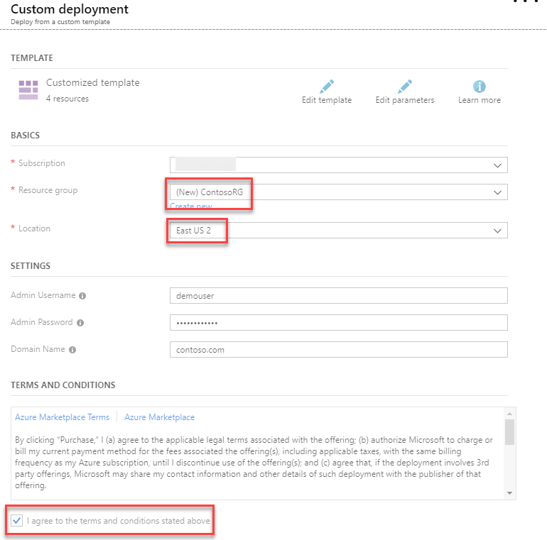
    
    >**Note**: The deployment may take up to 20 minutes.

5.  Once the deployment is successful, validate the deployment by opening the **CloudShopWeb** virtual machine and navigating your browser to its public IP address.

    

### Task 2: Create a VNET in the second region

1.  Browse to the Azure portal and authenticate at <https://portal.azure.com/>.

2.  In the left pane, click **+ Create a resource**.

3.  In the **New** blade, select **Networking \>** **Virtual Network**.

    

4.  In the **Create virtual network** blade, enter the following information:

    - Name: **VNET2**
    - Address space: **172.16.0.0/16**
    - Subscription: **Choose your subscription**.
    - Resource group (create new): **CUSRG**
    - Location: **Central US**
    - Subnet name: **Apps**
    - Subnet address range: **172.16.0.0/24**
    - DDoS protection: **Basic**
    - Service endpoints: **Disabled**
    - Firewall: **Disabled**

    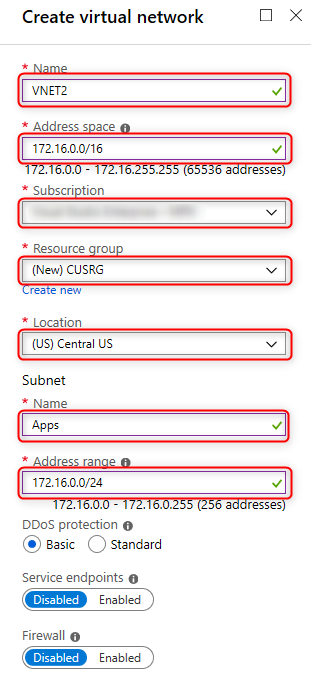

5. Click the **Create** button to continue.

6.  Once the deployment is complete, add two more subnets to the virtual network. To do this, select the **Subnets \>** icon in the **Settings** area.

    

7.  Click the **+ Subnet** option, and enter the following settings:

    

    -   Name: **Data**
    -   Address range (CIDR block): **172.16.1.0/24**
    -   Click the **OK** button to add this subnet.

    

8.  Once the subnet is created successfully, repeat the above step for an **Identity** subnet with the following settings:

    -   Name: **Identity**
    -   Address range (CIDR block): **172.16.2.0/24**
    -   Click the **OK** button to add this subnet.

    

9.  The subnets will look like this once complete:

    

### Task 3: Configure VNET Peering between Azure regions

1.  Open the first virtual network (VNET1) by clicking **All Services -\> Virtual networks** and clicking the name.

2.  Click on **Peerings** and click **+Add**.

    

3.  Name the peering, **VNET1TOVNET2** and change the Virtual network dropdown to **VNET2** click **Allow forwarded traffic,** and then click **OK**.

    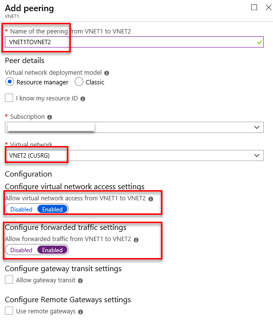

4.  Open the second virtual network (VNET2) by clicking **All Services -\> Virtual networks** and clicking the name.

5.  Click on **Peerings** and click **+Add**.

    

6.  Name the peering, **VNET2TOVNET1** and change the Virtual network dropdown to **VNET1** click **Allow forwarded traffic,** and then click **OK**.

    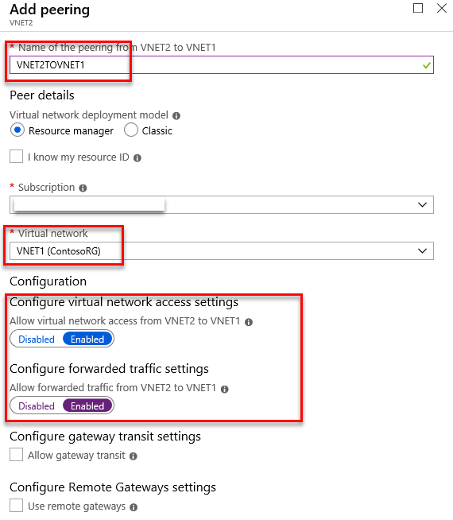

## Exercise 2: Build the primary DCs for resiliency

Duration: 30 minutes

In this exercise, you will deploy Windows Server Active Directory configured for resiliency using Azure Managed Disks and Availability Sets in the primary region. You will then deploy additional domain controllers in a second region for future expansion of the Azure footprint.

### Task 1: Create Resilient Active Directory Deployment 

In this task, you will change the disk cache settings on the existing domain controller **Read Only** to avoid corruption of Active Directory database.

1.  Select **Virtual machines** in the left menu pane of the Azure portal.

2.  Click on **ADVM**, and in the **Settings** area, select **Disks**.

    

3.  On the Disks blade, click **Edit**.

    

4.  Change the **Host caching** from **Read/Write** to **None** via the drop-down option, and click the **Save** icon.

    

    >**Note**: In production, we would not want to have any OS drives that do not have read/write cache enabled. This machine will be decommissioned, but first, we want to make sure the AD Database and SYSVOL will not be corrupted during our updates.

5.  In the left pane, click **+ Create a resource**.

6.  In the **New** blade, select **Windows Server 2016 Datacenter**.

    

7.  In the **Create virtual machine** blade, enter the **Basics** information:

    -   Subscription: **Select your subscription**.
    -   Resource group (create new): **EU2ADRG**
    -   Virtual machine name: **DC01**
    -   Size: **Standard D2SV3**
    -   Region: **East US 2**
    -   Username: **demouser**
    -   Password: **demo\@pass123**
    -   Confirm password: **demo\@pass123**
    -   Public inbound ports: **Allow selected ports**
    -   Select inbound ports: **RDP (3389)**

    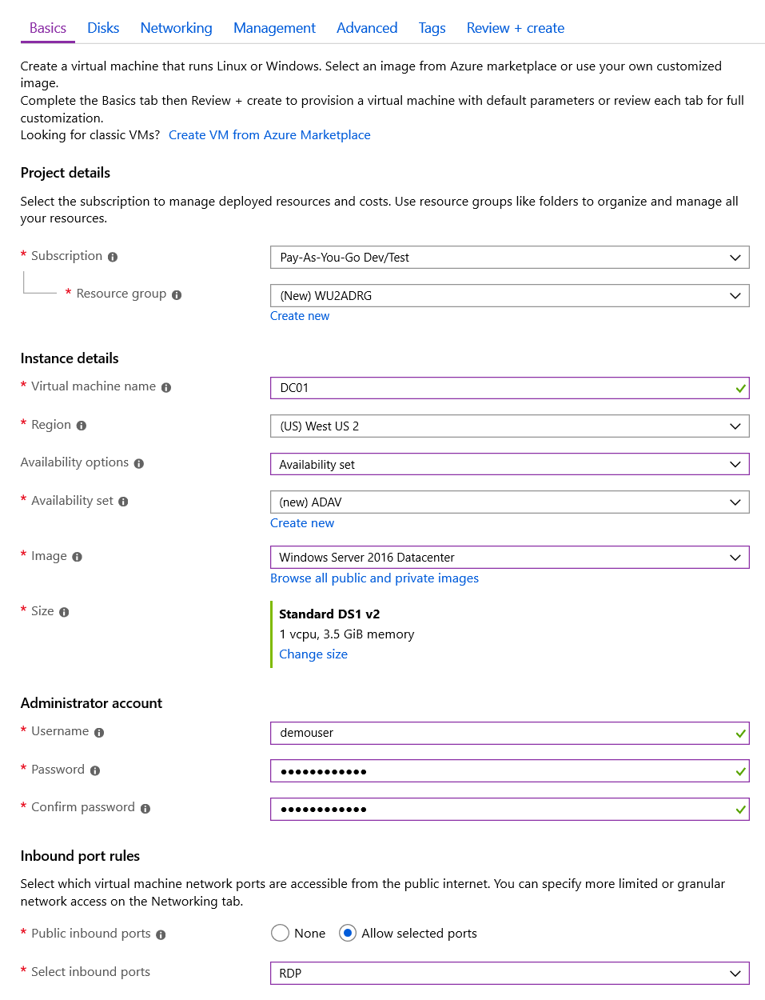

8. For **Availability options**, select **Availability set**. Select **Create new** and enter the name **ADAV** and click **OK**.

    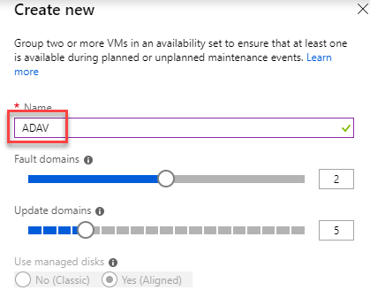

9. Click the **Networking** tab and select the existing virtual network **VNET1** and the **Identity** subnet.

    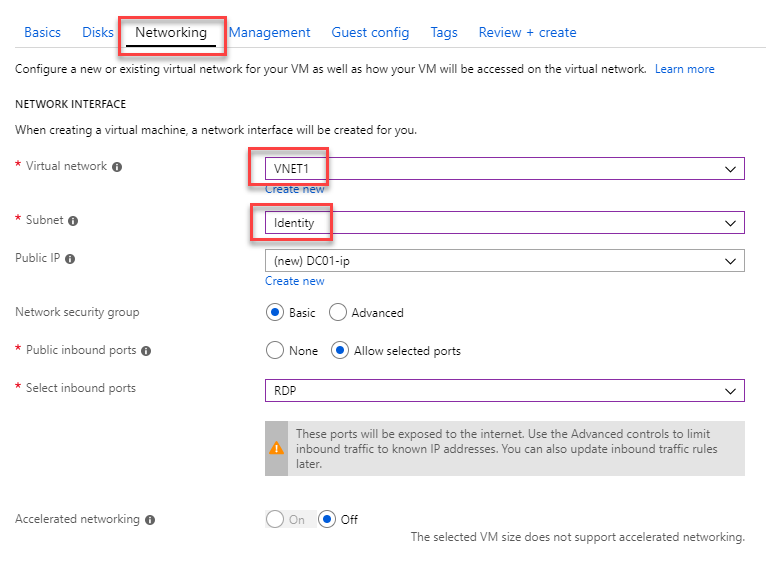

10. Click the **Management** tab and configure as follows:

    - Boot diagnostics: **On**
    - Diagnostics storage account: **Create new and select a unique name**.
    - Enable backup: **On**
    - Recovery Services vault: **Create new**
    - Recovery Services vault name: **BackupVault**
    - Resource group (create new): **BackupVaultRG**

    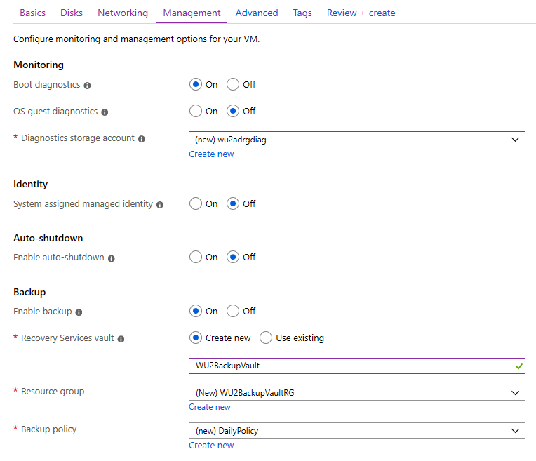
    
    >**Note**: Backup with a Domain Controller is a supported scenario. Care should be taken on restore. For more information see the following: <https://docs.microsoft.com/en-us/azure/backup/backup-azure-arm-restore-vms#backup-for-restored-vms>.

11. Click the **Review + create** button or click on the **Review + create** tab. There will be a final validation and when this is passed, click the **Create** button to complete the deployment.

12. Give the deployment a few minutes to build the Availability Set resource. Then, repeat the virtual machine creation steps to create **DC02**, as that will be another Domain Controller making sure to place it in the **ADAV** availability set and select the existing diagnostics storage account and the existing **BackupVault**.

    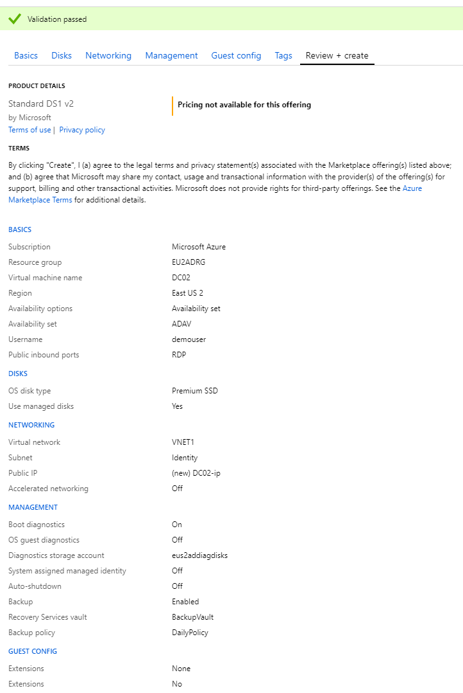 

### Task 2: Create the Active Directory deployment in the second Azure region

In this task, you will deploy Active Directory in the second region, so identity is available for new workloads. In this region, an additional level of resiliency will be introduced by using Availability Zones for the virtual machines hosting Active Directory.

1.  In the left pane, click **+ Create a resource**.

2.  In the **New** blade, select **Virtual Machines \>** **Windows Server 2016 VM**.

    

3.  In the **Create virtual machine** blade, enter the **Basics** information:

    -   Subscription: **Select your subscription**.
    -   Resource group (create new): **CUSADRG**
    -   Virtual machine name: **DC03**
    -   Size: **Standard_D2SV3**
    -   Region: **Central US**
    -   Username: **demouser**
    -   Password: **demo\@pass123**
    -   Confirm password: **demo\@pass123**
    -   Public inbound ports: **Allow selected ports**
    -   Select inbound ports: **RDP (3389)**

    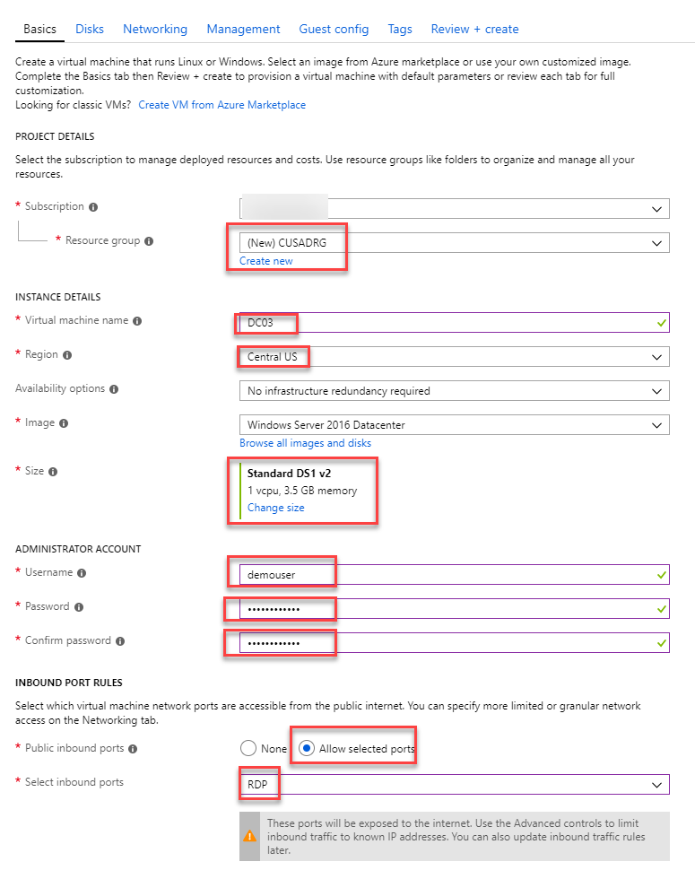

4. For **Availability options**, select **Availability zone**. Select zone **1**.

    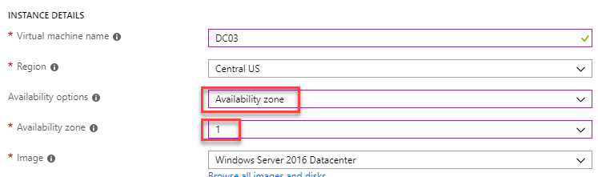

5. Click the **Networking** tab and select the existing virtual network **VNET2** and the **Identity** subnet.

    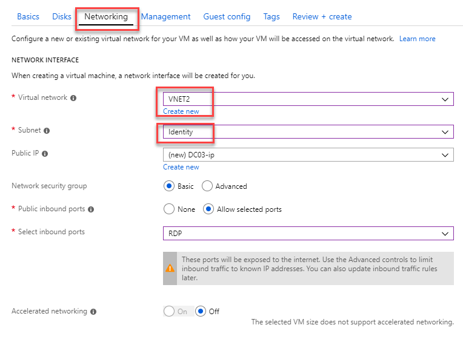

6. Click the **Management** tab and configure as follows:

    - Boot diagnostics: **On**
    - Diagnostics storage account: **Create new and select a unique name**
    - Enable backup: **On**
    - Recovery Services vault: **Create new**
    - Recovery Services vault name: **BackupVault2**
    - Resource group (create new): **BackupVault2RG**

    
    
    >**Note**: Backup with a Domain Controller is a supported scenario. Care should be taken on restore. For more information see the following: <https://docs.microsoft.com/en-us/azure/backup/backup-azure-arm-restore-vms#backup-for-restored-vms>.

7. Click the **Review + create** button or click on the **Review + create** tab. There will be a final validation and when this is passed, click the **Create** button to complete the deployment.

8. Give the deployment a few minutes to start and repeat those steps to create **DC04**, as that will be another Domain Controller making sure to place it in Availability Zone **2** and the existing **BackupVault2**.

    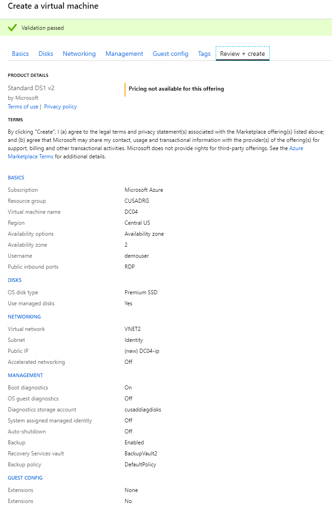

### Task 3: Add data disks to Active Directory domain controllers (both regions)

1.  Open **DC01** from the Azure portal.

2.  In the **Settings** blade, select **Disks**.

3.  Click on **Add data disk**.

    

4.  On the settings for the **Data disk menu**, click on the drop-down menu under **Name**, and click **Create Disk**.

    

5.  On the Create managed disk blade, enter the following, and click **Create**:

    -   Name: **DC01-Data-Disk-1**
    -   Resource group: **Use existing / EU2ADRG**
    -   Account Type: **Premium SSD**
    -   Source Type: **None (empty disk)**
    -   Size: **32**

6.  Once the disk is created, the portal will move back to the **Disks** blade. Locate the new disk under **Data Disks**, change the **HOST CACHING** to **None**, and click **Save**.

    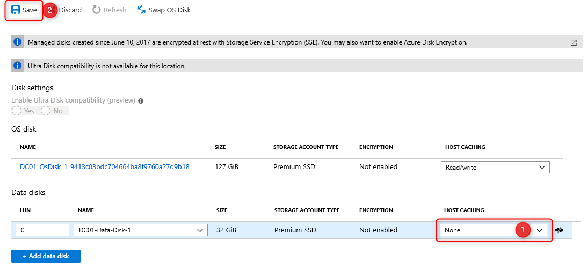

7.  Perform these same steps for **DC02** naming the disk **DC02-Data-Disk-1**. Also, make sure the Host caching is set to **None**.

8.  Perform the add disk steps for **DC03** and **DC04** naming the disks **DC03-Data-Disk-1** and **DC04-Data-Disk1** respectively. Make sure to set the Host caching to **None**. For these disks, select the resource group **CUSADRG**.

### Task 4: Format data disks on DCs and configure DNS settings across connection

1.  Browse to **DC01** in the Azure portal.

2.  Click the **Connect** icon on the menu bar to RDP into the server.

    

3.  Login to the VM with **demouser** and password created during deployment.

    

    >**Note**: You might have to click "Use a different account," depending on which OS you are connecting from to put in the demouser credentials.

4.  Click **Yes** to continue to connect to DC01.

5.  Once the logged in, click on **File and Storage Services** in **Server Manager**.

    

6.  Click on **Disks**, and let the data load. You should now see an **Unknown** partition disk in the list.

    

7.  Right-click on this disk and choose **New Volume...** from the context menu options.

    

8.  Follow the prompts in the **New Volume Wizard** to format this disk, as the **F:\\** drive for the domain controller.

9.  Perform these same steps for the remaining 3 DCs (**DC02**, **DC03**, and **DC04**).

10. Go back to the Azure portal dashboard and click on **DC01**. Next, click on **Networking** followed by the name of the NIC.

    

    

11. Select the **IP** **configurations**.

    

12. Click the IP Configuration named **ipconfig1**.

    

13. On the **ipconfig1** blade, change the **Private IP address settings** to **Static.** Leave all the other settings at their defaults and click the **Save** icon.

14. Once Azure notifies the network interface change is saved, repeat these steps on the remaining 3 DCs (**DC02**, **DC03**, and **DC04**).

    >**Note**: The Static IP for **DC02** should be 10.0.2.6. **DC03** should be 172.16.2.4 and **DC04** should be 172.16.2.5.

15. In the Azure portal, click **All Services \>** and in the filter, type in **Virtual Networks**. Select **VNET2** from the list.

16. In the **Settings** area, select **DNS Servers**.

    

17. Change **DNS servers** to **Custom**, and provide the address of **10.0.2.4** in the **Add DNS server** box. Click the **Save** icon to commit the changes.

    

18. At this point, restart **DC03** and **DC04**, so they can get their new DNS Settings.

    >**Note**: **DC01** and **DC02** received the correct DNS settings from the VNET DNS configured prior to their deployment, as the custom DNS was set before the hands-on lab for that VNET. **DC03** and **DC04** must be rebooted to receive the updated DNS settings from their virtual network.

19. While these two DCs are rebooting, RDP into **ADVM** using the credentials for **demouser**, and run the following PowerShell command:

    ```powershell
    Set-DnsServerPrimaryZone -Name contoso.com -DynamicUpdate NonsecureAndSecure
    ```

    >**Note**: This would not be done in a production environment, but for purposes of our hands-on lab, we need to perform this step for the SQL Cluster in the coming tasks.

20. After the PowerShell command runs, sign out of **ADVM**.

### Task 5: Promote DCs as additional domain controllers 

1.  Login to **LABVM** created before the hands-on lab or the machine where you have downloaded the exercise files.

2.  Browse to the Azure portal and authenticate at <https://portal.azure.com/>.

3.  Click on **DC01** on the Azure dashboard.

4.  In the **Settings** area, click **Extensions**.

    

5.  Click the **+ Add** icon.

    

6.  Choose **Custom Script Extension** by Microsoft Corp., and click the **Create** button to continue.

    

7.  Browse to the **C:\\HOL** folder and select the **AddDC.ps1** script by clicking the folder icon for **Script file (Required)**. Then, click the **OK** button to continue.

    

8.  This script will run the commands to add this DC to the domain as an additional DC in the contoso.com domain. Repeat these steps for **DC02**, **DC03**, and **DC04**.

9.  Once this succeeds, you will see a **Provisioning succeeded** message under **Extensions** for all four domain controllers.

    

    >**Note**: If this were a live production environment, there would need to be some additional steps to clean up Region 1 and to configure DNS, Sites and Services, Subnets, etc. Please refer to documentation on running Active Directory Virtualized or in Azure for details. ADVM should be demoted gracefully, and if required, a new DC can be added to the ADAV Availability Set and data disk attached for F:\\.

10. Open the settings for **VNET2** in the Azure portal. Under DNS servers, remove the exiting custom DNS entry and add the two new domain controller IP addresses and click **Save**.

    - DNS servers
        - **172.16.2.4**
        - **172.16.2.5**

    

### Summary

In this exercise, you deployed Windows Server Active Directory and configured for resiliency using Azure Managed Disks and Availability Sets in the primary region and Availability Zones in the failover region. Availability Sets offer an SLA of 99.95% and Availability Zones offer an SLA of 99.99%. 

## Exercise 3: Build web tier and SQL for resiliency

Duration: 60 minutes

In this exercise, you will deploy resilient web servers using VM scale sets and a SQL Always-On Cluster for resiliency at the data tier.

### Task 1: Deploy SQL Always-On Cluster 

In this task, you will deploy a SQL Always-On cluster using an ARM template that deploys to your existing Virtual Network and Active Directory infrastructure.

1.  Navigate to https://github.com/hansenms/iac/tree/master/sql-alwayson and click **Deploy to Azure** to deploy the template.
   
2.  Specify the following information
   
    Resource group: **CloudShopRG** 
    
    Location: **East US 2** 
    
    **Subnet Id**: Go to **resources.azure.com** then go to Subscription - Resource Group - ContosoRG - Providers - Microsoft.Network - VirtualNetworks - **Find subnet id for Data Subnet**. Copy the full subnet ID in between the **" "** quote.

    Admin username **demouser**
    Admin Password **demo@pass123**
    Domain Name: contoso.com

    Leave the rest of the template parameters with their default values.

    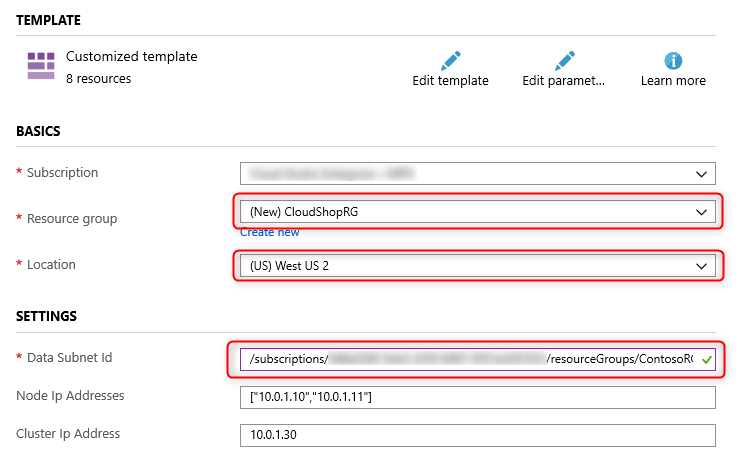

3.  Check the **I agree to the terms and conditions state above** checkbox on the page and click **Purchase**.

    

4.  Wait until the template deployment is complete before continuing. 

    >**Note**: The deployment may take up to 30 minutes.

    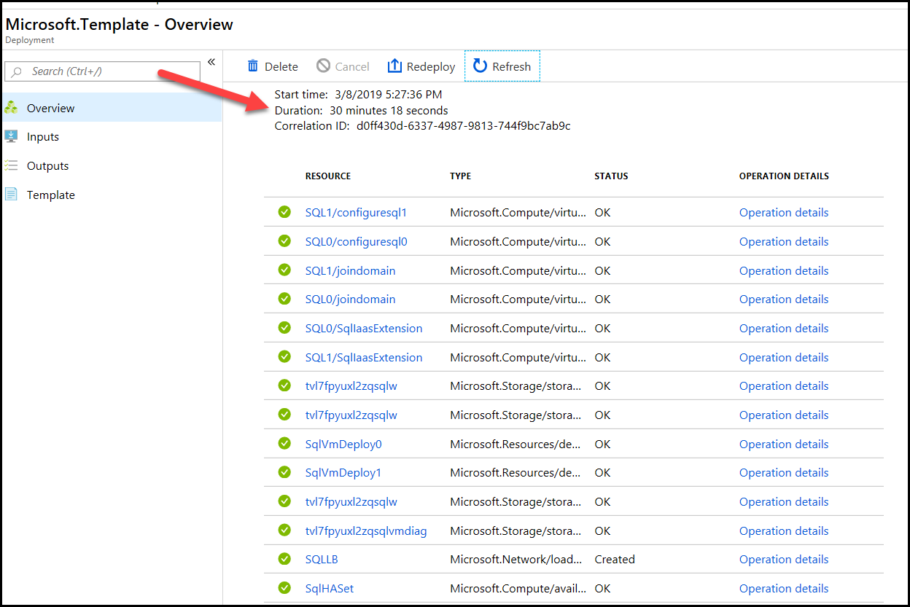

5.  Open a remote desktop connection to the **SQL0** virtual machine you created in the previous task, and login using the **contoso\\demouser** account with the password **demo@pass123**.

    
    >**Note**: Use `ADVM` as a jump box to connect to SQL0 on the private IP Address.

6.  Once connected, open the Windows Explorer, check to make sure the **F:\\** Drive is present.
     
   

7.  open the **Failover Cluster Manager**, click connect to the cluster and type **SQLClusterAG**. Cluster manager will connect to the newly deployed Always on availability group. expand the cluster, select Nodes, validate all nodes are online and Assigned Vote and Current Vote are listed as "1" for all nodes of the cluster.

    

8.  Launch **SQL Server 2017 Configuration Manager** on **SQL0**.

    

9.  Click **SQL Server Services**, right-click **SQL Server (MSSQLSERVER)**, and select **Properties**.

    

10. Select the **AlwaysOn High Availability** tab, make sure the box for **Enable AlwaysOn Availability Groups** is selected.

     Properties dialog box")

11. On the **Log On** tab, change the service account to **contoso\\demouser** using **demo\@pass123** for the password. Click **OK** to accept the changes, and click **Yes** to confirm the restart of the server.

     Properties dialog box")

    

12. Minimize the RDP Window for **SQL0**.

13. From the Azure portal, locate **SQL1**, and click **Connect.** Make sure to Sign On using the **contoso\\demouser** domain account.

    
    >**Note**: Use `ADVM` as a jump box to connect to SQL1 on the private IP Address.

14. From the RPD Session on **SQL1**, repeat steps to verify the configuration of **AlwaysOn High Availability** and **Log On** using SQL 2017 Configuration Manager.

15. Move back to RDP session with **SQL0**.
    
16. Navigate to the local C: drive and the two folder directories Data and Logs
    
    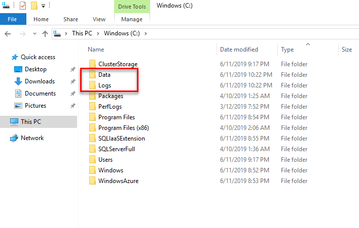

17. Launch **SQL Server Management Studio 17**, and connect to the local instance of SQL Server.

18. Click **Connect** to login to SQL Server.

    

19. Use the PowerShell or PowerShell ISE to deploy the cloudshop database by running the command below. Deploy-cloudshop-db.ps1 script is available in this GitHub repository. The script will deploy the cloudshop database to the database servers. 
    
    >**Note**: You need to pass the parameters below with the PowerShell script. If you download the script from the URL below in your local desktop or any drive, just copy and paste in your PowerShell window.
    
    https://github.com/opsgility/cw-building-resilient-iaas-architecture/tree/master/script-extensions 

    
    PS C:\Users\demouser.SQL0\Desktop> .\deploy-cloudshop-db.ps1  -user "demouser" -password "demo@pass123" -dbsource "https://cloudworkshop.blob.core.windows.net/building-resilient-iaas-architecture/AdventureWorks2012.bak" -sqlConfigUrl "https://raw.githubusercontent.com/opsgility/cw-building-resilient-iaas-architecture/master/script-extensions/configure-sql.ps1"


    >**Note**: You may need to wait few minutes to view the newly created AdventureWorks database in SSMS.

20. SQL Server Availability Groups require that the database be in full recovery mode. To put your database in full recovery mode, open SSMS - Right click AdventureWorks database - Task - Back Up. Make sure **Backup type** and **Recovery Type** is **Full** selected. Click **Ok** to initiate the backup. 

    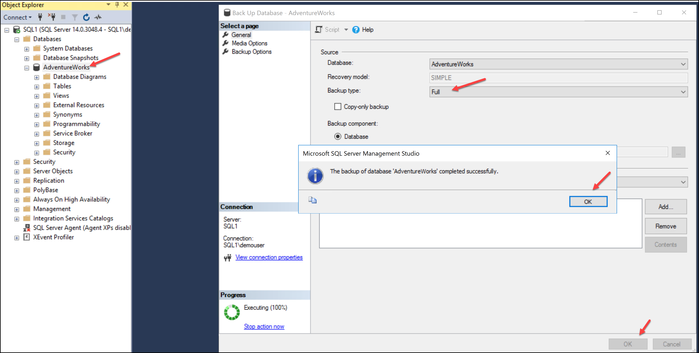


21. Expand **AlwaysOn High Availability -\> Availability Groups**, right-click **Availability Databases** (Primary), - Add Database -  and select Adventure works and continue the prompt to add the database to the availability group. This will start the wizard.
    
22. Click **Next** on the Introduction Page of the Wizard.
    
23. Click the check box next to the AdventureWorks database. Then click Next.
    
    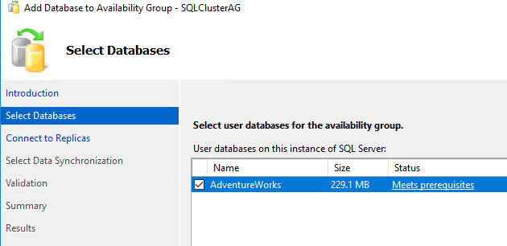

    >**Note**: If your AdventureWorks database does not meet the prerequisites, you should double-check that your database is in full recovery mode and that you have taken a full backup.

24. On the connect to existing Secondary Replicas page. Click the Connect button using the default credentials. On the Connect to Server box click to the connect button using the default credentials here as well. Once connected click the Next button to continue.
    
    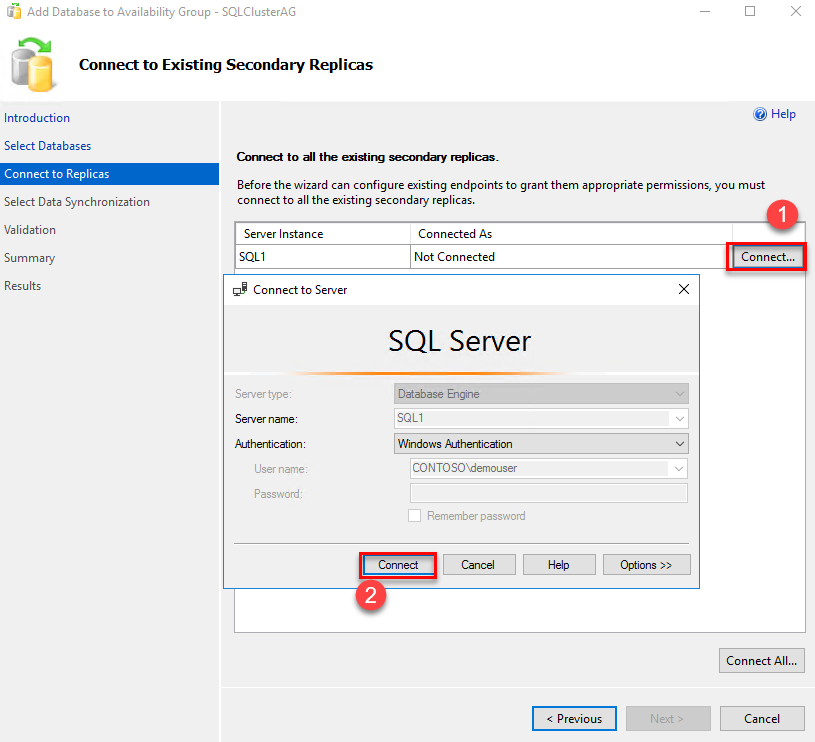

25. Use the default of Automatic Seeding and click the Next button. 
    
26. On the validation screen your results should all of the status of Success. Click Next and then Finish to conclude the Wizard. Close the wizard by clicking the close button.
    
    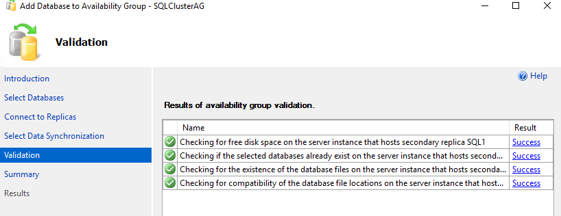

27. Once completed, Right click the **Availability Groups** - **Show Dashboard**. Your dashboard should look similar to this:

    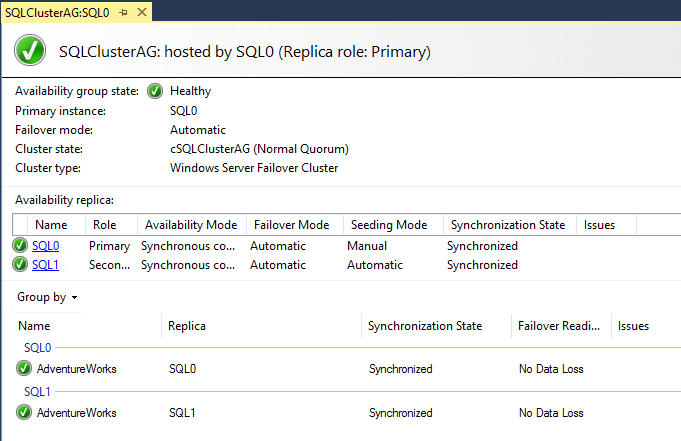

### Task 2: Build a scalable and resilient web tier

In this task, you will deploy a highly available web site. 

1. Navigate to the URL: https://github.com/opsgility/cw-building-resilient-iaas-architecture and click to **Deploy to Azure** on the sample for building a resilient IaaS Architecture - Deploy Web Tier.
   
2.  Specify the existing resource group **CloudShopRG**. 

3.  **Subnet ID**: Go to **resources.azure.com** then go to Subscription - Resource Group - ContosoRG - Providers - Microsoft.Network - VirtualNetworks - **Find subnet id for App Subnet**. Copy the full subnet ID in between the **" "** quote.

4.  Check the **I agree to the terms and conditions state above** checkbox on the page and click **Purchase**.

    >**Note**: It could take up to 30 minutes to deploy the environment.

### Summary

In this exercise, you deployed resilient web servers behind a load balancer, and a SQL Always-On Availability Group for database resiliency through an ARM template. Also, you deployed resilient web tier with an external load balancer through an ARM template.

## Exercise 4: Configure SQL Server Managed Backup 

Duration: 15 minutes

In this exercise, you will configure SQL Server Managed Backup to back up to an Azure Storage Account.

### Task 1: Create an Azure Storage Account

In this task, you will add a 3rd node to the SQL Always-On deployment in a second region that you can then failover with Azure Site Recovery in the event of a failure in the primary region.

1.  From **LABVM**, execute the following PowerShell commands in the PowerShell ISE to create a new storage account and generate the T-SQL needed to configure managed backup for the AdventureWorks database. You must first login to Azure through the PowerShell console before the execution of the following command.

    ```powershell
    $storageAcctName = "[unique storage account name]"

    $resourceGroupName = "CloudShopRG"
    $containerName= "backups"
    $location = "East US 2"
    $storageSkuName = "Standard_LRS"

    "Creating Storage Account $storageAcctName"
    $sa = New-AzureRmStorageAccount -ResourceGroupName $resourceGroupName  `
        -Name $storageAcctName `
        -Location $location `
        -SkuName $storageSkuName 

    $storageKey = (Get-AzureRmStorageAccountKey -Name $storageAcctName -ResourceGroupName $resourceGroupName )[0].Value
    $context = New-AzureStorageContext -StorageAccountName $storageAcctName -StorageAccountKey $storageKey

    Write-Host "Creating New Storage Container  $containerName" 
    New-AzureStorageContainer -name $containerName -permission container -context $context

    $fullSasToken = New-AzureStorageContainerSASToken -Name $containerName -Permission rwdl -FullUri -Context $context  
    $containerUrl = $fullSasToken.Substring(0,$fullSasToken.IndexOf("?"))
    $sasToken = $fullSasToken.Substring($fullSasToken.IndexOf("?")+1)

    $enableManagedBackupScript = @"
    --------------------
    ---BEGIN TSQL Script
    --------------------
    CREATE CREDENTIAL [$containerUrl] 
    WITH IDENTITY = 'Shared Access Signature', 
         SECRET = '$sasToken' 

    GO

    EXEC msdb.managed_backup.sp_backup_config_basic   
     @enable_backup = 1,   
     @database_name = 'AdventureWorks',  
     @container_url = '$containerUrl',   
     @retention_days = 30
       
     --------------------
     ---END TSQL Script
     --------------------
    "@

    Write-Host $enableManagedBackupScript 
    ```

2.  Execute the code using PowerShell ISE. Make sure you change the **\$storageAcctName = \"\[unique storage account name\]\"** field to a unique storage account name across Azure prior to execution. 

3.  Save the T-SQL code generated between the **Begin TSQL Script** and **End TSQL Script** in your PowerShell ISE output after execution into a notepad file. This code creates an identity using a Shared Access Signature (SAS) to a container in the storage account and configures managed backup when executed.

### Task 2: Configure managed backup in SQL Server

1.  Connect to **SQL0** using remote desktop and launch SQL Server Management Studio and connect to the database instance.

2.  Right click on **SQL0**, and click **New Query**.

    

3.  Paste in the following code and click **Execute** to enable SQL Server Agent extended stored procedures. Refresh SQL Server Management Studio and if SQL Server Agent is stopped right click on it and click Start.

    ```sql
    EXEC sp_configure 'show advanced options', 1
    GO
    RECONFIGURE
    GO
    EXEC sp_configure 'Agent XPs', 1
    GO
    RECONFIGURE
    GO
    ```

4.  Paste the T-SQL code you copied in the previous task into the query window replacing the existing code and click **Execute**. This code creates the new SQL identity with a Shared Access Signature for your storage account. 

5.  Paste the code into the query window replacing the existing code and click **Execute** to create a custom backup schedule.

    ```sql
    USE msdb;  
    GO  
    EXEC managed_backup.sp_backup_config_schedule   
         @database_name =  'AdventureWorks'  
        ,@scheduling_option = 'Custom'  
        ,@full_backup_freq_type = 'Weekly'  
        ,@days_of_week = 'Monday'  
        ,@backup_begin_time =  '17:30'  
        ,@backup_duration = '02:00'  
        ,@log_backup_freq = '00:05'  
    GO
    ```
6.  Execute the following tSQL in the query window to generate a backup on-demand. You can also specify Log for \@type.

    ```sql
    EXEC msdb.managed_backup.sp_backup_on_demand   
    @database_name  = 'AdventureWorks',
    @type ='Database'
    ```
    
## Exercise 5: Validate resiliency

### Task 1: Validate resiliency for the CloudShop application 

1.  In the Azure portal, open the **CloudShopRG** resource group. Click the Load Balancer, **OPSLB**.

2.  Click the **Overview** tab and copy the public IP address to the clipboard, and navigate to it in a different browser tab.

3.  After the application is loaded, click the Spike CPU button to simulate an auto scale event.

    

4.  After 15-20 minutes, refresh the browser and you will see cloud shop site is running and switched from one web server to another one. 

### Task 2: Validate SQL Always On

1.  Within the Azure portal, click on Virtual Machines and open **SQL0** Click **Stop** at the top of the blade to shut the virtual machine off.

2.  After the VM is deallocated, refresh the CloudShop application in your browser. If the page loads with data in the dropdown list SQL has successfully failed over the primary node to the secondary. You can login to the secondary VM (SQL1) and connect via SQL Server Management Studio to confirm.

### Task 3: Validate backups are taken 

1.  In the Azure portal, click All Services and search for Recovery Vault. Click the link and you should see the two recovery vaults created as part of the deployment of the Active Directory domain controllers.

2.  Open each vault and validate that a backup of the VM has occurred.

    

    >**Note**: Backup storage consumption may be 0 B if a backup has not occurred. The timing of backups is driven by the policy associated with the backup. Only one policy can be assigned to a virtual machine when using the Azure Backup Extension for Virtual Machines.

3.  To validate the SQL Server backup, open the Storage Account created earlier in the Azure portal and click **Blobs** -\> and then **backups**. If the backup has already completed, you will see the backup file in the container.

    

## Exercise 6: Implementing Azure Site Recovery 

### Task 1: Configure ASR Protection for Cloud Shop

1. In the Azure Portal - Resource Group - BackupVault2RG and open the BackupVault2.
   
2. In the **BackupVault2** blade, click on **Site Recovery** under **GETTING STARTED**.
   
3. Under **FOR ON-PREMISES MACHINES AND AZURE VMS** click **Step 1: Replicate Application**.

    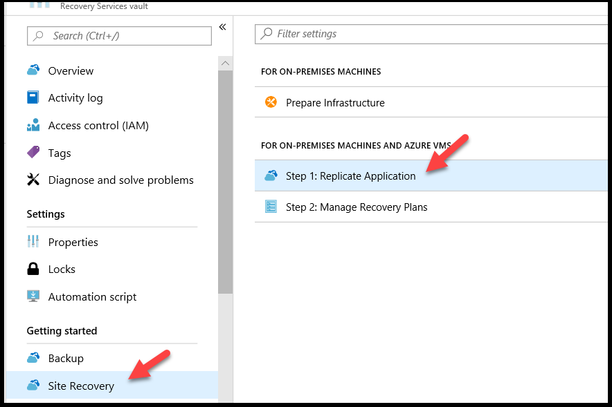

4. On Step 1 Source, under Source Location choose the azure region where your Cloud Shop deployment exists. Then under Source resource group select the resource group where your Cloud Shop deployment exists (e.g. "CloudShopRG"). Select **Resource Manager** as Azure VM Deployment Model. Click OK.

    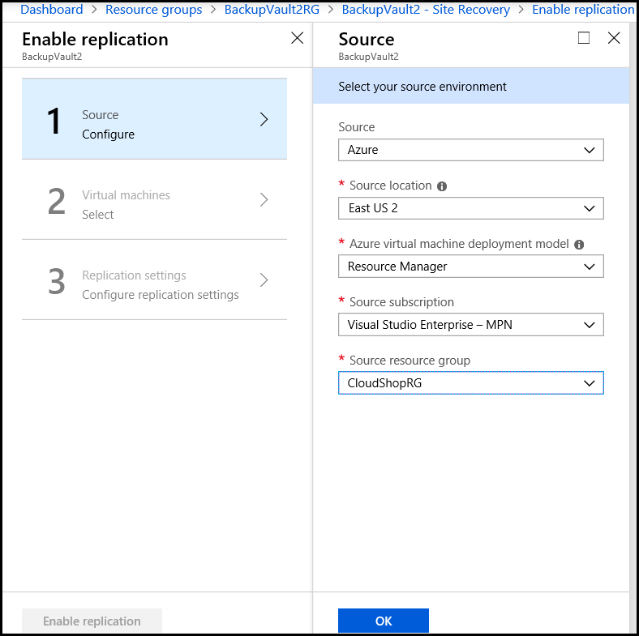

5. On Step 2, Select the Virtual Machines (Web and SQL Servers) for the replication.

6. On the Configure settings blade, notice that you can alter the target resource group and virtual network settings, along with the replication policy. Click **Create target resources**. 

    >**Note**: Do not close the blade. It will close by itself after the target resources are created (2-3 minutes).

7. Several Site Recovery jobs will be initiated which are creating the replication policy as well as the target resources to be used during a failover. 

8. If you click on the Enable replication job, you can see additional details of what takes place when protecting a VM. It may take up to 30 minutes to complete the job. You can review it under Monitoring - Site Recovery Jobs at the Recovery Services Vault BackupVault2 blade. 
   
    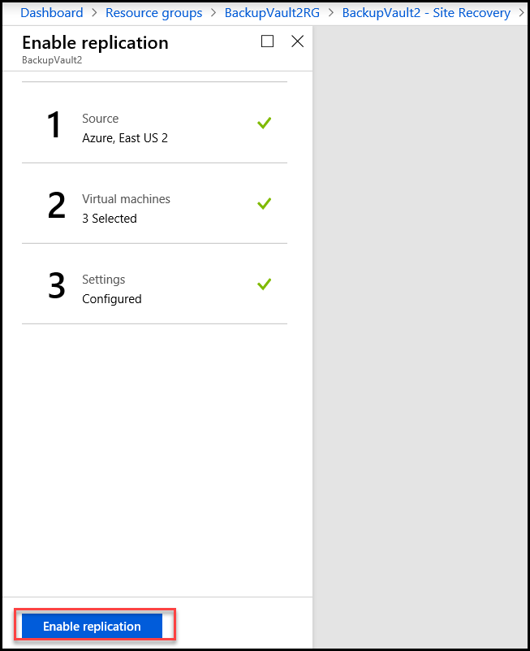

9. Once all the Enable replication jobs are successful, click on **Replicated items** under **Protected Items** to view the status of the initial replication.
    
10. While waiting for the initial replication/synchronization, move on to the next task.

### Task 2: Creating the Recovery Plan

In this task, you will create the recovery plan that will be used to orchestrate failover actions, such as the order in which failed-over VMs are powered on.

1. Within the properties of the Recovery Services vault, click on **Recovery Plans (Site Recovery)** under Manage. Click on Step 2: Manage Recovery Plans.

    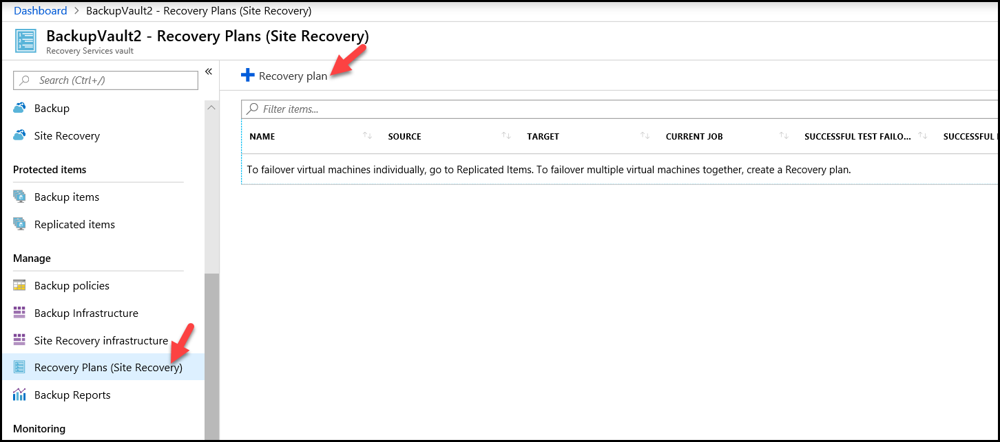

2. On the Create recovery plan blade enter the name CloudShopRP. In the Source area select the region where you deployed Cloud Shop. The Target will be automatically selected. Under Allow items with deployment model, select Resource Manager. Click Select items and select the Virtual Machines. Click OK and, back on the Create recovery plan blade, click OK.

    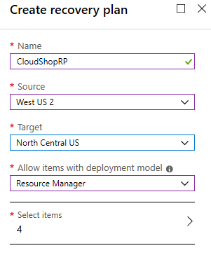

3. After a minute or two, you should see the CloudShopRP on the Recovery plans blade. This recovery plan would bring up both servers at once during a failover. In an N-tier application, it is often best to have the data tier come up first. So, we will edit the recovery plan to accomplish this. Click the CloudShopRP recovery plan.
   
4. On the CloudShopRP blade click Customize. Within the Recovery plan blade, click + Group.

    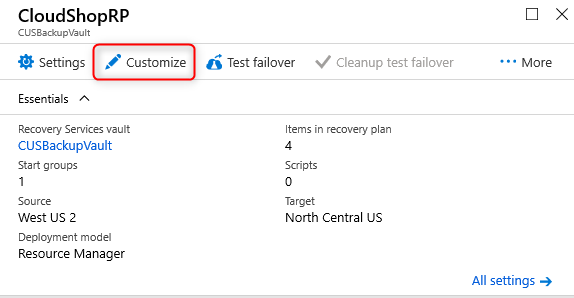

5. Under Group 1: Start click on the ellipse beside WebVM-1 and WebVM-2 and choose Delete machine. Leave only SQL Server in Group-1.


6. Click on the ellipse beside Group 2: Start and choose Add protected item and Add Both Web servers. Then save the changes.

    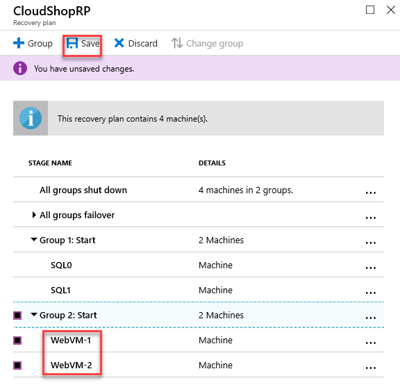

7. Now go back to the Recovery Services Vault BackupVault2 - Overview blade. Click on Site Recovery. Notice the two servers that make the Cloud Shop application are replicating. Take note of their status. They should be close to 100%. You will not be able to continue until they are finished replicating. 
   
   >**Note**: This may take up to an hour.

### Task 3: Creating the Test Fail Over.

1. Within the Azure portal, click on Resource Groups and locate the resource group with -asr added to the end of its name.
   
    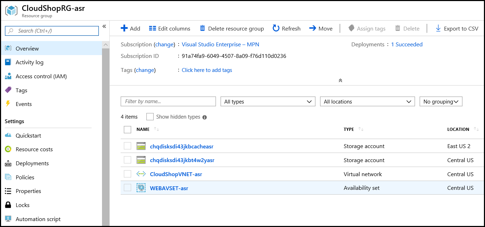

2. Click on this resource group and notice the resources created by ASR to support workload protection and failover.

3. Navigate back to the Overview section of your Recovery Services vault via the tile on your dashboard. Under Site Recovery, click on **Replicated items** and ENSURE both Cloud Shop VMs are fully protected before continuing.
   
4. Navigate back to the Overview section of the **Recovery Services Vault**. Under Site Recovery click on **Recovery Plans**.

    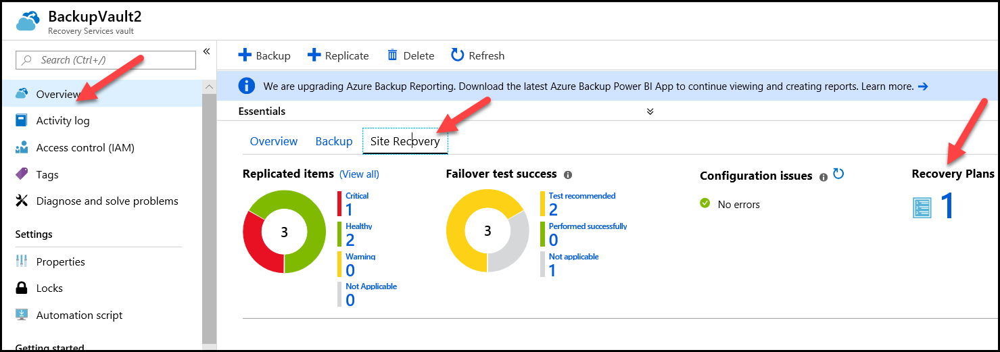

5. Right-click the CloudShopRP and click **Test Failover**.

    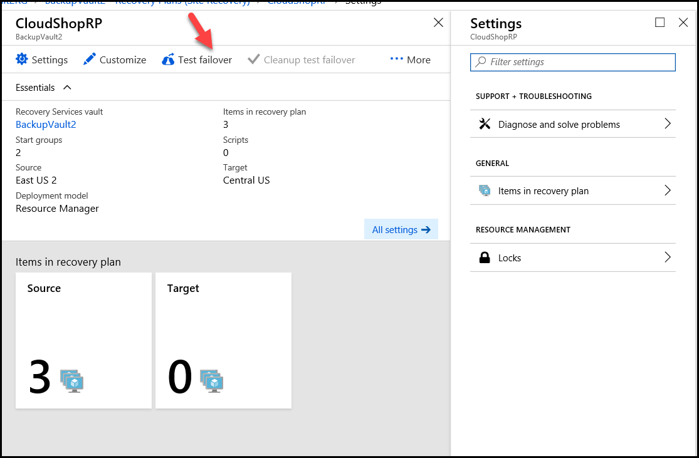

6. On the new Test failover blade, under Choose a recovery point, select Latest processed (low RTO) and under Azure virtual network choose **CloudShopVNET1-asr**. Click OK.

>**Note**: In a 'real-world' recovery test, you should choose an isolated virtual network so as to not impact the production application. 

7. From the Recovery Services vault blade, click Jobs under MONITORING AND REPORTS. In the new blade, under General, select **Site recovery jobs**.
On the Site recovery jobs blade click on the running job (Test failover).

8. On the Test failover blade, monitor the progress of the failover. Notice each step is executing and you can track the status and execution time. Also notice that the data tier is being started first, then the app tier, as per our recovery plan.

9. Navigate back to the Overview section of the **Recovery Services Vault**. Under Site Recovery click back on Recovery plans. Notice the Recovery plan is waiting on your input.


10. Under Resource groups in the left-hand navigation bar, navigate to the resource group created for this protected workload, called CloudShopRG1-asr. Note the resources that have been created as a part of the failover action. The compute resources were not provisioned until the failover occurred.

### Task 4: Cleaning the Test Fail Over.

1. In the Azure portal, navigate back to the **Recovery Services Vault** via the dashboard tile. In the **Overview** section of the Recovery Services Vault, under the **Site Recovery tab**, click on **Recovery plans**.
   
2. Notice that the recovery plan has a pending job called **Cleanup test failover** pending. Right-click on the **CloudShopRP recovery plan** and select **Cleanup test failover**.

3. In the Test failover cleanup blade, enter notes indicating that the test was successful, and click the checkbox indicating the testing is complete. Then click OK.
   
4. Navigate back to the Overview section of the **Recovery Services Vault**. Under Site Recovery find the jobs tile and click on In-progress jobs. 
   
5. On the Site recovery jobs blade, click on the running job. Monitor the status until the environment is cleaned up (approximately 5 minutes).

6. In the Azure portal navigate to Resource Groups and click on the **CloudShopRG1-asr** resource group. Notice that the virtual machines and network interfaces have all been deleted, leaving only the resources ASR initial created to support protection and the manually-created public IP address.


## After the hands-on lab

### Task 1: Delete the resource groups created

1.  Within the Azure portal, click Resource Groups on the left navigation.

2.  Delete each of the resource groups created in this lab by clicking them followed by clicking the Delete Resource Group button. You will need to confirm the name of the resource group to delete.

You should follow all steps provided *after* attending the hands-on lab.

