<div class="MCWHeader1">
Building a resilient IaaS architecture
</div>

<div class="MCWHeader2">
Hands-on lab step-by-step
</div>

<div class="MCWHeader3">
August 2018
</div>


Information in this document, including URL and other Internet Web site references, is subject to change without notice. Unless otherwise noted, the example companies, organizations, products, domain names, e-mail addresses, logos, people, places, and events depicted herein are fictitious, and no association with any real company, organization, product, domain name, e-mail address, logo, person, place or event is intended or should be inferred. Complying with all applicable copyright laws is the responsibility of the user. Without limiting the rights under copyright, no part of this document may be reproduced, stored in or introduced into a retrieval system, or transmitted in any form or by any means (electronic, mechanical, photocopying, recording, or otherwise), or for any purpose, without the express written permission of Microsoft Corporation.

Microsoft may have patents, patent applications, trademarks, copyrights, or other intellectual property rights covering subject matter in this document. Except as expressly provided in any written license agreement from Microsoft, the furnishing of this document does not give you any license to these patents, trademarks, copyrights, or other intellectual property.

The names of manufacturers, products, or URLs are provided for informational purposes only and Microsoft makes no representations and warranties, either expressed, implied, or statutory, regarding these manufacturers or the use of the products with any Microsoft technologies. The inclusion of a manufacturer or product does not imply endorsement of Microsoft of the manufacturer or product. Links may be provided to third party sites. Such sites are not under the control of Microsoft and Microsoft is not responsible for the contents of any linked site or any link contained in a linked site, or any changes or updates to such sites. Microsoft is not responsible for webcasting or any other form of transmission received from any linked site. Microsoft is providing these links to you only as a convenience, and the inclusion of any link does not imply endorsement of Microsoft of the site or the products contained therein.
© 2018 Microsoft Corporation. All rights reserved.

Microsoft and the trademarks listed at https://www.microsoft.com/en-us/legal/intellectualproperty/Trademarks/Usage/General.aspx are trademarks of the Microsoft group of companies. All other trademarks are property of their respective owners.

**Contents**

<!-- TOC -->

- [Building a resilient IaaS architecture hands-on lab step-by-step](#building-a-resilient-iaas-architecture-hands-on-lab-step-by-step)
    - [Abstract and learning objectives](#abstract-and-learning-objectives)
    - [Overview](#overview)
    - [Solution architecture](#solution-architecture)
    - [Requirements](#requirements)
        - [Help references](#help-references)
    - [Exercise 1: Prepare connectivity between regions](#exercise-1-prepare-connectivity-between-regions)
        - [Task 1: Deploy the lab environment](#task-1-deploy-the-lab-environment)
        - [Task 2: Create a VNET in the second region](#task-2-create-a-vnet-in-the-second-region)
        - [Task 3: Configure VNET Peering between region](#task-3-configure-vnet-peering-between-region)
    - [Exercise 2: Build the DCs in for resiliency](#exercise-2-build-the-dcs-in-for-resiliency)
        - [Task 1: Create Resilient Active Directory Deployment](#task-1-create-resilient-active-directory-deployment)
        - [Task 2: Create the Active Directory deployment in the second region](#task-2-create-the-active-directory-deployment-in-the-second-region)
        - [Task 3: Add data disks to Active Directory domain controllers (both regions)](#task-3-add-data-disks-to-active-directory-domain-controllers-both-regions)
        - [Task 4: Format data disks on DCs and configure DNS settings across connection](#task-4-format-data-disks-on-dcs-and-configure-dns-settings-across-connection)
        - [Task 5: Promote DCs as additional domain controllers](#task-5-promote-dcs-as-additional-domain-controllers)
        - [Summary](#summary)
    - [Exercise 3: Build web tier and SQL for resiliency](#exercise-3-build-web-tier-and-sql-for-resiliency)
        - [Task 1: Deploy SQL Always-On Cluster](#task-1-deploy-sql-always-on-cluster)
        - [Task 2: Convert the SQL deployment to Managed Disks](#task-2-convert-the-sql-deployment-to-managed-disks)
        - [Task 3: Build a scalable and resilient web tier](#task-3-build-a-scalable-and-resilient-web-tier)
        - [Summary](#summary)
    - [Exercise 4: Configure SQL Server Managed Backup](#exercise-4-configure-sql-server-managed-backup)
        - [Task 1: Create an Azure Storage Account](#task-1-create-an-azure-storage-account)
        - [Task 2: Configure managed backup in SQL Server](#task-2-configure-managed-backup-in-sql-server)
    - [Exercise 5: Validate resiliency](#exercise-5-validate-resiliency)
        - [Task 1: Validate resiliency for the CloudShop application](#task-1-validate-resiliency-for-the-cloudshop-application)
        - [Task 2: Validate SQL Always On](#task-2-validate-sql-always-on)
        - [Task 3: Validate backups are taken](#task-3-validate-backups-are-taken)
    - [After the hands-on lab](#after-the-hands-on-lab)
        - [Task 1: Delete the resource groups created](#task-1-delete-the-resource-groups-created)

<!-- /TOC -->

# Building a resilient IaaS architecture hands-on lab step-by-step 

## Abstract and learning objectives 

In this hands-on lab, you will deploy a pre-configured IaaS environment and then redesign and update it to account for resiliency and in general high availability. Throughout the hands-on lab you will use various configuration options and services to help build a resilient architecture.

At the end of the lab, you will be better able to design and use availability sets, Managed Disks, SQL Server Always on Availability Groups, as well as design principles when provisioning storage to VMs. In addition, you'll learn effective employment of Azure Backup to provide point-in-time recovery.

## Overview

Contoso has asked you to deploy their infrastructure in a resilient manner to insure their infrastructure will be available for their users and gain an SLA from Microsoft.

## Solution architecture

Highly resilient deployment of Active Directory Domain Controllers in Azure.
    

Deployment of a web app using scale sets, and a highly available SQL Always On deployment.
    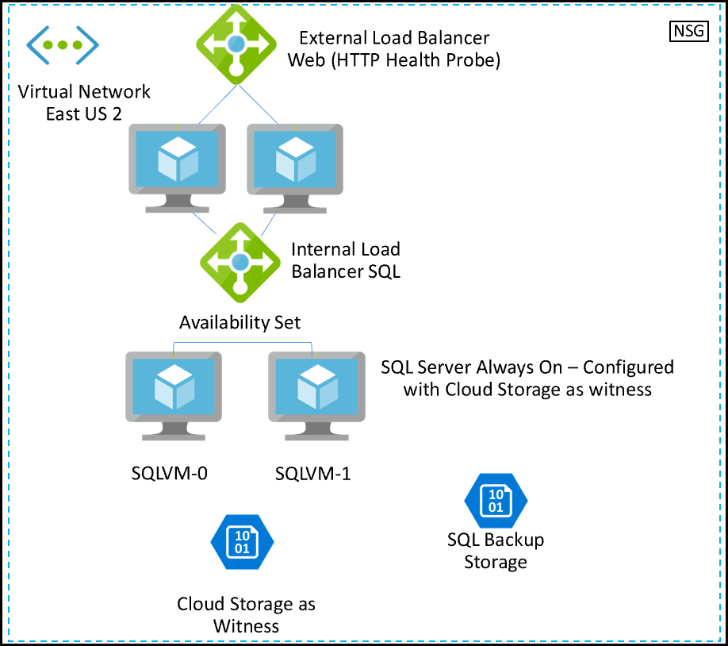

## Requirements

1.  Microsoft Azure Subscription

2.  Virtual Machine Built during this hands-on lab or local machine with the following:

    a.  Visual Studio 2017 Community or Enterprise Edition

    b.  Latest Azure PowerShell Cmdlets

    c.  <https://azure.microsoft.com/en-us/downloads/>

    d.  Ensure you reboot after installing the SDK or Azure PowerShell will not work correctly

### Help references
|    |            |
|----------|:-------------:|
| **Description** | **Links** |
| Authoring ARM Templates | <https://azure.microsoft.com/en-us/documentation/articles/resource-group-authoring-templates/> |
| Virtual Machine Scale Set Samples | <https://github.com/gbowerman/azure-myriad> |
| Azure Quick Start Templates | <https://github.com/Azure/azure-quickstart-templates> |
| Network Security Groups | <https://azure.microsoft.com/en-us/documentation/articles/virtual-networks-nsg/> |
| Managed Disks | <https://azure.microsoft.com/en-us/services/managed-disks> |
| Always-On Availability Groups | <https://docs.microsoft.com/en-us/sql/database-engine/availability-groups/windows/overview-of-always-on-availability-groups-sql-server?view=sql-server-2017> |
| SQL Server Managed Backup to Azure | <https://docs.microsoft.com/en-us/sql/relational-databases/backup-restore/sql-server-managed-backup-to-microsoft-azure?view=sql-server-2017> |
| Virtual Network Peering | <https://docs.microsoft.com/en-us/azure/virtual-network/virtual-network-peering-overview> |
| Azure Backup |  <https://azure.microsoft.com/en-us/services/backup/> |


## Exercise 1: Prepare connectivity between regions

Duration: 30 minutes

Contoso is planning to deploy infrastructure in multiple regions in Azure to provide infrastructure closer to their employees in each region as well as the ability to provide additional resiliency in the future for certain workloads. In this exercise, you will configure connectivity between the two regions.

### Task 1: Deploy the lab environment

1.  Login to the Azure portal (<https://portal.azure.com>) with the credentials that you want to deploy the lab environment to

2.  In a separate tab, navigate to: <https://github.com/opsgility/cw-building-resilient-iaas-architecture>

3.  Click the button **Deploy to Azure**

    

4.  Specify the Resource group name as **ContosoRG** and the region as **West Central US**, **check the two check boxes** on the page and click **Purchase**

    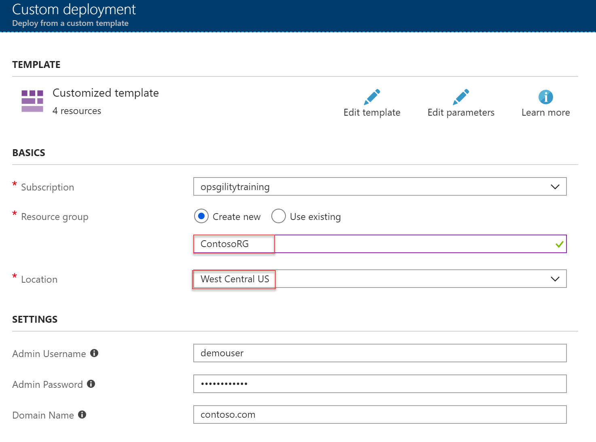

5.  Once the deployment is successful, validate the deployment by opening the **CloudShopWeb** virtual machine and navigating your browser to its public IP address

    

### Task 2: Create a VNET in the second region

1.  Browse to the Azure portal and authenticate at <https://portal.azure.com/>

2.  In the left pane, click **+ Create Resource**

3.  In the **New** blade, select **Networking \>** **Virtual Network**

    

4.  For the **Create virtual network** settings, enter the following information:

    -   Name: **VNET2**

    -   Address space: **172.16.0.0/16**

    -   Subscription: **Choose your subscription**

    -   Resource group: **Create new -- WUS2RG**

    -   Location: **West US 2**

    -   Subnet name: **Apps**

    -   Subnet address range: **172.16.0.0/24**
  
    -   DDoS protection: **Basic**

    -   Service endpoints: **Disabled**

    -   Click the **Create** button to continue


        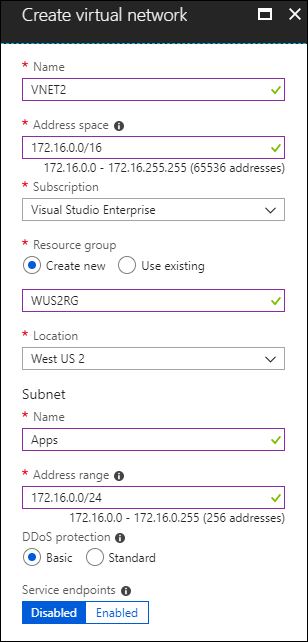

5.  Once the deployment is complete, add two more subnets to the virtual network. To do this, select the **Subnets \>** icon in the **Settings** area.\
    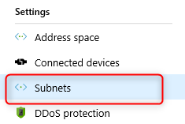

6.  Click the **+ Subnet** option, and enter the following settings:

    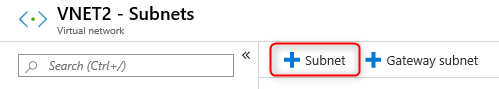

    -   Name: **Data**

    -   Address range (CIDR block): **172.16.1.0/24**

    -   Click the **OK** button to add this subnet:

        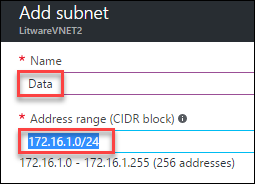

7.  Once the subnet is created successfully, repeat the above step for an **Identity** subnet with the following settings:

    -   Name: **Identity**

    -   Address range (CIDR block): **172.16.2.0/24**

    -   Click the **OK** button to add this subnet:

        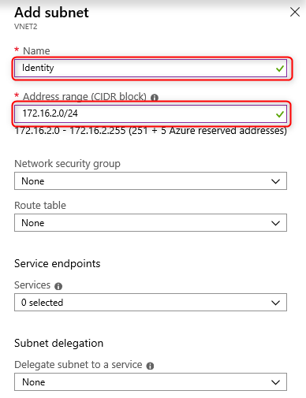

8.  The subnets will look like this once complete:

    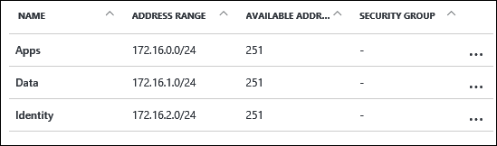

### Task 3: Configure VNET Peering between region

1.  Open the first virtual network (VNET1) by clicking **All Services -\> Virtual networks** and clicking the name

2.  Click on **Peerings** and click **+Add**

    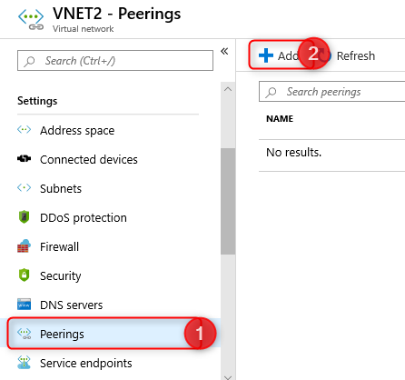

3.  Name the peering, **VNET1TOVNET2** and change the Virtual network dropdown to **VNET2** click **Allow forwarded traffic,** and then click **OK**

    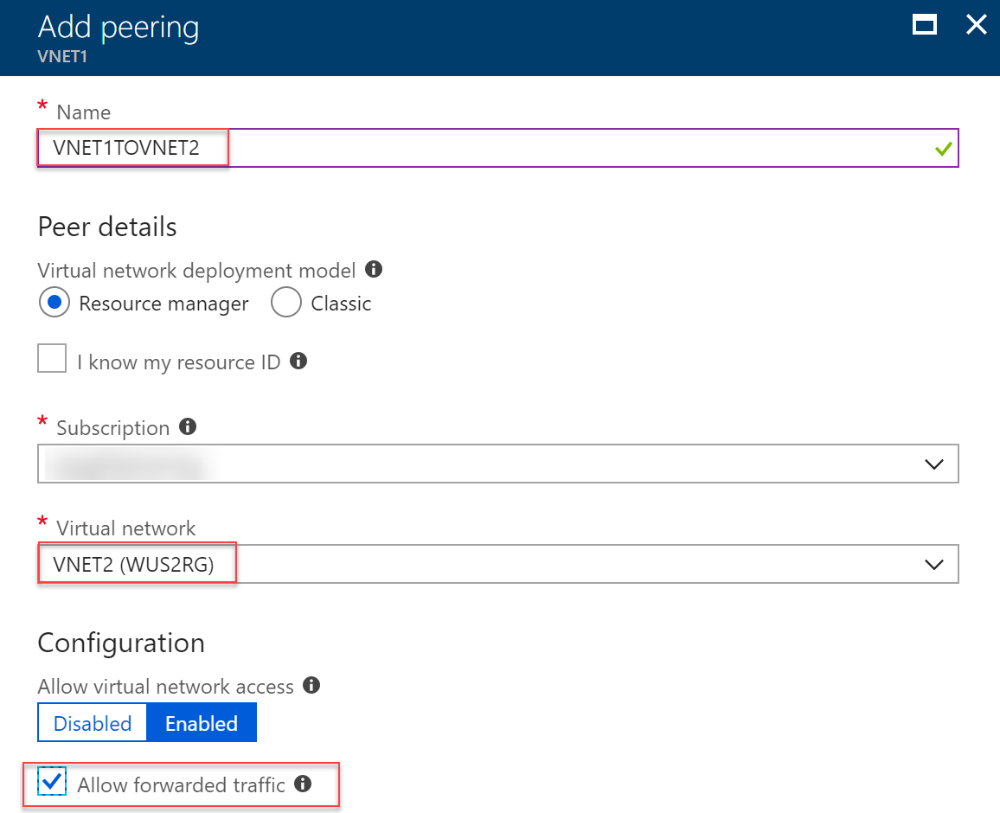

4.  Open the second virtual network (VNET2) by clicking **All Services -\> Virtual networks** and clicking the name

5.  Click on **Peerings** and click **+Add**

    

6.  Name the peering, **VNET2TOVNET1** and change the Virtual network dropdown to **VNET1** click **Allow forwarded traffic,** and then click **OK**

    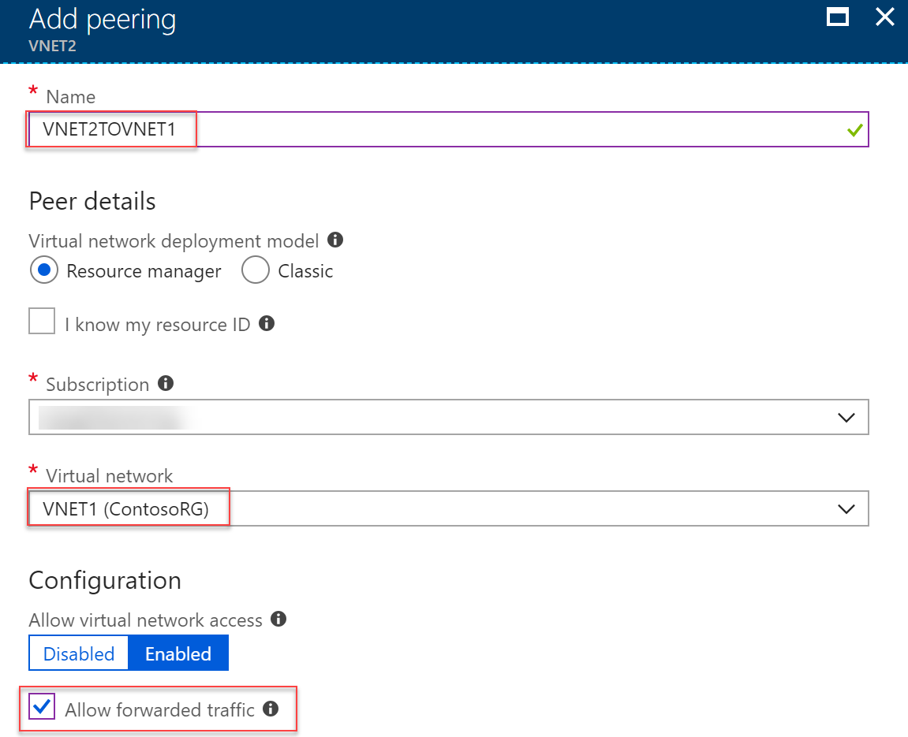

## Exercise 2: Build the DCs in for resiliency

Duration: 30 minutes

In this exercise, you will deploy Windows Server Active Directory configured for resiliency using Azure Managed Disks and Availability Sets in the primary region. You will then deploy additional domain controllers in a second region for future expansion of the Azure footprint.

### Task 1: Create Resilient Active Directory Deployment 

In this task, you will change the disk cache settings on the existing domain controller **Read Only** to avoid corruption of Active Directory database.

1.  Select **Virtual machines** in the left menu pane of the Azure portal

2.  Click on **ADVM**, and in the **Settings** area, select **Disks**

    

3.  On the Disks blade, click **Edit**

    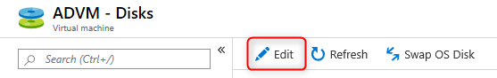

4.  Change the **Host caching** from **Read/Write** to **None** via the drop-down option, and click the **Save** icon

    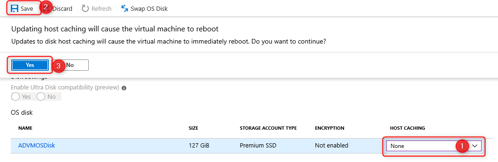

**Note**: In production, we would not want to have any OS drives that do not have read/write cache enabled. This machine will be decommissioned, but first, we want to make sure the AD Database and SYSVOL will not be corrupted during our updates.

5.  In the left pane, click **+ Create Resource**

6.  In the **New** blade, select **Compute** **\>** **Windows Server 2016 Datacenter**

    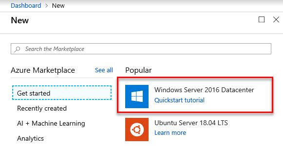

7.  In the **Create virtual machine** blade, enter the **Basics** information:

    -   Name: **DC01**

    -   VM disk type: **Premium SSD**

    -   Username: **demouser**

    -   Password: **demo\@pass123**

    -   Confirm password: **demo\@pass123**

    -   Subscription: **Select your subscription**

    -   Resource group: **Create New - ADRG**

    -   Location: **West Central US**

    -   Click the **OK** button to continue

        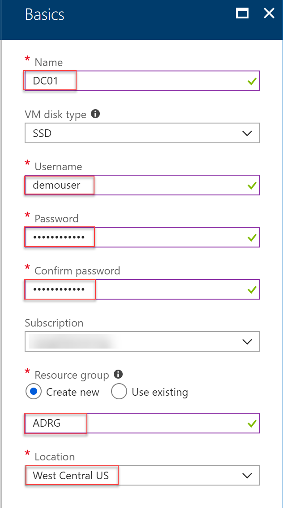

8.  For the **Size**, select **DS1\_V2**. You may have to select the **View All** option if it is not one of the recommended sizes.

9.  In the **Settings** options, choose the following configuration (accept the defaults if not specified below):
  
    -   Availability set: **Create new, ADAV**

    -   Storage Use Managed Disks: **Yes**

    -   Virtual Network: **Click the name to choose VNET1**

    -   Subnet: **Choose Identity as the subnet**

    -   Select public inbound ports: **RDP (3389)**

    -   Auto-shutdown: **Off**

    -   Guest OS Diagnostics: **Enabled**

    -   Backup: **Enabled**

    -   Recovery Services Vault: **Create New -\> BackupVault**

    -   Resource Group: **Create New -\> BackupVaultRG**

    -   Then, click the **OK** button to continue to the **Summary**

    > **Note**: Backup with a Domain Controller is a supported scenario. Care should be taken on restore. For more information see the following: <https://docs.microsoft.com/en-us/azure/backup/backup-azure-arm-restore-vms#backup-for-restored-vms>


    There will be a final validation and when this is passed, click the **Create** button to complete the deployment.

10. Give the deployment a few minutes to build the Availability Set resource. Then, repeat those steps to create **DC02**, as that will be another Domain Controller making sure to place it in the **ADAV** availability set and the existing **BackupVault**.

### Task 2: Create the Active Directory deployment in the second region

In this task, you will deploy Active Directory in the second region, so identity is available for new workloads.

1.  In the left pane, click **+ Create Resource**

2.  In the **New** blade, select **Virtual Machines \>** **Windows Server 2016 Datacenter**

    

3.  In the **Create virtual machine** blade, enter the **Basics** information:

    -   Name: **DC03**

    -   VM disk type: **SSD**

    -   Username: **demouser**

    -   Password: **demo\@pass123**

    -   Confirm password: **demo\@pass123**

    -   Subscription: **Select your subscription**

    -   Resource group: **WUS2ADRG**

    -   Location: **West US 2**

    -   Click the **OK** button to continue

        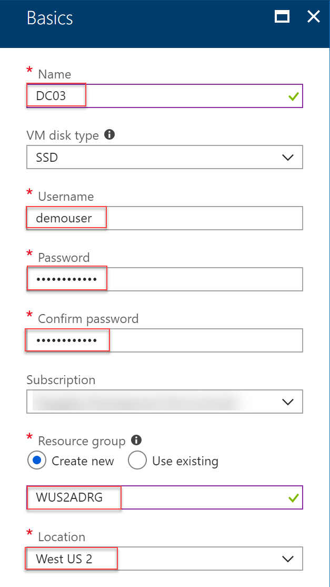

4.  For the **Size**, select **Standard DS1 V2**. You may have to select the **View All** option if it is not one of the recommended sizes.

5.  Click the **Select** button to continue to **Settings**

6.  In the **Settings** options, choose the following configuration (accept the defaults if not specified below):

    -   Availability set: **Create new, ADAV2**

    -   Storage Use Managed Disks: **Yes**

    -   Virtual Network: **Click the name to choose VNET2**

    -   Subnet: **Choose Identity as the subnet**

    -   Select public inbound ports: **RDP (3389)**

    -   Auto-shutdown: **Off**

    -   Guest OS Diagnostics: **Enabled**

    -   Backup: **Enabled**

    -   Recovery Services Vault: **Create New -\> BackupVault2**

    -   Resource Group: **Create New -\> BackupVault2RG**

    -   Then, click the **OK** button to continue to the **Summary**

7.  There will be a final validation. When this is passed, click the **Create** button to complete the deployment.

8. Give the deployment a few minutes to build the Availability Set resource. Then, repeat those steps to create **DC04**, as that will be another Domain Controller making sure to place it in the **ADAV2** availability set and the existing **BackupVault2**.

### Task 3: Add data disks to Active Directory domain controllers (both regions)

1.  Open **DC01** from the Azure portal

2.  In the **Settings** blade, select **Disks**

3.  Click on **Add data disk**

    

4.  On the settings for the **Data disk menu**, click on the drop-down menu under **Name**, and click **Create Disk**

    

5.  On the Create managed disk blade, enter the following, and click **Create**:

    -   Name: **DC01-Data-Disk-1**

    -   Resource group: **Use existing / ADRG**

    -   Account Type: **Premium SSD**

    -   Source Type: **None (empty disk)**

    -   Size: **32**


6.  Once the disk is created, the portal will move back to the **Disks** blade. Locate the new disk under **Data Disks**, change the **HOST CACHING** to **None**, and click **Save**.

    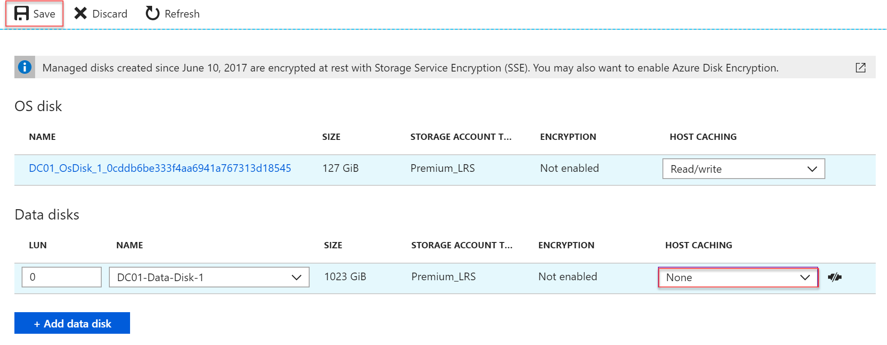

7.  Perform these same steps for **DC02** naming the disk **DC02-Data-Disk-1**. Also, make sure the Host caching is set to **None**.

8.  Perform the add disk steps for **DC03** and **DC04** naming the disks **DC03-Data-Disk-1** and **DC04-Data-Disk1** respectively. Make sure to set the Host caching to **None**.

### Task 4: Format data disks on DCs and configure DNS settings across connection

1.  Click on **DC01** on the Azure dashboard

2.  Click the **Connect** icon on the menu bar to RDP into the server

    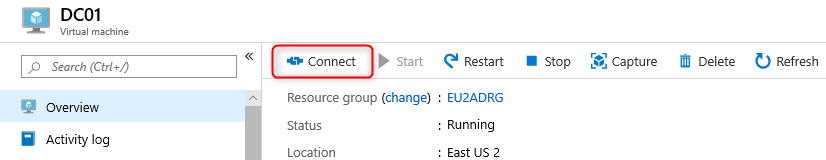

3.  Login to the VM with **demouser** and password created during deployment

    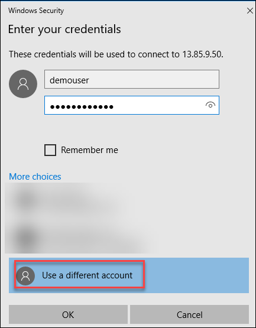

    > **Note**: You might have to click "Use a different account," depending on which OS you are connecting from to put in the demouser credentials.

4.  Click **Yes** to continue to connect to DC01

5.  Once the logged in, click on **File and Storage Services** in **Server Manager**

    

6.  Click on **Disks**, and let the data load. You should now see an **Unknown** partition disk in the list.

    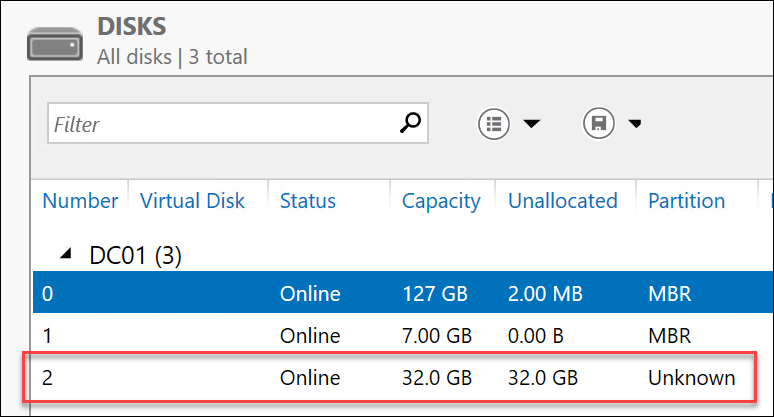

7.  Right-click on this disk and choose **New Volume...** from the context menu options

    

8.  Follow the prompts in the **New Volume Wizard** to format this disk, as the **F:\\** drive for the domain controller

9.  Perform these same steps for the remaining 3 DCs (**DC02**, **DC03**, and **DC04**)

10. Go back to the Azure portal dashboard and click on **DC01**. Next, click on **Networking** followed by the name of the NIC.

    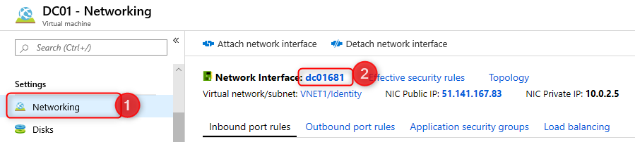

    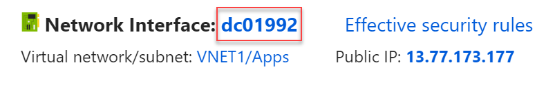

11. Select the **IP** **configurations**

    

12. Click the IP Configuration named **ipconfig1**

    

13. On the **ipconfig1** blade, change the **Private IP address settings** to **Static.** Leave all the other settings at their defaults and click the **Save** icon.

14. Once Azure notifies the network interface change is saved, repeat these steps on the remaining 3 DCs (**DC02**, **DC03**, and **DC04**)

    > **Note**: Static IP for DC02 should be 10.0.2.6. DC03 should be 172.16.2.4 and DC04 should be 172.16.2.5.

15. In the Azure portal, click **More Services \>** and in the filter, type in **Virtual Networks**. Select **VNET2** from the list.

16. In the **Settings** area, select **DNS Servers**

    

17. Change **DNS servers** to **Custom**, and provide the address of **10.0.2.4** in the **Add DNS server** box. Click the **Save** icon to commit the changes.

    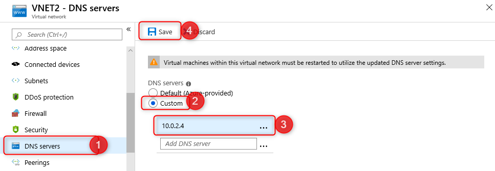

18. At this point, restart **DC03** and **DC04**, so they can get their new DNS Settings

    > **Note**: DC01 and DC02 received the correct DNS settings from the VNET DNS configured prior to their deployment, as the Customer DNS was set before the hands-on lab for that VNET. DC03 and DC04 must be rebooted to receive the updated DNS settings from their virtual network.

19. While these two DCs are rebooting, RDP into **ADVM**, and run the following PowerShell command:

    ```
    Set-DnsServerPrimaryZone -Name contoso.com -DynamicUpdate NonsecureAndSecure 
    ```

    > **Note**: This would not be done in a production environment, but for purposes of our hands-on lab, we need to perform this step for the SQL Cluster in the coming tasks.

20. After the PowerShell command runs, Sign Out of **ADDC**

### Task 5: Promote DCs as additional domain controllers 

1.  Login to **LABVM** created before the hands-on lab or the machine where you have downloaded the exercise files

2.  Browse to the Azure portal and authenticate at <https://portal.azure.com/>

3.  Click on **DC01** on the Azure dashboard

4.  In the **Settings** area, click **Extensions**

    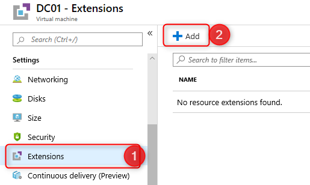

5.  Click the **+ Add** icon

    

6.  Choose **Custom Script Extension** by Microsoft Corp., and click the **Create** button to continue

    

7.  Browse to the **C:\\HOL** folder and select the **AddDC.ps1** script by clicking the folder icon for **Script file (Required)**. Then, click the **OK** button to continue.

    

8.  This script will run the commands to add this DC to the domain as an additional DC in the contoso.com domain. Repeat these steps for **DC02**, **DC03**, and **DC04**.

9.  Once this succeeds, you will see a **Provisioning succeeded** message under **Extensions** for all four domain controllers

    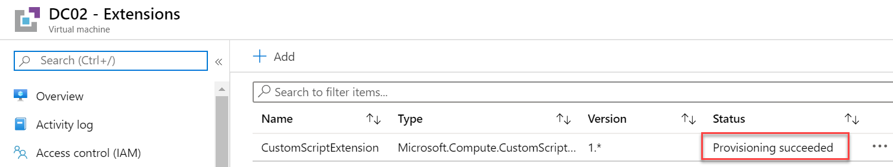

    > **Note**: While this a live production environment, there would need to be some additional steps to clean up Region 1 and to configure DNS, Sites and Services, Subnets, etc. Please refer to documentation on running Active Directory Virtualized or in Azure for details. ADDC should be demoted gracefully, and if required, a new DC can be added to the ADAVSet and data disk attached for F:\\.

10. Open the settings for VNET2 in the Azure portal. Under DNS servers, remove the exiting custom DNS entry and add the two new domain controller IP addresses and click **Save**

    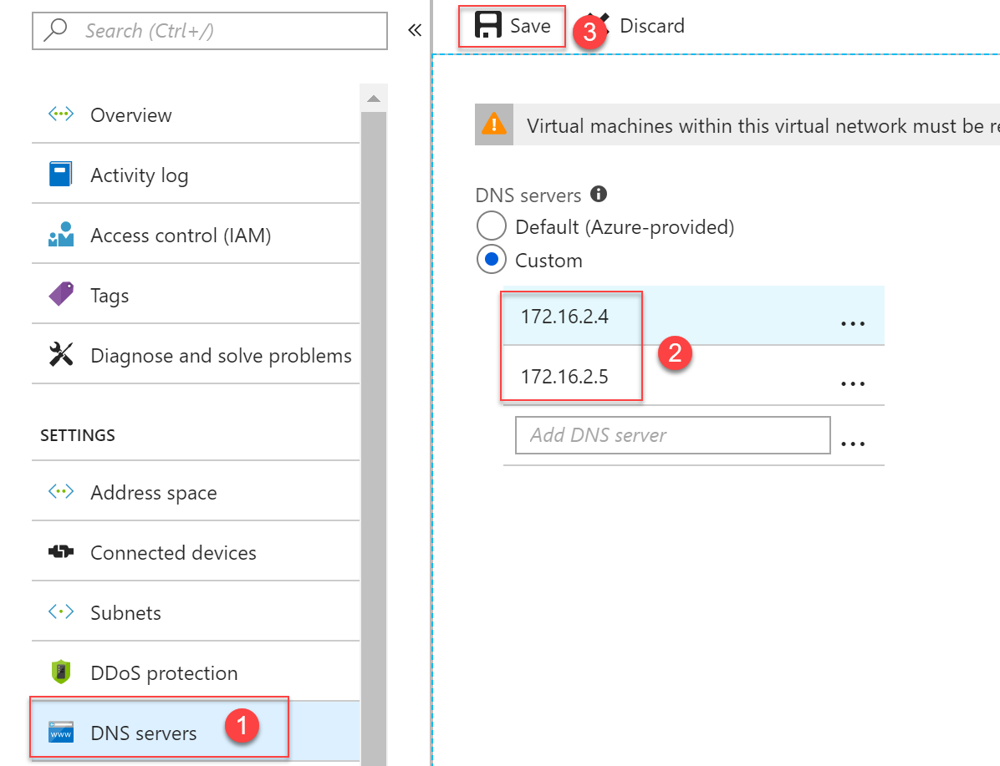

### Summary

In this exercise, you deployed Windows Server Active Directory and configured for resiliency using Azure Managed Disks and Availability Sets in the primary and the failover region.

## Exercise 3: Build web tier and SQL for resiliency

Duration: 60 minutes

In this exercise, you will deploy resilient web servers using VM scale sets and a SQL Always-On Cluster for resiliency at the data tier.

### Task 1: Deploy SQL Always-On Cluster 

In this task, you will deploy a SQL Always-On cluster using an ARM template that deploys to your existing Virtual Network and Active Directory infrastructure.

1.  Navigate to <https://github.com/opsgility/cw-building-resilient-iaas-architecture-sql> and click the **Deploy to Azure Button**

    

2.  Specify the resource group name as **CloudShopRG** and ensure the region is set to **West Central US**

    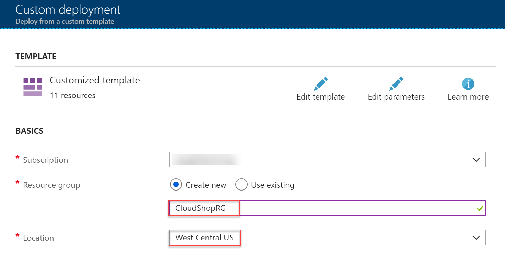

3.  Check the checkbox for agreeing to terms and conditions and click Purchase to start the deployment.

    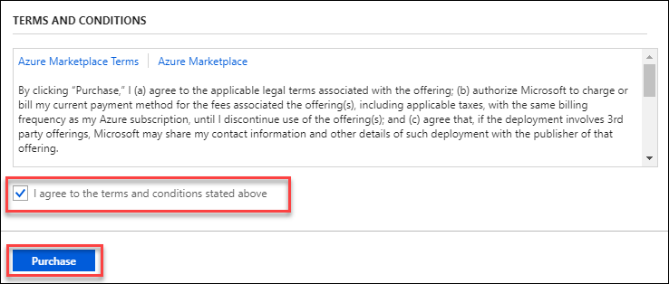

4.  Wait until the template deployment is complete before continuing.

5.  Open a remote desktop connection to the **SQLVM-1** virtual machine you created in the previous task, and login using the **contoso\\demouser** account with the password **demo@pass123**.

    

6.  Once connected, open the Windows Explorer, check to make sure the F:\\ Drive is present, and the Database was restored to the F:\\Data directory

7.  Next, run this command from **SQLVM-1** to create a Cluster for the SQL Always-On Group. **Start \> PowerShell \> Enter**, and execute the following commands:

```
    New-Cluster -Name CLUST-1 -Node SQLVM-1,SQLVM-2,WITNESSVM -StaticAddress 10.0.1.8 
```

8.  This will create a three-node cluster with a static IP address. It is also possible to use a wizard for this task, but the resulting cluster will require additional configuration to set the static IP address to be viable in Azure. This is due to the way Azure DHCP distributes IP addresses causing the cluster to receive the same IP address as the node it is executing on resulting in a duplicate IP address and failure of the cluster service.

    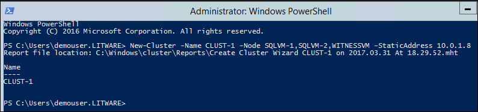

9.  Once the PowerShell command has completed, open the **Failover Cluster Manager**, expand the **CLUST-1** cluster, select Nodes, validate all nodes are online and Assigned Vote and Current Vote are listed as "1" for all nodes of the cluster

    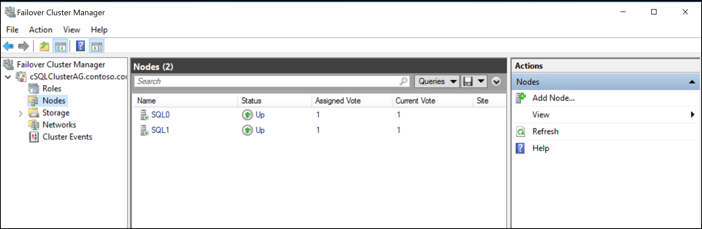

10. Launch **SQL Server 2016 Configuration Manager** on **SQLVM-1**

    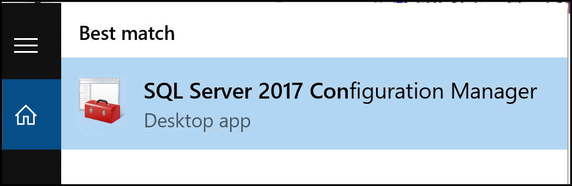

11. Click **SQL Server Services**, right-click **SQL Server (MSSQLSERVER)**, and select **Properties**

    

12. Select the **AlwaysOn High Availability** tab, check the box for **Enable AlwaysOn Availability Groups**, click **Apply**, and click **OK** on the message that changes will not take effect until after the server is restarted

     Properties dialog box")

13. On the **Log On** tab, change the service account to **contoso\\demouser** using **demo\@pass123** for the password. Click **OK** to accept the changes, and click **Yes** to confirm the restart of the server.

     Properties dialog box")

    

14. Minimize the RDP Window for **SQLVM-1**

15. From the Azure portal, locate **SQLVM-2**, and click **Connect.** Make sure to Sign On using the **contoso\\demouser** domain account.

    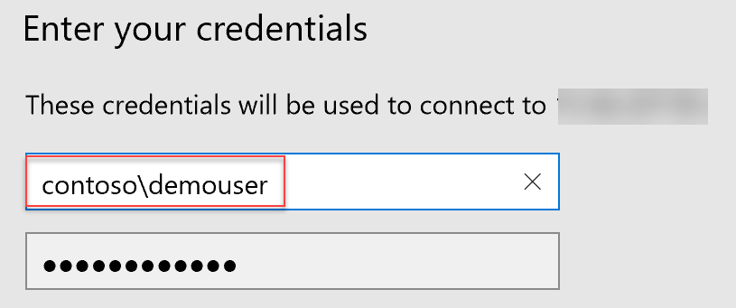

16. From the RPD Session on **SQLVM-2**, repeat steps to configure **AlwaysOn High Availability** and **Log On** using SQL 2016 Configuration Manager

17. Move back to RDP session with **SQLVM-1**

18. Launch **SQL Server 2016 Management Studio**, and connect to the local instance of SQL Server

    

19. Click **Connect** to login to SQL Server

    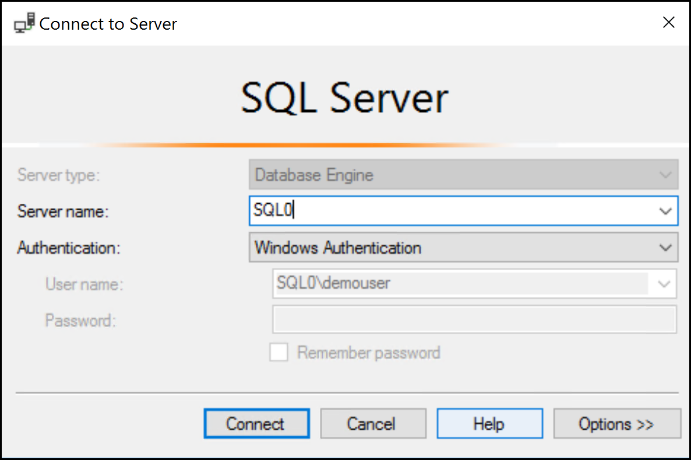

    > **Note**: Availability Groups require that the databases be in full recovery mode and that an initial backup has been taken. If you deployed via the ARM template this will be done for you.

20. Minimize your **SQLVM-1** RDP Session and then Copy from your **LABVM** the file **C:\\HOL\\CreateAGRegion1.sql** and then back on **SQLVM-1** paste it into the **C:\\SQDATA** directory

21. Within SQL Server Management Studio, open the **C:\\SQDATA\\CreateAGRegion1.sql** file

     window")

22. Select the **Query** menu and click **SQLCMD Mode**

    

23. Click the **Execute** button to configure the Availability Group

    

    > **Note**: Some security messages are expected. This script was generated by the SQL Server New Availability Group Wizard and modified to support AUTOMATIC\_SEEDING. Automatic seeding makes initializing replicas much easier, and the speed of the process is increased significantly. For more details on automatic seeding and performance improvements please refer to SQLCAT's blog: <https://blogs.msdn.microsoft.com/sqlcat/2016/06/28/sqlsweet16-episode-2-availability-groups-automatic-seeding-2/>.

    

24. Expand **AlwaysOn High Availability -\> Availability Groups**, right-click **AdventureWorksAG** (Primary), and choose **Show Dashboard**. Your dashboard should look like this:

    

25. On the Azure portal, open the settings of the **BackendLB** load balancer in the **CloudShopRG** resource group

    

26. Click on **Backend pools**

    

27. Click **BackendPool1** which will open a window showing **SQLVM-1**. Click the **Add a target network IP configuration**.

    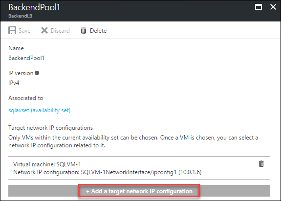

28. From the List for Target Virtual Machine select the **SQLVM-2** and the Network IP Configuration **ipconfig1 (10.0.1.7)**. Note that your IP address may be different.

    

29. Click the **Save** to add **SQLVM-2** to the **BackendPool1**

    

30. Go back to **SQLVM-1** and open an **Administrative PowerShell\_ISE** session. Execute the following PowerShell to configure your cluster for the probe port.

    ```
    $ClusterNetworkName = "Cluster Network 1"
    $IPResourceName = "AdventureWorksAG_10.0.1.9"
    $ILBIP = "10.0.1.50"
    Import-Module FailoverClusters
    Get-ClusterResource $IPResourceName | Set-ClusterParameter -Multiple @{"Address"="$ILBIP";"ProbePort"="59999";"SubnetMask"="255.255.255.255";"Network"="$ClusterNetworkName";"EnableDhcp"=0}
    Stop-ClusterResource -Name $IPResourceName
    Start-ClusterResource -Name "AdventureWorksAG"
    ```


31. Connect to **SQLVM-02** and launch **SQL Server Management Studio**

32. Open a Server connection to the **AdventureWorks** listener endpoint to verify connectivity. The listener is like entering a SQL Server's Name, but this is the Availability Group.

    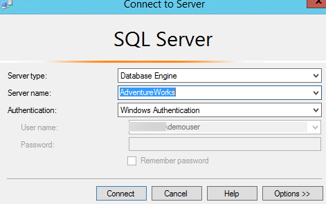

    

33. After successfully connecting to the AOG listener, disconnect from both SQLVM-1 and SQLVM-2 by using Sign Out from the RDP windows

### Task 2: Convert the SQL deployment to Managed Disks 

In this task, you will convert the disks of the SQL deployment to managed disks. This task could be automated as part of the template deployment; however, it is important to understand how to migrate existing infrastructure to managed disks.

1.  On LABVM open the PowerShell ISE Tool

**Note**: In the next few steps, you will use PowerShell to migrate the disks for the SQL Unfractured to Managed Disks.

2.  In the execution pane, login to Azure using the Login-AzureRmAccount, and press Enter

    Login-AzureRmAccount

3.  At the Azure login screen, enter your Account and Password

    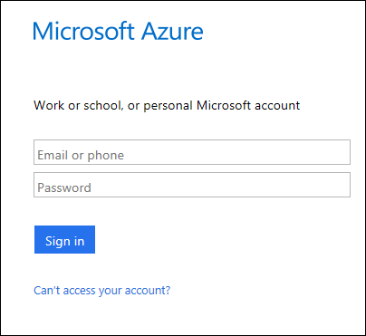

4.  Once logged in, make sure to set your subscription that is the default for this hands-on lab

    ```
    Get-AzureRMSubscription
    Select-AzureRmSubscription -SubscriptionName ???your subscription name???
    ```

5.  Once this is completed, run the following command to verify your VMs for the hands-on lab are present.

    ```
    Get-AzureRMVM -ResourceGroupName CloudShopRG

    ```
    
6.  Now, move to the scripting pane of the PowerShell ISE tool. Paste this code into the window.

    ```
    <#
        The following code converts the existing availability set to aligned/managed and then converts the disks to managed as well. 
        Note: The PlatformFaultDomainCount is set to 2 - this is because the region currently only supports two managed fault domains
    #>

    $rgName = 'CloudShopRG'

    $avSetName = 'SQLAVSet'

    $avSet = Get-AzureRmAvailabilitySet -ResourceGroupName $rgName -Name $avSetName

    $avSet.PlatformFaultDomainCount = 2

    Update-AzureRmAvailabilitySet -AvailabilitySet $avSet -Sku Aligned

    foreach($vmInfo in $avSet.VirtualMachinesReferences)
    {
        $vm = Get-AzureRmVM -ResourceGroupName $rgName | Where-Object {$_.Id -eq $vmInfo.id}

        Stop-AzureRmVM -ResourceGroupName $rgName -Name $vm.Name -Force

        ConvertTo-AzureRmVMManagedDisk -ResourceGroupName $rgName -VMName $vm.Name
    }
    ```

7.  Next, click the **Play** button in PowerShell\_ISE. This will deallocate all the machines in the Availability Set SQLAVSET and migrate them to a Managed AVSET and the disk to Managed Disks.

    > **Note**: This process will take about 10-15 minutes to complete and be careful not to stop the process.

8.  Open the Azure portal and browse to the **CloudShopRG** Resource Group. Notice now, the machines are using Managed Disks, and the disk objects now appear.

    

### Task 3: Build a scalable and resilient web tier

In this task, you will deploy a VM scale set that can automatically scale up or down based on the CPU criteria. The application the scale set deploys points to the new SQL AlwaysOn availability group created previously.

1.  Navigate to <https://github.com/opsgility/cw-building-resilient-iaas-architecture-ss> and click the **Deploy to Azure Button**

    

2.  Specify the existing resource group **CloudShopRG** and set the **Instance Count to 2**

    > **Note**: The instance count is the initial number of servers deployed. The number can change based on the auto scale rules set in the ARM template.

3.  Agree to the terms, check **Pin to dashboard** and click **Purchase**

4.  While the scale set is deploying, open the ARM template you just deployed by navigating to: <https://github.com/opsgility/cw-building-resilient-iaas-architecture-ss/blob/master/azure-deploy.json>. Review the auto scale settings in the autoscalewad resource to understand how the default auto scale settings are configured.

### Summary

In this exercise, you deployed resilient web servers behind a load balancer, and a SQL Always-On Availability Group for database resiliency.

## Exercise 4: Configure SQL Server Managed Backup 

Duration: 15 minutes

In this exercise, you will configure SQL Server Managed Backup to back up to an Azure Storage Account.

### Task 1: Create an Azure Storage Account

In this task, you will add a 3rd node to the SQL Always-On deployment in a second region that you can then failover with Azure Site Recovery in the event of a failure in the primary region.

1.  From the lab virtual machine, execute the following PowerShell ISE commands to create a new storage account and generate the T-SQL needed to configure managed backup for the AdventureWorks database

    ```
    $storageAcctName = "[unique storage account name]"

    $resourceGroupName = "CloudShopRG"
    $containerName= "backups"
    $location = "West Central US"
    $storageSkuName = "Standard_LRS"


    "Creating Storage Account $storageAcctName"
    $sa = New-AzureRmStorageAccount -ResourceGroupName $resourceGroupName  `
                                    -Name $storageAcctName `
                                    -Location $location `
                                    -SkuName $storageSkuName 


    $storageKey = (Get-AzureRmStorageAccountKey -Name $storageAcctName -ResourceGroupName $resourceGroupName )[0].Value
    $context = New-AzureStorageContext -StorageAccountName $storageAcctName -StorageAccountKey $storageKey


    Write-Host "Creating New Storage Container  $containerName" 
    New-AzureStorageContainer -name $containerName -permission container -context $context


    $fullSasToken = New-AzureStorageContainerSASToken -Name $containerName -Permission rwdl -FullUri -Context $context  
    $containerUrl = $fullSasToken.Substring(0,$fullSasToken.IndexOf("?"))
    $sasToken = $fullSasToken.Substring($fullSasToken.IndexOf("?")+1)


    $enableManagedBackupScript = @"
    --------------------
    ---BEGIN TSQL Script
    --------------------
    CREATE CREDENTIAL [$containerUrl] 
    WITH IDENTITY = 'Shared Access Signature', 
         SECRET = '$sasToken' 

    GO

    EXEC msdb.managed_backup.sp_backup_config_basic   
     @enable_backup = 1,   
     @database_name = 'AdventureWorks',  
     @container_url = '$containerUrl',   
     @retention_days = 30
       
     --------------------
     ---END TSQL Script
     --------------------
    "@


    write-host $enableManagedBackupScript 
    ```

2.  Execute the code using PowerShell ISE. Make sure you change the **\$storageAcctName = \"\[unique storage account name\]\"** field to a unique storage account name across Azure prior to execution. 

3.  Save the T-SQL code generated between the **Begin TSQL Script** and **End TSQL Script** in your PowerShell ISE output after execution into a notepad file. This code creates an identity using a Shared Access Signature (SAS) to a container in the storage account and configures managed backup when executed.

### Task 2: Configure managed backup in SQL Server

1.  Connect to **SQLVM-1** using remote desktop and launch SQL Server Management Studio

2.  Right click on **SQLVM-1**, and click **New Query**

    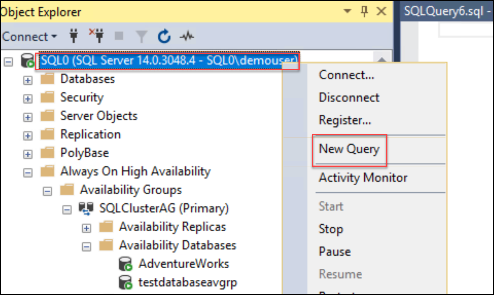

3.  Paste in the following code and click **Execute** to enable SQL Server Agent extended stored procedures. Refresh SQL Server Management Studio and if SQL Server Agent is stopped right click on it and click Start.

    ```
    EXEC sp_configure 'show advanced options', 1
    GO
    RECONFIGURE
    GO
    EXEC sp_configure 'Agent XPs', 1
    GO
    RECONFIGURE
    GO
    ```

4.  Paste the T-SQL code you copied in the previous task into the query window replacing the existing code and click **Execute**. This code creates the new SQL identity with a Shared Access Signature for your storage account. 

5.  Paste the code into the query window replacing the existing code and click **Execute** to create a custom backup schedule

    ```
    USE msdb;  
    GO  
    EXEC managed_backup.sp_backup_config_schedule   
         @database_name =  'AdventureWorks'  
        ,@scheduling_option = 'Custom'  
        ,@full_backup_freq_type = 'Weekly'  
        ,@days_of_week = 'Monday'  
        ,@backup_begin_time =  '17:30'  
        ,@backup_duration = '02:00'  
        ,@log_backup_freq = '00:05'  
    GO  
    ```
6.  Execute the following tSQL in the query window to generate a backup on-demand. You can also specify Log for \@type

    ```
    EXEC msdb.managed_backup.sp_backup_on_demand   
    @database_name  = 'AdventureWorks',
    @type ='Database' 
    ```
    
## Exercise 5: Validate resiliency

### Task 1: Validate resiliency for the CloudShop application 

1.  In the Azure portal, open the **CloudShopRG** resource group. Click the VM scale set created in the previous task.

2.  Click the Scaling menu item to review the auto scale settings that were deployed with the ARM template

    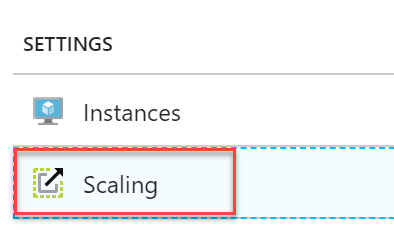

    

3.  Click the **Overview** tab and copy the public IP address to the clipboard, and navigate to it in a different browser tab

4.  After the application is loaded, click the Spike CPU button to simulate an auto scale event

    

5.  After 15-20 minutes, click the instances button to validate that additional instances were added in response to the CPU spike

    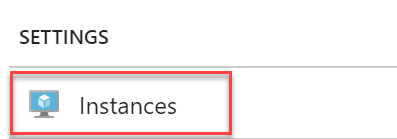

    You will see something like the following after a while with new instances starting.

    

### Task 2: Validate SQL Always On

1.  Within the Azure portal, click on Virtual Machines and open **SQLVM-1.** Click **Stop** at the top of the blade to shut the virtual machine off.

2.  After the VM is deallocated, refresh the CloudShop application in your browser. If the page loads with data in the dropdown list SQL has successfully failed over the primary node to the secondary. You can login to the secondary vm (SQLVM-2) and connect via SQL Server Management Studio to confirm.

### Task 3: Validate backups are taken 

1.  In the Azure portal, click All Services and search for Recovery Vault. Click the link and you should see the two recovery vaults created as part of the deployment of the Active Directory domain controllers.

2.  Open each vault and validate that a backup of the VM has occurred

    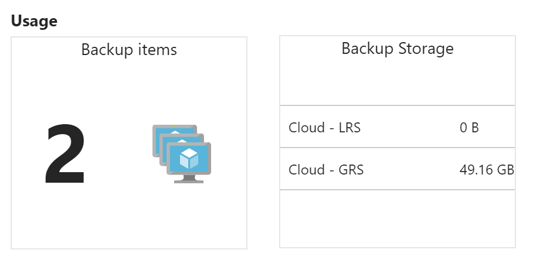

3.  To validate the SQL Server backup, open the Storage Account created earlier in the Azure portal and click **Blobs** -\> and then **backups**. If the backup has already completed, you will see the backup file in the container.

    

## After the hands-on lab

### Task 1: Delete the resource groups created

1.  Within the Azure portal, click Resource Groups on the left navigation

2.  Delete each of the resource groups created in this lab by clicking them followed by clicking the Delete Resource Group button. You will need to confirm the name of the resource group to delete.

You should follow all steps provided *after* attending the hands-on lab.

