<div class="MCWHeader1">
Building a resilient IaaS architecture
</div>

<div class="MCWHeader2">
Hands-on lab step-by-step
</div>

<div class="MCWHeader3">
December 2019
</div>


Information in this document, including URL and other Internet Web site references, is subject to change without notice. Unless otherwise noted, the example companies, organizations, products, domain names, e-mail addresses, logos, people, places, and events depicted herein are fictitious, and no association with any real company, organization, product, domain name, e-mail address, logo, person, place or event is intended or should be inferred. Complying with all applicable copyright laws is the responsibility of the user. Without limiting the rights under copyright, no part of this document may be reproduced, stored in or introduced into a retrieval system, or transmitted in any form or by any means (electronic, mechanical, photocopying, recording, or otherwise), or for any purpose, without the express written permission of Microsoft Corporation.

Microsoft may have patents, patent applications, trademarks, copyrights, or other intellectual property rights covering subject matter in this document. Except as expressly provided in any written license agreement from Microsoft, the furnishing of this document does not give you any license to these patents, trademarks, copyrights, or other intellectual property.

The names of manufacturers, products, or URLs are provided for informational purposes only and Microsoft makes no representations and warranties, either expressed, implied, or statutory, regarding these manufacturers or the use of the products with any Microsoft technologies. The inclusion of a manufacturer or product does not imply endorsement of Microsoft of the manufacturer or product. Links may be provided to third party sites. Such sites are not under the control of Microsoft and Microsoft is not responsible for the contents of any linked site or any link contained in a linked site, or any changes or updates to such sites. Microsoft is not responsible for webcasting or any other form of transmission received from any linked site. Microsoft is providing these links to you only as a convenience, and the inclusion of any link does not imply endorsement of Microsoft of the site or the products contained therein.

© 2019 Microsoft Corporation. All rights reserved.

Microsoft and the trademarks listed at https://www.microsoft.com/en-us/legal/intellectualproperty/Trademarks/Usage/General.aspx are trademarks of the Microsoft group of companies. All other trademarks are property of their respective owners.

**Contents**

<!-- TOC -->

- [Building a resilient IaaS architecture hands-on lab step-by-step](#building-a-resilient-iaas-architecture-hands-on-lab-step-by-step)
  - [Abstract and learning objectives](#abstract-and-learning-objectives)
  - [Overview](#overview)
  - [Solution architecture](#solution-architecture)
  - [Requirements](#requirements)
    - [Help references](#help-references)
  - [Exercise 1: Prepare connectivity between regions](#exercise-1-prepare-connectivity-between-regions)
    - [Task 1: Create a VNet in the second region](#task-1-create-a-vnet-in-the-second-region)
    - [Task 2: Configure VNet Peering between Azure regions](#task-2-configure-vnet-peering-between-azure-regions)
    - [Task 3: Configure ADVM as the DNS server for VNET2](#task-3-configure-advm-as-the-dns-server-for-vnet2)
  - [Exercise 2: Build a resilient Active Directory deployment](#exercise-2-build-a-resilient-active-directory-deployment)
    - [Task 1: Deploy redundant Domain Controller VMs in the first Azure region](#task-1-deploy-redundant-domain-controller-vms-in-the-first-azure-region)
    - [Task 2: Deploy redundant Domain Controller VMs in the second Azure region](#task-2-deploy-redundant-domain-controller-vms-in-the-second-azure-region)
    - [Task 3: Configure static internal IP addresses on each Domain Controller VM](#task-3-configure-static-internal-ip-addresses-on-each-domain-controller-vm)
    - [Task 4: Format Data Disks and promote new VMs as additional Domain Controllers](#task-4-format-data-disks-and-promote-new-vms-as-additional-domain-controllers)
    - [Task 5: Update the VNET settings to use the new Domain Controller VMs as the default DNS servers](#task-5-update-the-vnet-settings-to-use-the-new-domain-controller-vms-as-the-default-dns-servers)
    - [Summary](#summary)
  - [Exercise 3: Build web tier and SQL Server for resiliency](#exercise-3-build-web-tier-and-sql-server-for-resiliency)
    - [Task 1: Deploy the SQL and Web VMs](#task-1-deploy-the-sql-and-web-vms)
    - [Task 2: Verify the SQL Always-On Availability Group configuration](#task-2-verify-the-sql-always-on-availability-group-configuration)
    - [Task 3: Deploy the application database to the SQL Always-On cluster](#task-3-deploy-the-application-database-to-the-sql-always-on-cluster)
    - [Task 4: Verify the CloudShop application](#task-4-verify-the-cloudshop-application)
    - [Summary](#summary-1)
  - [Exercise 4: Configure SQL Server Managed Backup](#exercise-4-configure-sql-server-managed-backup)
    - [Task 1: Create an Azure Storage Account](#task-1-create-an-azure-storage-account)
    - [Task 2: Configure managed backup in SQL Server](#task-2-configure-managed-backup-in-sql-server)
  - [Exercise 5: Validate resiliency](#exercise-5-validate-resiliency)
    - [Task 1: Validate resiliency for the CloudShop application](#task-1-validate-resiliency-for-the-cloudshop-application)
    - [Task 2: Validate SQL Always On](#task-2-validate-sql-always-on)
    - [Task 3: Validate VM backups are taken](#task-3-validate-vm-backups-are-taken)
  - [Exercise 6: Implement Azure Site Recovery](#exercise-6-implement-azure-site-recovery)
    - [Task 1: Configure ASR Protection for CloudShop](#task-1-configure-asr-protection-for-cloudshop)
    - [Task 2: Creating the Recovery Plan](#task-2-creating-the-recovery-plan)
    - [Task 3: Execute a Test Failover.](#task-3-execute-a-test-failover)
    - [Task 4: Clean up the Test Failover.](#task-4-clean-up-the-test-failover)
  - [After the hands-on lab](#after-the-hands-on-lab)
    - [Task 1: Delete the resource groups created](#task-1-delete-the-resource-groups-created)

<!-- /TOC -->

# Building a resilient IaaS architecture hands-on lab step-by-step 

## Abstract and learning objectives 

In this hands-on lab, you will deploy a pre-configured IaaS environment and then redesign and update it to account for resiliency and in general high availability. Throughout the hands-on lab you will use various configuration options and services to help build a resilient architecture.

At the end of the lab, you will be better able to design and use availability sets, Managed Disks, SQL Server Always on Availability Groups, as well as design principles when provisioning storage to VMs. In addition, you'll learn effective employment of Azure Backup to provide point-in-time recovery.

## Overview

Contoso has asked you to deploy their infrastructure in a resilient manner to ensure their infrastructure will be available for their users and gain an SLA from Microsoft.

## Solution architecture

Highly resilient deployment of Active Directory Domain Controllers in Azure.
    

Deployment of a web app using scale sets, and a highly available SQL Always On deployment.
    

## Requirements

Complete the steps given in the [Before the HOL - Building a resilient IaaS architecture](https://cloudworkshop.blob.core.windows.net/building-resilient-iaas-architecture/Hands-on%20lab/Before%20the%20HOL%20-%20Building%20a%20resilient%20IaaS%20architecture.html) guide before starting this lab.

### Help references
|    |            |
|----------|:-------------:|
| **Description** | **Links** |
| Azure Resiliency Overview | <https://azure.microsoft.com/features/resiliency/> |
| Network Security Groups | <https://azure.microsoft.com/documentation/articles/virtual-networks-nsg/> |
| Managed Disks | <https://azure.microsoft.com/services/managed-disks> |
| Always-On Availability Groups | <https://docs.microsoft.com/sql/database-engine/availability-groups/windows/overview-of-always-on-availability-groups-sql-server?view=sql-server-2017> |
| SQL Server Managed Backup to Azure | <https://docs.microsoft.com/sql/relational-databases/backup-restore/sql-server-managed-backup-to-microsoft-azure?view=sql-server-2017> |
| Virtual Network Peering | <https://docs.microsoft.com/azure/virtual-network/virtual-network-peering-overview> |
| Azure Backup |  <https://azure.microsoft.com/services/backup/> |


## Exercise 1: Prepare connectivity between regions

Duration: 10 minutes

Contoso is planning to deploy infrastructure in multiple regions in Azure to provide infrastructure closer to their employees in each region as well as the ability to provide additional resiliency in the future for certain workloads. In this exercise, you will configure connectivity between the two regions.


### Task 1: Create a VNet in the second region

1.  Browse to the Azure portal and authenticate at <https://portal.azure.com/>.

2.  In the left pane, select **+ Create a resource**.

3.  In the **New** blade, select **Networking**, then select **Virtual Network**.

4.  In the **Create virtual network** blade, enter the following information:

    - Name: **VNET2**
  
    - Address space: **172.16.0.0/16**
  
    - Subscription: **Choose your subscription**
  
    - Resource group (create new): **CUSRG**
  
    - Location: **(US) Central US**
  
    - Subnet name: **Apps**
  
    - Subnet address range: **172.16.0.0/24**
  
    - DDoS protection: **Basic**
  
    - Service endpoints: **Disabled**
  
    - Firewall: **Disabled**

    

5. Select the **Create** button to continue.

6.  Once the deployment is complete, add two more subnets to the virtual network. To do this, navigate to the VNET2 blade, then select the **Subnets** icon in the **Settings** area.

    

7.  Select the **+ Subnet** option, and enter the following settings:

    

    -   Name: **Data**
  
    -   Address range (CIDR block): **172.16.1.0/24**
  
    -   Other settings: **default values**
    
    Select the **OK** button to add this subnet.

    

8.  Once the subnet is created successfully, repeat the above steps to create an **Identity** subnet with the following settings:

    -   Name: **Identity**
  
    -   Address range (CIDR block): **172.16.2.0/24**
  
    -   Other settings: **default values**

    

9.  The subnets will look like this once complete:

    

### Task 2: Configure VNet Peering between Azure regions

In this task, you will connect VNET1 (in West US 2) with VNET2 (in Central US) by using global VNet peering.

1.  Open the new virtual network (VNET2) by selecting **All Services**, then **Virtual networks**, then **VNET2** (if it is not open already).

2.  Under 'Settings', select **Peerings**, then select **+Add**.

    

3.  Complete the **Add peering** blade as follows (leave other settings at their default values):
   
    - Name of the peering from VNET2 to VNET1: **VNET2TOVNET1** 
  
    - Virtual network: **VNET1 (ContosoRG)**.
  
    - Name of the peering from VNET1 to VNET2: **VNET1TOVNET2** 

    Select **OK** to create the peering connections joining VNET1 and VNET2.

    

### Task 3: Configure ADVM as the DNS server for VNET2

The existing domain controller ADVM is already configured as the default DNS server for any virtual machines created in VNET1. During the creation of our resilient AD deployment, we also need to use ADVM as the default DNS server for virtual machines in VNET2. To do this, we will change the DNS configuration for VNET2

1.  Return to the Azure portal blade for **VNET2**. In the **Settings** area, select **DNS Servers**. Change **DNS servers** to **Custom** and provide the address of **10.0.2.4** in the **Add DNS server** box. Select the **Save** icon to commit the changes.

    

## Exercise 2: Build a resilient Active Directory deployment

Duration: 40 minutes

In this exercise, you will deploy a pair of Windows Server VMs in the primary region (West US 2). These VMs will be configured for resiliency using an Availability Set. These VMs will later be configured as domain controllers for this region.

### Task 1: Deploy redundant Domain Controller VMs in the first Azure region

1.  In the left pane, select **+ Create a resource**. In the **New** blade, select **Windows Server 2016 Datacenter**.

    

2.  In the **Create virtual machine** blade, enter the **Basics** information:

    -   Subscription: **Select your subscription**.
  
    -   Resource group: **(Create new) WU2ADRG**
  
    -   Virtual machine name: **DC01**

    -   Region: **West US 2**
  
    -   Availability options: **See below**
  
    -   Image: **Windows Server 2016 Datacenter**

    -   Azure Spot Instance: **No**
  
    -   Size: **Standard D2s v3**
  
    -   Username: **demouser**
  
    -   Password: **demo\@pass123**
  
    -   Confirm password: **demo\@pass123**
  
    -   Public inbound ports: **Allow selected ports**
  
    -   Select inbound ports: **RDP (3389)**

    For **Availability options**, select **Availability set**. Select **Create new** and enter the name **ADAV** and select **OK**.

    

    Once all settings are filled in, the **Basics** tab should look like this:

    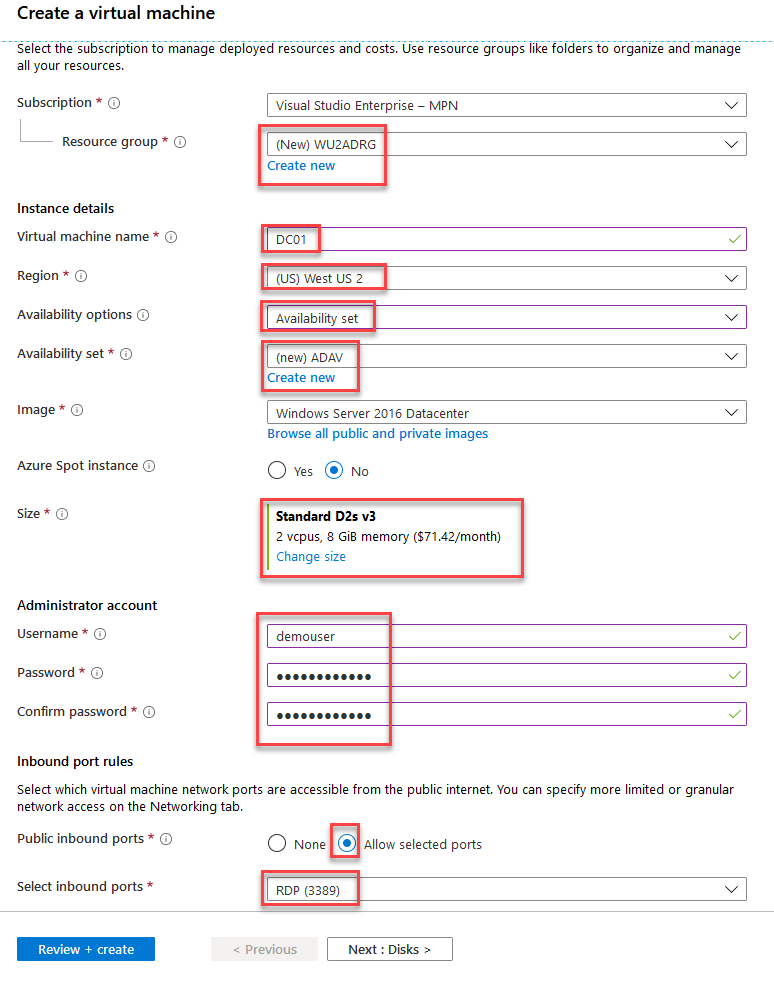

3. Select **Next: Disks >** (or select the **Disks** tab). Under **Data disks** select **Create and attach a new disk**.

    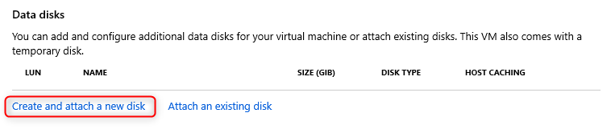

4. On the **Create a new disk** blade, select **Change size** and change the disk size to **32 GiB**. Ensure that the account type is **Premium SSD**. 

    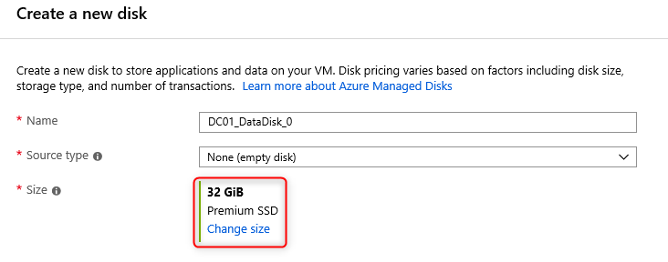

5. Select **OK** to return to the VM create wizard and confirm that the new disk has host caching set to **None**.

    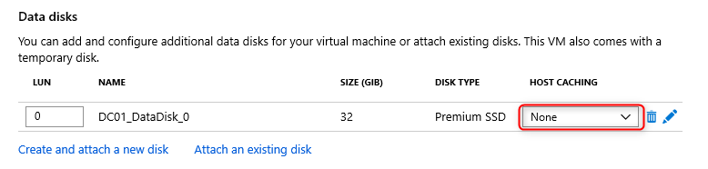

6. Select **Next: Networking >** and select the existing virtual network **VNET1** and the **Identity** subnet.

    

7.  Select **Next: Management >** and configure as follows:

    - Boot diagnostics: **On**
  
    - Diagnostics storage account: **Create new and select a unique name, it may already be created**
  
    - Auto-shutdown: **Off**
  
    - Enable backup: **On**
  
    - Recovery Services vault: **Create new**
  
    - Recovery Services vault name: **WU2BackupVault**
  
    - Resource group (create new): **WU2BackupVaultRG**
  
    - Backup Policy: **(new)DailyPolicy**

    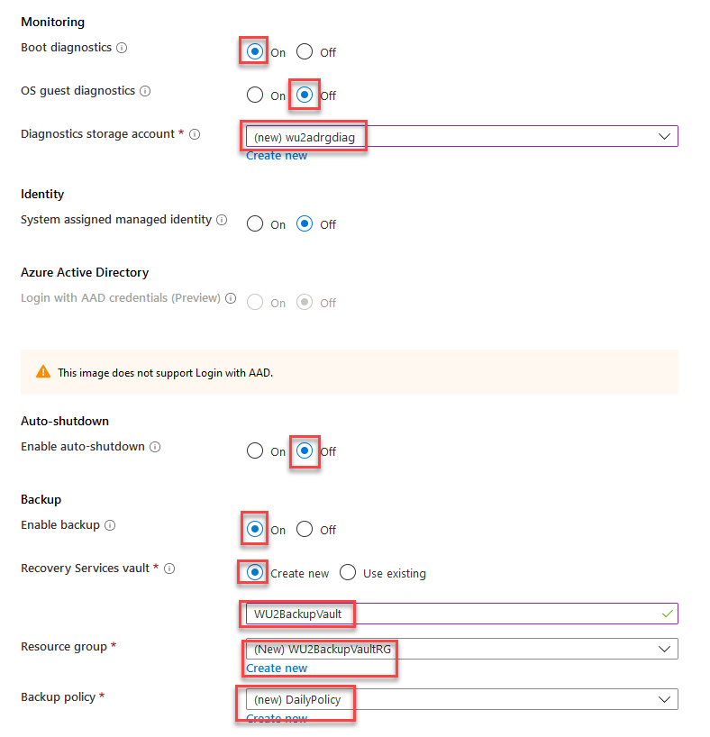
    
    > **Note**: Backup with a Domain Controller is a supported scenario. Care should be taken on restore. For more information see the following: <https://docs.microsoft.com/azure/backup/backup-azure-arm-restore-vms#backup-for-restored-vms>.

8.  Select the **Review + create** button or select on the **Review + create** tab. There will be a final validation and when this is passed, select the **Create** button to complete the deployment.

9.  Give the deployment a few minutes to build the Availability Set resource. Then, repeat the virtual machine creation steps to create **DC02**, as that will be another Domain Controller making sure to place it in the **ADAV** availability set, **remember to add a data disk, and select the existing resource group, virtual network, Identity subnet, diagnostic storage account, and recovery services vault**.

    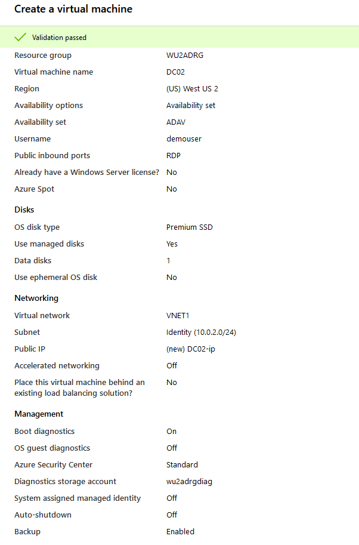 

### Task 2: Deploy redundant Domain Controller VMs in the second Azure region

In this task, you will deploy a pair of VMs in the second region. These will later be configured as domain controllers for this region. In this region, an additional level of resiliency will be introduced by using Availability Zones for the virtual machines hosting Active Directory.

1.  In the left pane, select **+ Create a resource**. In the **New** blade, select **Windows Server 2016 Datacenter**.

    

2.  In the **Create virtual machine** blade, enter the **Basics** information:

    -   Subscription: **Select your subscription**
  
    -   Resource group: **(Create new) CUSADRG**
  
    -   Virtual machine name: **DC03**
  
    -   Region: **Central US**
  
    -   Availability options: **See below**
  
    -   Image: **Windows Server 2016 Datacenter**
  
    -   Size: **Standard D2s v3**
  
    -   Username: **demouser**
  
    -   Password: **demo\@pass123**
  
    -   Confirm password: **demo\@pass123**
  
    -   Public inbound ports: **Allow selected ports**
  
    -   Select inbound ports: **RDP (3389)**

    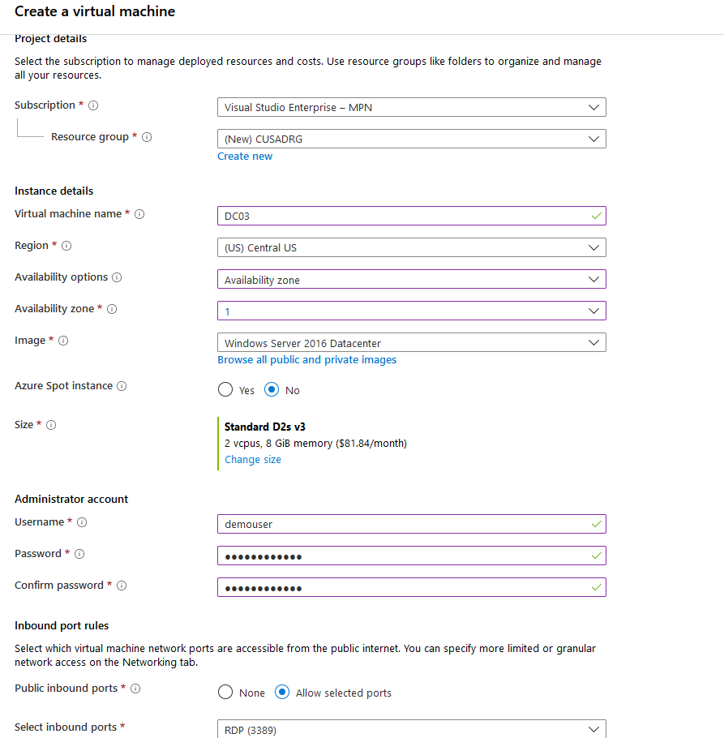

3. For **Availability options**, select **Availability zone**. Select zone **1**.

    

4. Select **Next: Disks >** (or select the **Disks** tab). Add a Data Disk, using the same steps as you did for **DC01** and **DC02**.

    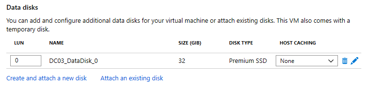

5. Select **Next: Networking >** and select the existing virtual network **VNET2** and the **Identity** subnet.

    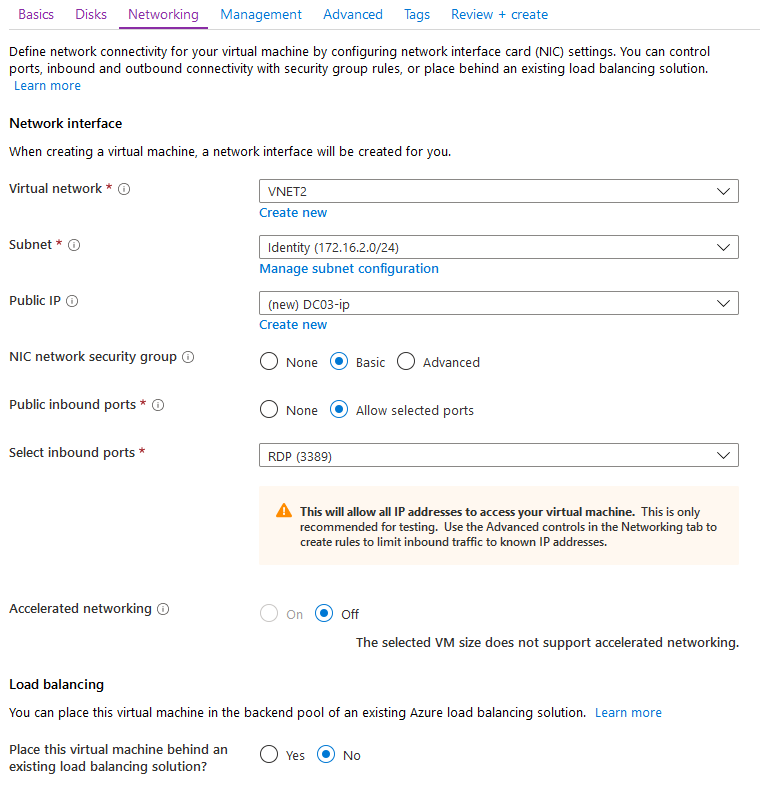

6. Select the **Management** tab and configure as follows:

    - Boot diagnostics: **On**

    - Diagnostics storage account: **Create new and select a unique name. It may already be created for you**.
  
    - Auto-shutdown: **Off**
  
    - Enable backup: **On**
  
    - Recovery Services vault: **Create new**
  
    - Recovery Services vault name: **CUSBackupVault**
  
    - Resource group (create new): **CUSBackupVaultRG**
  
    - Backup Policy: **(new)DailyPolicy**

    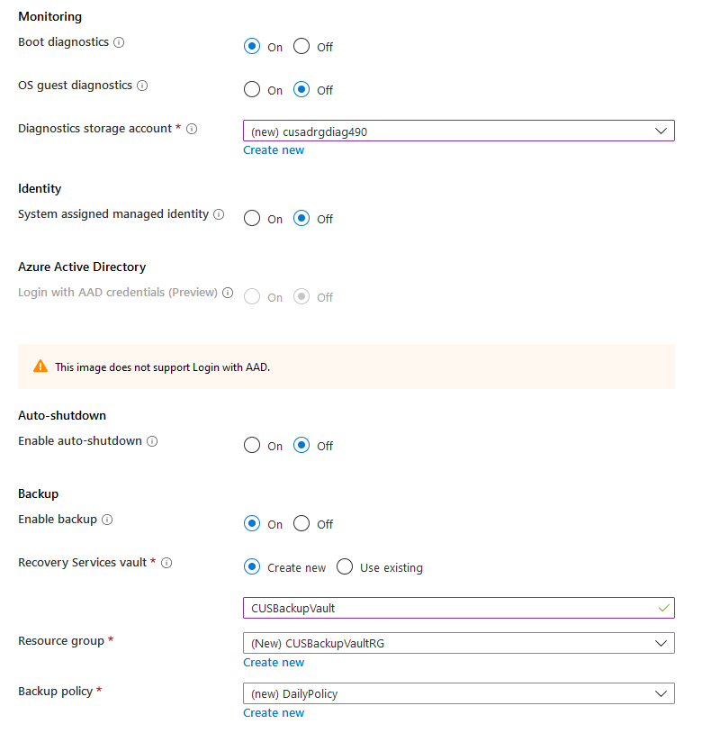
    
7. Select the **Review + create** button or select the **Review + create** tab. There will be a final validation and when this is passed, select the **Create** button to complete the deployment.

8.  Give the deployment a few seconds to start, then repeat the above steps to create **DC04**, as that will be another Domain Controller in this region. Make sure to place it in Availability Zone **2**, remember to add a data disk, and use the existing resource group, virtual network, and recovery services vault for this region.

    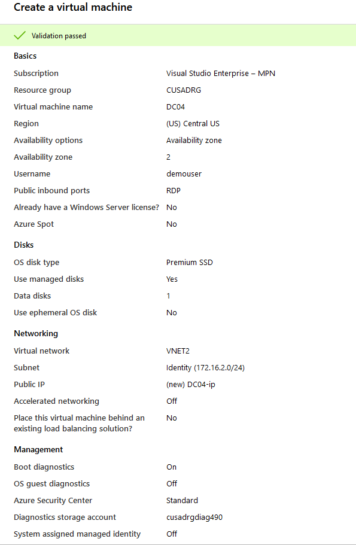


### Task 3: Configure static internal IP addresses on each Domain Controller VM

Before promoting our new DCxx VMs to be domain controllers, they need to be configured with static internal IP addresses. This option is not currently available when first creating the VM when using the Azure portal, so instead we will set the static IP address for each VM after it has been created.

1.  Navigate to the **DC01** virtual machine in the portal. Next, select **Networking**  under **Settings** followed by the name of the NIC.

    

2.  Select **IP configurations** under **Settings**.

    

3.  Select the IP Configuration named **ipconfig1**.

    

4.  On the **ipconfig1** blade, change the **Private IP address settings** to **Static** assignment. The IP address should be **10.0.2.5**.  Leave all the other settings at their defaults and select the **Save** button.

   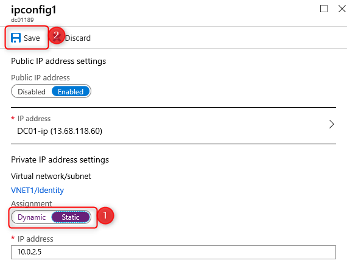

5.  Repeat these steps on the remaining 3 DCs (**DC02**, **DC03**, and **DC04**).

    > **Note:** The Static IPs for each Domain Controller should be shown as the following table:
    
    > |  VM  | IP Address  |
    > |:----:|:-----------:| 
    > | DC01 |  10.0.2.5   |
    > | DC02 |  10.0.2.6   |
    > | DC03 |  172.16.2.4 |
    > | DC04 |  172.16.2.5 |


### Task 4: Format Data Disks and promote new VMs as additional Domain Controllers 

In this task, you will use a CustomScriptExtension to execute a PowerShell script on each of the DCxx virtual machines. This script will first mount and format the Data Disk as the 'F' drive. It will then promote the VM to be a Domain Controller, synchronizing the 'contoso.com' domain from the existing ADVM domain controller that was deployed as part of the CloudShop application.

1.  Login to the **LABVM** created before the hands-on lab or the machine where you have downloaded the exercise files.

2.  Browse to the Azure portal at <https://portal.azure.com/> and log in using your subscription credentials.

3.  Navigate to the **DC01** virtual machine blade. In the **Settings** area, select **Extensions**, followed by **+ Add**.

    

4.  Choose **Custom Script Extension** by Microsoft Corp., and select the **Create** button to continue.

    

5.  Select the **Script File** text box to open file explorer. Browse to the **C:\\HOL** folder and select the **AddDC.ps1** script. Under **Arguments (Optional)**, copy and paste the following text:

    ```
    -user demouser@contoso.com -password demo@pass123 -domain contoso.com
    ```
   
     Then, select the **OK** button to continue.

    

6.  Repeat these steps for **DC02**, **DC03**, and **DC04**.

7.  While the script is running, take a few moments to open the **C:\\HOL\\AddDC.ps1** script in a text editor (such as Notepad) to review what it does. Note that it first mounts and formats the data disk as an 'F' drive, then installs Active Directory, then finally promotes the VM to a domain controller for the specified domain.

8.  Once the extension deployment succeeds, you will see a **Provisioning succeeded** message under **Extensions** for all four domain controllers. Wait for this status to show before proceeding to the next task (you may need to refresh your browser to update the extension status).

    


### Task 5: Update the VNET settings to use the new Domain Controller VMs as the default DNS servers

Our new domain controller VMs are up and running. We now need to modify the DNS settings for both VNET1 and VNET2 so that any new VMs we create in these networks use the new high-availability domain controller infrastructure as their default DNS servers instead of ADVM.

1. Open the settings for **VNET1** in the Azure portal. Under DNS servers, remove the exiting custom DNS entry and add the internal IP addresses of the two new domain controller VMs in this region, DC01 (**10.0.2.5**) and DC02 (**10.0.2.6**). Select **Save**.

    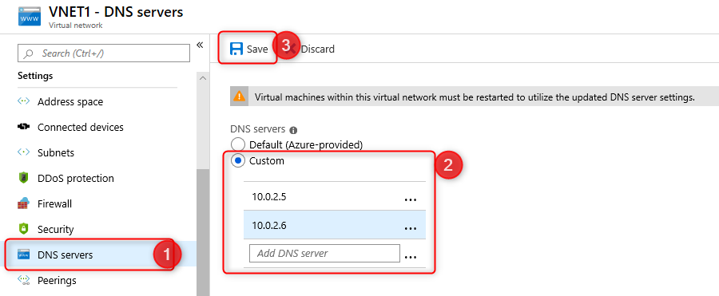

2. Restart VMs **DC01** and **DC02**, so they pick up the new DNS server settings.
   
3. Repeat this process for **VNET2**, this time using the internal IP addresses for the domain controller VMs DC03 (**172.16.2.4**) and DC04 (**172.16.2.5**).

4. Restart VMs **DC03** and **DC04**, so they pick up the new DNS server settings.

### Summary

In this exercise, you deployed a Windows Server Active Directory infrastructure to two Azure regions, connected to the existing contoso.com domain. The VMs have been configured for resiliency using Availability Sets in the West US 2 region and Availability Zones in the Central US region. Availability Sets offer an SLA of 99.95% and Availability Zones offer an SLA of 99.99%. 

> **Note**: In a real-world scenario, you might now gracefully demote and de-provision the ADVM virtual machine. However, if connecting to an on-premises domain controller, you would more likely keep it as-is. The choice depends on your AD architecture.


## Exercise 3: Build web tier and SQL Server for resiliency

Duration: 60 minutes

In this exercise, you will deploy resilient web servers and a SQL Always-On Cluster for resiliency at the data tier.

### Task 1: Deploy the SQL and Web VMs 

In this task, you will deploy a SQL Always-On cluster using an ARM template that deploys to your existing Virtual Network and Active Directory infrastructure. The cluster comprises two VMs (SQL0 and SQL1) together with a storage account acting as a cloud witness.

1.  Select the **Deploy to Azure** button below to open the Azure portal and launch the template deployment for the SQL Always On deployment. Log in to the Azure portal using your subscription credentials if you are prompted to do so.

    [](https://portal.azure.com/#create/Microsoft.Template/uri/https%3A%2F%2Fcloudworkshop.blob.core.windows.net%2Fbuilding-resilient-iaas-architecture%2Flab-resources%2Fsql-alwayson%2Fazuredeploy.json)

2.  Specify the following information:
   
    - Resource group: **(Create new) CloudShopRG** 
  
    - Location: **West US 2** 
  
    - Data Subnet ID: **See note below**
    
    Leave the rest of the template parameters with their default values.

    > **Note:** To check the subnet ID, open **resources.azure.com** then go to **subscriptions** > **Your subscription** > **resourceGroups** > **ContosoRG** > **providers** > **Microsoft.Network** > **virtualNetworks**. Then find the subnet id for the **Data** subnet in **VNET1**. Copy the full subnet ID in between the **" "** quotes.

    

3.  Check the **I agree to the terms and conditions state above** checkbox on the page and select **Purchase**.

    

    Proceed to the next step to deploy the highly available Web VMs **without** waiting for the SQL deployment to complete. Running both deployments in parallel will save time.

4.  Select the **Deploy to Azure** button below to open the Azure portal and launch the template deployment for the CloudShop web tier. Log in to the Azure portal using your subscription credentials if you are prompted to do so.

    [](https://portal.azure.com/#create/Microsoft.Template/uri/https%3A%2F%2Fcloudworkshop.blob.core.windows.net%2Fbuilding-resilient-iaas-architecture%2Flab-resources%2Fcloudshopwebtier.json)
   
5.  Specify the following information:
    
    - Resource group: **CloudShopRG**
  
    - Apps Subnet ID: **Resource ID of the Apps subnet in VNET1, from Resource Explorer**.
    
    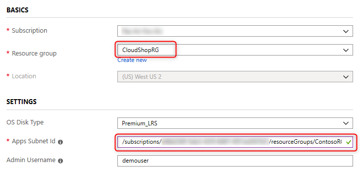

6.  Check the **I agree to the terms and conditions state above** checkbox on the page and select **Purchase**.

7.  While you wait for the deployments to complete, take some time to review the deployment templates (see **Resource Groups** > **CloudShopRG** > **Deployments**, then select a deployment to review progress and inspect the template). In particular:

    - Observe how the SQL deployment uses a Copy() loop to deploy 2 VMs, which are placed behind a load balancer. 3 extensions are run on each VM: one to install SQL Server, another to domain join, and a third to configure SQL Server.
  
    - Observe how the Web VM deployment passes the private front-end IP address of the SQL cluster load-balancer (10.0.1.30) to the Web VM setup script as a parameter, and how that script then injects this address into the Web.config of the web application.

8.  Wait for both deployments to proceed before continuing. This will take around 30-40 minutes.

### Task 2: Verify the SQL Always-On Availability Group configuration

In this task you will verify that the SQL Always-On Availability Group has been configured correctly.

1.  Open a remote desktop connection to the **ADVM** virtual machine and then open **Remote Desktop Connection** by searching for it in the Start menu. Start a remote desktop connection to the **SQL0** virtual machine you created in the previous task using the ip address, **10.0.1.10**, and login using the **contoso\\demouser** account with the password **demo@pass123**.

    > **Note:** Since the SQL0 VM does not have a public IP address, `ADVM` serves as a jump box to connect to SQL0 on the private IP address **10.0.1.10**.

2.  Once connected, open the Windows Explorer, check to make sure the **F:\\** Drive is present.

3.  Open the **Failover Cluster Manager** from the Start menu and select **Connect to cluster** on the right. Type **SQLClusterAG** and click **OK**. Cluster manager will connect to the newly deployed Always-On Availability Group. Select **Nodes**, validate all nodes are online and Assigned Vote and Current Vote are listed as "1" for all nodes of the cluster.

    

4.  Launch **SQL Server 2017 Configuration Manager** from the Start menu on **SQL0**.

    

5.  Select **SQL Server Services**, right-click **SQL Server (MSSQLSERVER)**, and choose **Properties**.

    

6. Select the **AlwaysOn High Availability** tab, make sure the box for **Enable AlwaysOn Availability Groups** is selected.

     Properties dialog box")

7. On the **Log On** tab, change the service account to **contoso\\demouser** using **demo\@pass123** for the password (it may be configured correctly already). Select **OK** to accept the changes and select **Yes** to confirm the restart of the server if necessary.

     Properties dialog box")

    

8. Minimize the RDP Window for **SQL0**.

9. Again, using `ADVM` as a jump box, open a Remote Desktop session to SQL1 using the private IP address **10.0.1.11**.

    
    >**Note**: Use `ADVM` as a jump box to connect to SQL1 on the private IP Address.

10. From the RPD Session on **SQL1**, repeat steps to verify the configuration of **AlwaysOn High Availability** and **Log On** using SQL Server 2017 Configuration Manager (steps 4-9).


### Task 3: Deploy the application database to the SQL Always-On cluster

In this task, you will deploy the application database to the SQL Always-On database cluster created in task 1. The database will be deployed from a backup. To save time, a backup is provided for you.

1. Within the RDP session to **SQL1**, Open PowerShell or PowerShell ISE. Run the following command to download the **configure-sql1** script to your local C: drive.

    ```
    Invoke-WebRequest -Uri https://cloudworkshop.blob.core.windows.net/building-resilient-iaas-architecture/lab-resources/configure-sql1.ps1 -OutFile C:\configure-sql1.ps1
    ```

2. Run the script using the command below. This will configure authentication for the SQL1 node.

    ```
    C:\configure-sql1.ps1
    ```

3.  Still on **SQL1**, open Windows Explorer and navigate to the **C:\\** drive. Create two new folders, **C:\\Data** and **C:\\Logs**. These are required when we add our database to the Always-On Availability Group later in this task.

4.  Return to the RDP session with **SQL0**. Launch **SQL Server Management Studio 17 (SSMS)** from the Start menu and select **Connect** to login to SQL Server.

    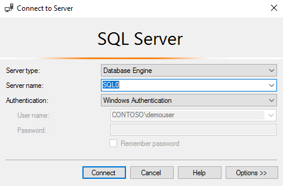

5.  Open PowerShell or PowerShell ISE. Run the following command to download the **deploy-cloudshop-db.ps1** script to your local C: drive.

    ```PowerShell
    Invoke-WebRequest -Uri https://cloudworkshop.blob.core.windows.net/building-resilient-iaas-architecture/lab-resources/script-extensions/deploy-cloudshop-db.ps1 -OutFile C:\deploy-cloudshop-db.ps1
    ```

6.  Run the script using the command below. This will download and deploy the CloudShop database. 
    
    ```PowerShell
    C:\deploy-cloudshop-db.ps1  -user "demouser" -password "demo@pass123" -dbsource "https://cloudworkshop.blob.core.windows.net/building-resilient-iaas-architecture/AdventureWorks2012.bak" -sqlConfigUrl "https://cloudworkshop.blob.core.windows.net/building-resilient-iaas-architecture/lab-resources/script-extensions/configure-sql.ps1"
    ```

    > **Note:** You may need to wait few minutes to view the newly created AdventureWorks database in SSMS.

7.  SQL Server Availability Groups require that the database be in full recovery mode. In SSMS, right-click the **AdventureWorks** database and choose **Properties**. In the properties window, select **Options** in the left-nav and change the Recovery model to **Full**. Select **OK** to close the window.

    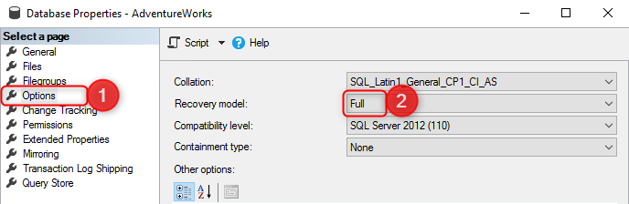

8.  SQL Server Availability Groups also require that a database backup is taken. In SSMS, right-click the **AdventureWorks** database, then select **Tasks**, **Back Up**. Make sure **Backup type** is **Full** and select **Add** to specify the backup file (for example, C:\AdventureWorks.bak). Select **OK** to start the backup and wait for it to complete.

    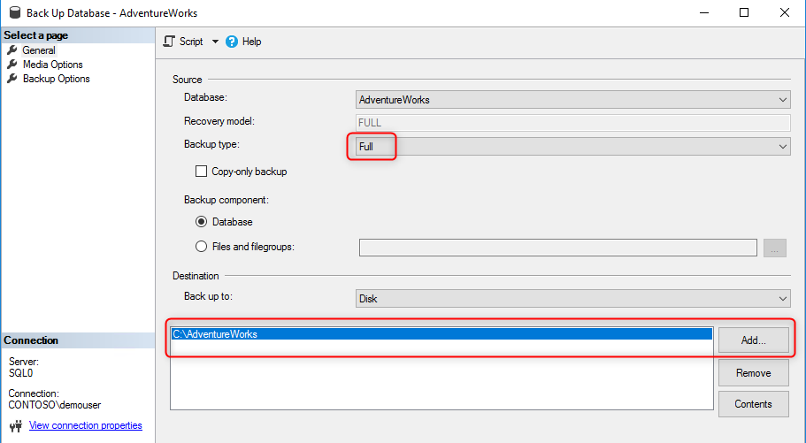


9.  In SSMS, expand **AlwaysOn High Availability -\> Availability Groups**. If **SQLClusterAG (Secondary)** is shown, right-click and choose **Failover...**. Select through the 'Fail Over Availability Group' wizard so this instance becomes the primary.
    
10. Right-click **SQLClusterAG (Primary)** and choose **Add Database...** to open the 'Add Database to Availability Group' Wizard.

    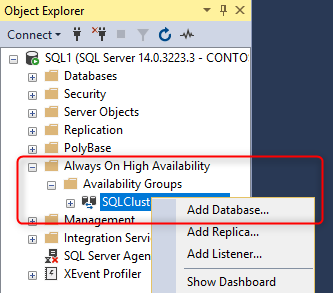
    
11. Select **Next** on the Introduction Page of the Wizard.
    
12. Select the check box next to the AdventureWorks database. Then select Next.
    
    

    > **Note:** If your AdventureWorks database does not meet the prerequisites, you should double-check that your database is in full recovery mode and that you have taken a full backup.

13. On the **Connect to Replicas** page, select the **Connect** button next to SQL1 and connect using the default credentials. Once connected, select the **Next** button to continue.
    
    

14. On the **Select Data Synchronization** page, use the default of **Automatic Seeding** and select the **Next** button. 
    
15. On the validation screen all results should show **Success**. Select **Next** and then **Finish** to conclude the wizard. Close the wizard with the **Close** button.
    
    

16. Right-click **SQLClusterAG (Primary)** and choose **Show Dashboard**. Your dashboard should look similar to this:

    

### Task 4: Verify the CloudShop application

In this task, you will verify that the new high-availability CloudShop deployment is working end-to-end.

1.  We will now verify that the high-availability web tier is operating correctly. In the Azure portal, find the **WebLB** load balancer and make a note of the public IP address.
    
    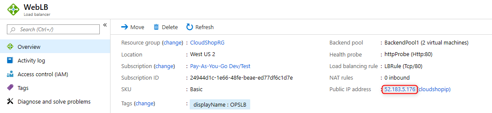
   
2.  In a new browser tab, navigate to this IP address and verify that the CloudShop application is shown.

### Summary

In this exercise, you deployed resilient SQL servers behind a load balancer hosting a SQL Always-On Availability Group for database resiliency. Also, you deployed resilient web tier with an external load balancer.

## Exercise 4: Configure SQL Server Managed Backup 

Duration: 15 minutes

In this exercise, you will configure SQL Server Managed Backup to back up the application database to an Azure Storage account.

### Task 1: Create an Azure Storage Account

In this task, you will create a storage account which will be used to store the database backups. You will also generate a T-SQL script containing the storage account parameters including a Shared Access Signature (SAS) access token.

1.  From **LABVM**, open PowerShell ISE. Log in to your Azure account using the following command.
   
    ```PowerShell
    Login-AzAccount
    ```

2.  Execute the following PowerShell script in the PowerShell ISE to create a new storage account and generate the T-SQL needed to configure managed backup for the AdventureWorks database. Make sure you change the **[unique storage account name]** field to a unique storage account name prior to execution (only lower-case letters and digits are permitted in storage account names). 

    ```powershell
    $storageAcctName = "[unique storage account name]"

    $resourceGroupName = "CloudShopRG"
    $containerName= "backups"
    $location = "West US 2"
    $storageSkuName = "Standard_LRS"

    Write-Host "Creating Storage Account $storageAcctName"
    $sa = New-AzStorageAccount -ResourceGroupName $resourceGroupName  `
        -Name $storageAcctName `
        -Location $location `
        -SkuName $storageSkuName 

    $storageKey = (Get-AzStorageAccountKey -Name $storageAcctName -ResourceGroupName $resourceGroupName )[0].Value
    $context = New-AzStorageContext -StorageAccountName $storageAcctName -StorageAccountKey $storageKey

    Write-Host "Creating New Storage Container  $containerName" 
    New-AzStorageContainer -name $containerName -permission container -context $context

    $fullSasToken = New-AzStorageContainerSASToken -Name $containerName -Permission rwdl -FullUri -Context $context  
    $containerUrl = $fullSasToken.Substring(0,$fullSasToken.IndexOf("?"))
    $sasToken = $fullSasToken.Substring($fullSasToken.IndexOf("?")+1)

    $enableManagedBackupScript = @"
    --------------------
    ---BEGIN TSQL Script
    --------------------
    CREATE CREDENTIAL [$containerUrl] 
    WITH IDENTITY = 'Shared Access Signature', 
         SECRET = '$sasToken' 

    GO

    EXEC msdb.managed_backup.sp_backup_config_basic   
     @enable_backup = 1,   
     @database_name = 'AdventureWorks',  
     @container_url = '$containerUrl',   
     @retention_days = 30
       
    --------------------
    ---END TSQL Script
    --------------------
    "@

    Write-Host $enableManagedBackupScript 
    ```

3.  After execution in the PowerShell output, save the T-SQL code generated between the **Begin TSQL Script** and **End TSQL Script** into a notepad file. This code creates an identity using a Shared Access Signature (SAS) to a container in the storage account and configures managed backup when executed.

### Task 2: Configure managed backup in SQL Server

In this task, you will configure SQL Server managed backup to the storage account created in task 1.

1.  Connect to **SQL0** using remote desktop.
   
    > **Note:** Remember to use ADVM as a jump box allowing you to connect to SQL0 on its private IP address **10.0.1.10**.

2.  Launch SQL Server Management Studio and connect to the database instance. Right-click **SQL0** and select **New Query**.

    

3.  Paste in the following code and select **Execute** to enable SQL Server Agent extended stored procedures.

    ```sql
    EXEC sp_configure 'show advanced options', 1
    GO
    RECONFIGURE
    GO
    EXEC sp_configure 'Agent XPs', 1
    GO
    RECONFIGURE
    GO
    ```

4.  Refresh SQL Server Management Studio if necessary. Find SQL Server Agent in the left-nav. If the agent is stopped, right-click it and choose **Start**, then **Yes** at the confirmation prompt.

    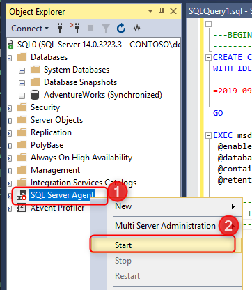

5.  Paste the T-SQL code you copied in the previous task into the query window replacing the existing code and select **Execute**. This code creates the new SQL identity with a Shared Access Signature for your storage account and enables managed backup to the storage account.

6.  Paste the code into the query window replacing the existing code and select **Execute** to create a custom backup schedule.

    ```sql
    USE msdb;  
    GO  
    EXEC managed_backup.sp_backup_config_schedule   
         @database_name =  'AdventureWorks'  
        ,@scheduling_option = 'Custom'  
        ,@full_backup_freq_type = 'Weekly'  
        ,@days_of_week = 'Monday'  
        ,@backup_begin_time =  '17:30'  
        ,@backup_duration = '02:00'  
        ,@log_backup_freq = '00:05'  
    GO
    ```
7.  Execute the following tSQL in the query window to generate a backup on-demand. You can also specify Log for \@type.

    ```sql
    EXEC msdb.managed_backup.sp_backup_on_demand   
    @database_name  = 'AdventureWorks',
    @type ='Database'
    ```
    
## Exercise 5: Validate resiliency

### Task 1: Validate resiliency for the CloudShop application 

1.  In the Azure portal, open the **CloudShopRG** resource group. Select the Load Balancer, **WebLB**.

2.  Select the **Overview** tab and copy the public IP address to the clipboard, and navigate to it in a different browser tab.

3.  The CloudShop application is shown. Make a note of which web server served the page (**WebVM-1** or **WebVM-2**). Using the Azure portal, navigate to this VM and select **Stop** (followed by **Yes**) to stop this VM.

4.  After a few minutes, refresh the browser and you will see cloud shop site is running and switched from the first web server to the other one. 

### Task 2: Validate SQL Always On

1.  Within the Azure portal, navigate to the **SQL0** VM and select **Stop** (followed by **Yes**) to stop this VM.

2.  After the VM is deallocated, refresh the CloudShop application in your browser. If the page loads with data in the dropdown list SQL has successfully failed over the primary node to the secondary. You can login to the secondary VM (**SQL1**) and connect via SQL Server Management Studio to confirm that this VM is now the primary.

    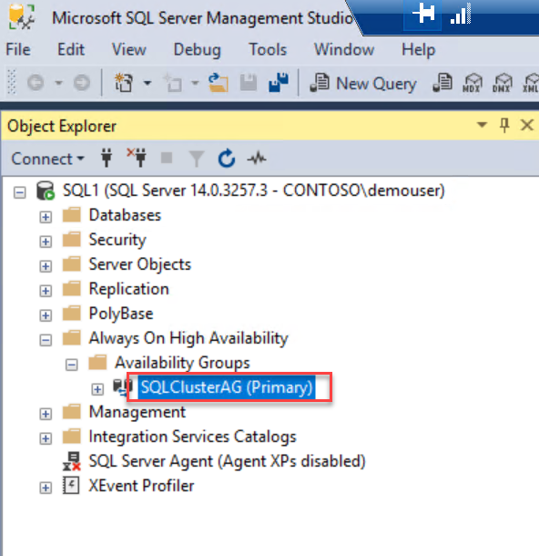

### Task 3: Validate VM backups are taken 

1.  In the Azure portal, select All Services and search for and select Recovery Services Vault. You should see the two recovery vaults created as part of the deployment of the Active Directory domain controllers.

2.  Open each vault and validate that a backup of the VM has occurred by clicking **Backup items** under **Protected items**. 

    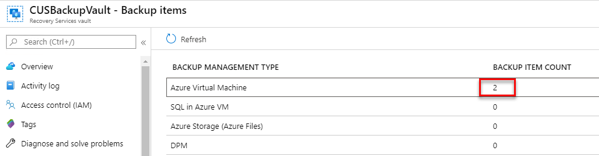

    >**Note**: Backup storage consumption may be 0 B if a backup has not occurred. The timing of backups is driven by the policy associated with the backup. Only one policy can be assigned to a virtual machine when using the Azure Backup Extension for Virtual Machines.

3.  To validate the SQL Server backup, open the Storage Account created earlier in the Azure portal and select **Containers** -\> and then **backups**. If the backup has already completed, you will see the backup file in the container.

    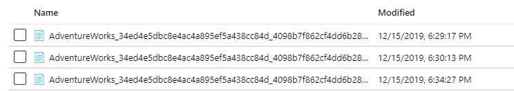

## Exercise 6: Implement Azure Site Recovery 

### Task 1: Configure ASR Protection for CloudShop

1. Make sure both SQL and Web VMs are in a running state. 

2. In the Azure portal, open the **CUSBackupVault** Recovery Services Vault.
   
3. In the **CUSBackupVault** blade, select **Site Recovery** under **Getting started**.
   
4. Under **FOR ON-PREMISES MACHINES AND AZURE VMS** select **Step 1: Replicate Application**.

    

5. On Step 1 Source, under **Source Location** choose the azure region where your Cloud Shop deployment exists (**West US 2**). Select **Resource Manager** as the Azure VM Deployment Model. Then under Source resource group select the resource group where your Cloud Shop deployment exists (**CloudShopRG**).  Select **OK**.

    

6. On Step 2, Select the Virtual Machines (both Web servers and both SQL Servers) for the replication. Select **OK**.

   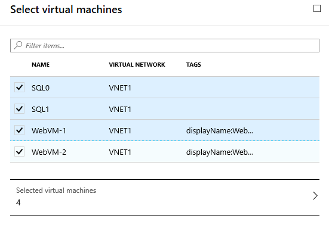

7. On the Configure settings blade, notice that you can alter the target resource group and virtual network settings, along with the replication policy. Select **Create target resources**. 

    >**Note**: Do not close the blade. It will close by itself after the target resources are created (2-3 minutes).

8. Select **Enable Replication**. Several Site Recovery jobs will be initiated which are creating the replication policy as well as the target resources to be used during a failover. 

    

9.  If you select the Enable replication job, you can see additional details of what takes place when protecting a VM. It may take up to 30 minutes to complete the job. You can review it under **Monitoring - Site Recovery Jobs** at the Recovery Services Vault blade. 
   
10. Once all the Enable replication jobs are successful, select **Replicated items** under **Protected Items** to view the status of the initial replication.
    
11. While waiting for the initial replication/synchronization, move on to the next task.

### Task 2: Creating the Recovery Plan

In this task, you will create the recovery plan that will be used to orchestrate failover actions, such as the order in which failed-over VMs are powered on.

1. On the **CUSBackupVault** blade, select **Recovery Plans (Site Recovery)** under **Manage**, then select **+ Recovery plan**.

    

2. On the Create recovery plan blade enter the name **CloudShopRP**. In the **Source** area select the region where you deployed Cloud Shop (**West US 2**). The Target will be automatically selected. Under **Allow items with deployment model**, select **Resource Manager**. Choose **Select items** and select all the Virtual Machines. Select **OK** and, back on the Create recovery plan blade, select **OK** again.

    

3. After a minute or two, you should see the CloudShopRP recovery plan on the Recovery plans blade. This recovery plan would bring up both servers at once during a failover. In an N-tier application, it is often best to have the data tier come up first. So, we will edit the recovery plan to accomplish this. Select the **CloudShopRP** recovery plan.
   
4. On the CloudShopRP blade, select **Customize**. Within the Recovery plan blade, select **+ Group**.

    

5. Under **Group 1: Start**, select the ellipse beside WebVM-1 and WebVM-2 and choose **Delete machine**. Leave only the SQL Servers in Group-1.

6. Select the ellipse beside **Group 2: Start** and choose Add protected item and add both web servers. Then **Save** the changes.

    

7. Now go back to the Recovery Services Vault **CUSBackupVault** blade and select **Replicated items**. Notice the servers that make the Cloud Shop application are replicating. Take note of their status. They should be close to 100%. 

    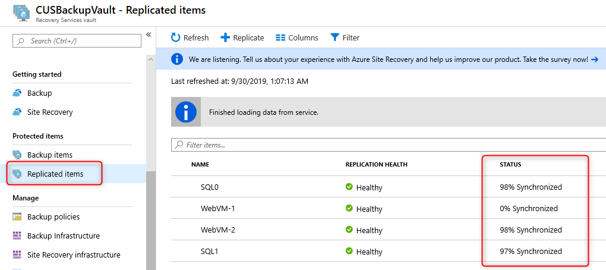

8.  Wait until all VMs have finished replicating before proceeding to the next task. Select **Refresh** to check the current status. This may take up to 1 hour.

### Task 3: Execute a Test Failover.

In this task, you will execute a test failover of the CloudShop VMs using Azure Site Recovery.

1. Within the Azure portal, select **Resource Groups** and select the **CloudShopRG-asr** resource group. 
   
    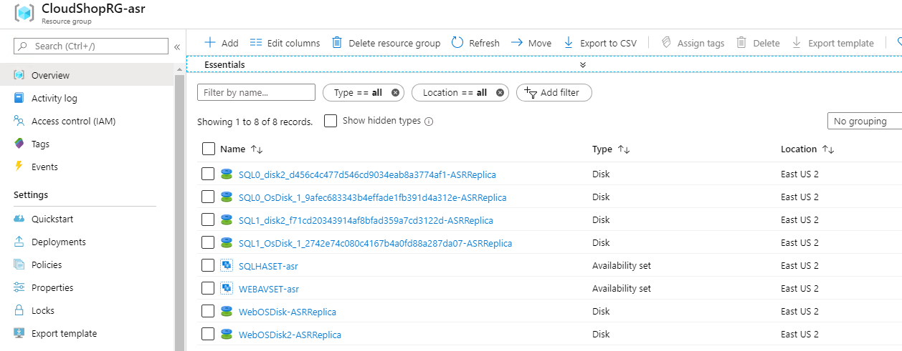

2. Notice the resources created by ASR to support workload protection and failover.

3. Navigate back to the Overview section of your Recovery Services vault (**CUSBackupVault**) via the tile on your dashboard. Under **Protected items** on the left, select **Replicated items** and check that both Cloud Shop VMs are fully protected before continuing.
   
4. Navigate back to the Overview section of the **Recovery Services Vault**. Under **Manage**, select **Recovery Plans**.

    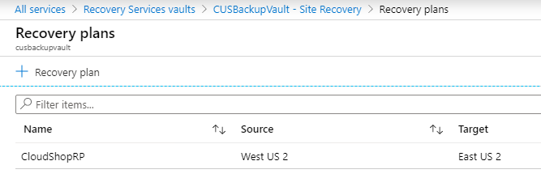

5. Right-click the **CloudShopRP** plan and choose **Test Failover**.

    

6. On the new Test failover blade, under **Choose a recovery point**, select **Latest processed (low RTO)** and under **Azure virtual network** choose **VNET1-asr**. Select **OK**.

>**Note**: In a 'real-world' recovery test, you should choose an isolated virtual network so as to not impact the production application. 

7. From the Recovery Services vault blade, select **Site recovery jobs** under **Monitoring**. On the Site recovery jobs blade, select the running job (Test failover).

8. On the Test failover blade, monitor the progress of the failover. Notice each step is executing and you can track the status and execution time. Also notice that the data tier is being started first, then the app tier, as per our recovery plan.

9. Once it completes, navigate back to the Overview section of the **Recovery Services Vault**. Under **Manage**, select back on **Recovery plans**. Notice the Recovery plan is waiting on your input.

    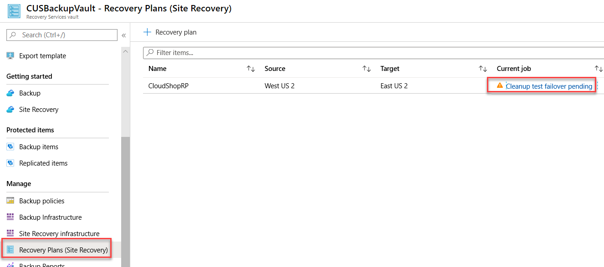

10. Under **Resource groups** in the left-hand navigation bar, navigate to the resource group created for this protected workload, called **CloudShopRG1-asr**. Note the resources that have been created as a part of the failover action. The compute resources were not provisioned until the failover occurred.
    
    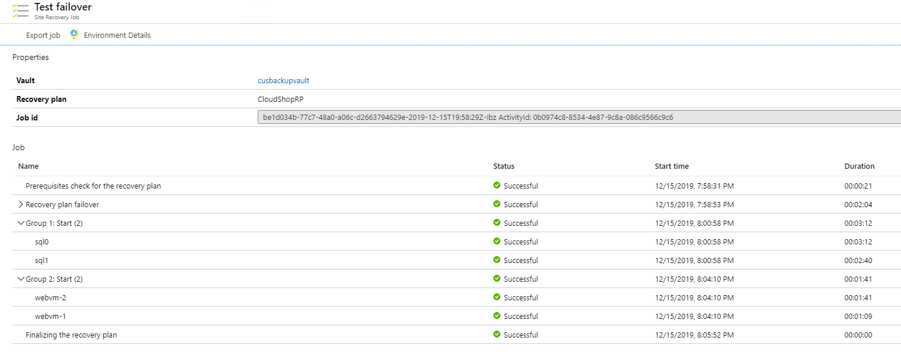

    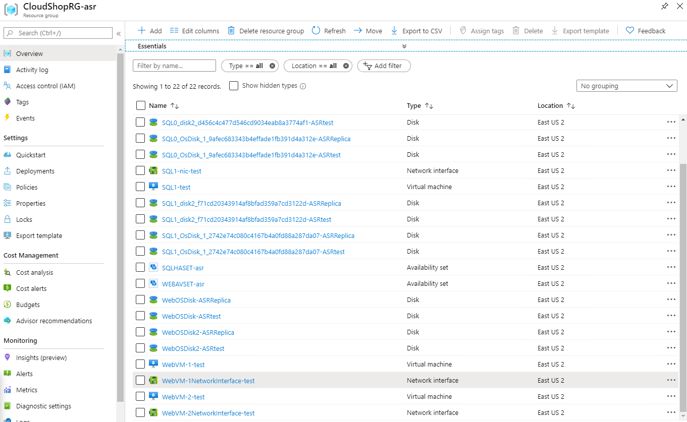

### Task 4: Clean up the Test Failover.

In this task, you will clean up the resources created during the test failover.

1. In the Azure portal, navigate back to the **CUSBackupVault** Recovery Services Vault  via the dashboard tile. In the **Overview** section of the Recovery Services Vault, under the **Site Recovery tab**, select **Recovery plans**.
   
2. Notice that the recovery plan has a pending job called **Cleanup test failover** pending. Right-click on the **CloudShopRP recovery plan** and choose **Cleanup test failover**.

3. In the Test failover cleanup blade, enter notes indicating that the test was successful and select the checkbox indicating the testing is complete. Then select **OK**.
   
4. Navigate back to the Overview section of the **Recovery Services Vault**. Under the Site Recovery tab find the jobs tile and select **In-progress**. 

     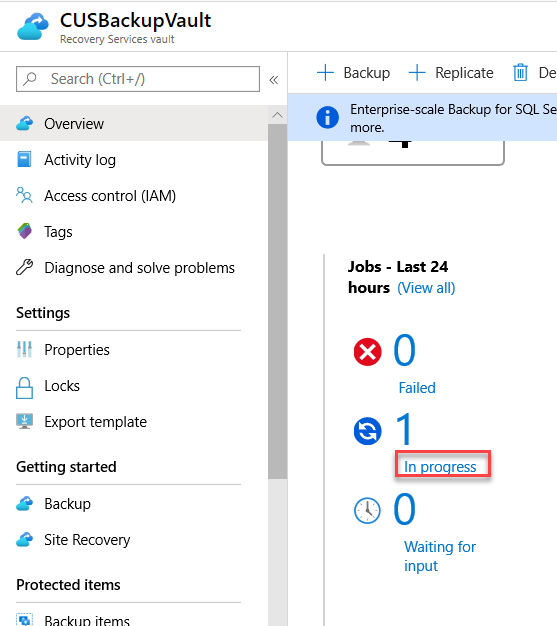
   
5. On the Site recovery jobs blade, select the running job. Monitor the status until the environment is cleaned up (approximately 5 minutes).

6. In the Azure portal navigate to **Resource Groups** and select the **CloudShopRG1-asr** resource group. Notice that the virtual machines and network interfaces have all been deleted, leaving only the resources ASR initial created to support protection and the manually created public IP address.

    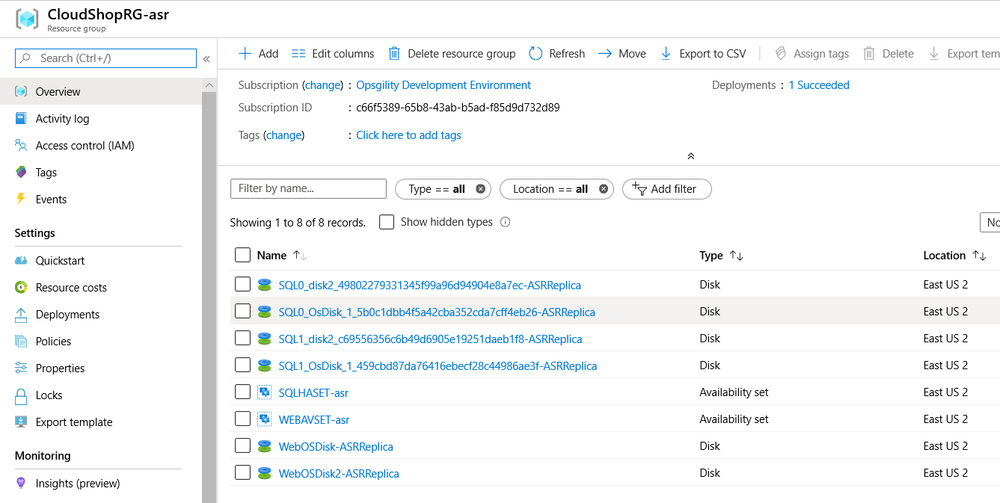

## After the hands-on lab

### Task 1: Delete the resource groups created

1.  Within the Azure portal, select Resource Groups on the left navigation.

2.  Delete each of the resource groups created in this lab by selecting them followed by the **Delete resource group** button. You will need to confirm the name of the resource group to delete.

3.  To delete the Recovery Services Vaults, you will first need to open the vaults, disable all VM backup and replication and delete any backup and replicated data. As currently implemented, Azure VM backups are only soft deleted (they can still be recovered). The vault itself cannot be deleted for 14 days after this soft delete.

You should follow all steps provided *after* attending the hands-on lab.


