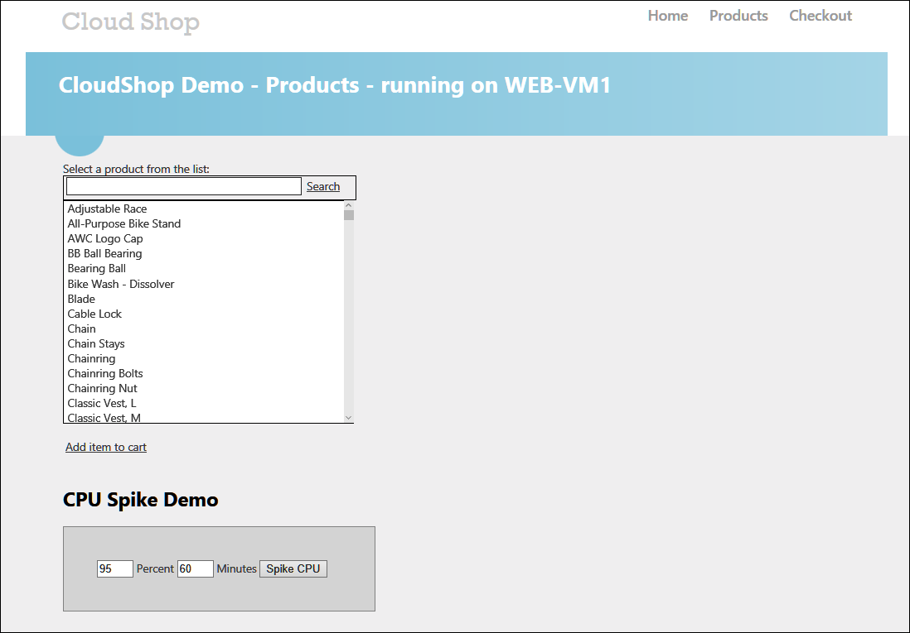

# Building a resilient IaaS architecture setup

## Requirements

1.  Microsoft Azure Subscription

2.  Virtual Machine Built during this hands-on lab or local machine with the following:

    -   Visual Studio 2017 Community or Enterprise Edition

    -   Latest Azure PowerShell Cmdlets

    -   <https://azure.microsoft.com/en-us/downloads/>

    -   Ensure you reboot after installing the SDK or Azure PowerShell will not work correctly

## Before the hands-on lab

Duration: 30 minutes

In this exercise, you build a Lab VM followed by preparing an Azure infrastructure containing several issues needing to be addressed from a resiliency standpoint. You will create an Active Directory environment, a SQL database tier, and a web tier for a Web Application.

### Task 1: Create a Virtual Machine using the Azure portal 

1.  Launch a browser and navigate to <https://portal.azure.com>. Once prompted, login with your Microsoft Azure credentials. If prompted, choose whether your account is an organization account or just a Microsoft Account.

**Note**: You may need to launch an \"in-private\" session in your browser if you have multiple Microsoft Accounts.

2.  Click on **+NEW**, and in the search box, type in **Visual Studio Community 2017 on Windows Server 2016 (x64)** and press Enter. Click the Visual Studio Community 2017 image running on Windows Server 2016 and with the latest update.

3.  In the returned search results, click the image name.

    

4.  At the bottom of the page in the Marketplace solution blade, keep the deployment model set to **Resource Manager**, and click **Create**.

    

5.  Set the following configuration on the Basics tab, and click **OK**.

    -   Name: **LABVM**

    -   VM disk type: **SSD**

    -   User name: **demouser**

    -   Password: **demo\@pass123**

    -   Subscription: **If you have multiple subscriptions choose the subscription to execute your labs in.**

    -   Resource Group: **OPSLABRG**

    -   Location: **Choose the closest Azure region to you.**

    

6.  Choose the **DS1\_V2 Standard** instance size on the Size blade.

**Note**: You may have to click the View All link to see the instance sizes.

**Note**: If the Azure Subscription you are using is [NOT]{.underline} a trial Azure subscription, you may want to choose the DS2\_V2 to have more power in this LABMV. If you are using a trial subscription or one that you know has a restriction on the number of cores, stick with the DS1\_V2.

7.  Click **Configure required settings** to specify a storage account for your virtual machine if a storage account name is not automatically selected for you.

    

8.  Click **Create new**.

    

9.  Specify a unique name for the storage account (all lower letters and alphanumeric characters), and ensure the green checkmark showing the name is valid.

    

10. Click **OK** to continue.

    

11. Click **Configure required settings** for the Diagnostics storage account if a storage account name is not automatically selected for you. Repeat the previous steps to select a unique storage account name. This storage account will hold diagnostic logs about your virtual machine that you can use for troubleshooting purposes.

    

12. Accept the remaining default values on the Settings blade, and click **OK**. On the Summary page, click **OK**. The deployment should begin provisioning. It may take more than 10 minutes for the virtual machine to complete provisioning.

    

**Note**: Once the deployment is complete, move on to the next exercise.

### Task 2: Connect to the VM and download the student files

1.  Move back to the portal page on your local machine and wait for **LABVM** to show the Status of **Running**. Click **Connect** to establish a new remote desktop session.

    

2.  Depending on your remote desktop protocol client and browser configuration, you will either be prompted to open an RDP file, or you will need to download it followed by opening it up separately to connect. You may also be required to click, **Use a different account**.

    

3.  Login with the credentials specified during creation:

    -   User: **demouser**

    -   Password: **demo\@pass123**

4.  You will be presented with a remote desktop connection warning because of a certificate trust issue. Click, **Don't ask me again for connections to this computer** followed by **Yes** to continue with the connection.

    

5.  When logging on for the first time, you will see a prompt on the right asking about network discovery. Click **No**.

    

6.  Notice that Server Manager opens by default. On the left, click **Local Server**.

    

7.  On the right side of the pane, click **On** by **IE Enhanced Security Configuration**.

    

8.  Change to **Off** for Administrators and click **OK**.

    

9.  In the lower left corner, click Internet Explorer to open it. On first use, you will be prompted about security settings. Accept the defaults by clicking **OK**.

    

10. If prompted, click **Don't show this again** regarding protected mode.

11. To download the exercise files for the hands-on lab, paste this URL into the browser.

    https://cloudworkshop.blob.core.windows.net/resilient-iaas-hackathon/Building_Resilient_Iaas_Hackathon_Student_Files.zip  

12. You will be prompted about what you want to do with the file. Select **Save**.

    

13. Download progress is shown at the bottom of the browser window. When the download is complete, click **Open folder**.

    

14. The **Downloads** folder will open, ***Right-click*** the zip file, and click **Extract All**. In the **Extract Compressed (Zipped) Folders** window, enter **C:\\HOL** in the **Files will be extracted to this folder** dialog. Click the **Extract** button.

### Task 3: Deploy the Lab Environment

1.  Login to the Azure portal (<https://portal.azure.com>) with the credentials that you want to deploy the lab environment to.

2.  In a separate tab, navigate to: <https://github.com/opsgility/cw-building-resilient-iaas-architecture>.

3.  Click the button **Deploy to Azure**.

    

4.  Specify the Resource group name as **LitwareRG** and the region as **West Central US**, **check the two checkboxes** on the page and click **Purchase**.

    

5.  Once the deployment is successful, validate the deployment by opening the **CloudShopWeb** virtual machine and navigating your browser to its public IP address.

    

    

### Summary

In this exercise, you prepared an Azure infrastructure containing several issues needing to be addressed from a resiliency standpoint. You created an Active Directory environment, a SQL Database tier, and a web tier for a Web Application.

You should follow all steps provided *before* attending the Hands-on lab.
